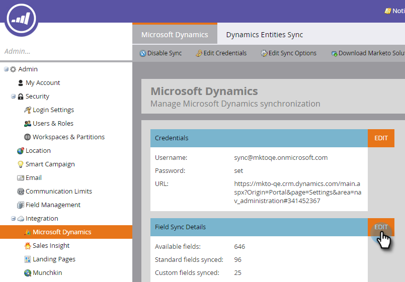

# 步驟3之3：將Microsoft Dynamics與Marketo連線（2011年內部部署） {#step-of-connect-microsoft-dynamics-with-marketo-on-premises}

好啦！ 我們已安裝解決方案並設定同步處理使用者。 接下來，我們需要連線Marketo和Dynamics。

>[!PREREQUISITES]
>
>* [步驟3之1：安裝Marketo解決方案（2011內部部署）](/help/marketo/product-docs/crm-sync/microsoft-dynamics-sync/sync-setup/connecting-to-legacy-versions/step-1-of-3-install-2011.md){target="_blank"}
>* [步驟2之3：在Dynamics （2011內部部署）中設定Marketo同步使用者](/help/marketo/product-docs/crm-sync/microsoft-dynamics-sync/sync-setup/connecting-to-legacy-versions/step-2-of-3-set-up-2011.md){target="_blank"}

>[!NOTE]
>
>**需要管理員許可權**

## 輸入Dynamics同步使用者資訊 {#enter-dynamics-sync-user-information}

1. 登入Marketo並按一下&#x200B;**[!UICONTROL 管理員]**。

   

1. 按一下&#x200B;**[!UICONTROL CRM]**。

   

1. 按一下&#x200B;**[!DNL Microsoft]**。

   

1. 在&#x200B;**[!UICONTROL 輸入認證]**&#x200B;中按一下&#x200B;**[!UICONTROL 編輯]**。

   

   >[!CAUTION]
   >
   >請確認您的認證正確無誤，因為提交後就無法回覆後續的結構描述變更。 如果儲存不正確的認證，您必須取得新的Marketo訂閱。

1. 輸入&#x200B;**[!UICONTROL 使用者名稱]**、**[!UICONTROL 密碼]**&#x200B;和CRM **[!UICONTROL URL]**，然後按一下&#x200B;**[!UICONTROL 儲存]**。

   

   >[!NOTE]
   >
   >* Marketo中的使用者名稱必須與CRM中同步處理使用者的使用者名稱相符。 格式可以是`user@domain.com`或DOMAIN\user。
   >* 如果您不知道該URL，[請在這裡瞭解如何找到它](/help/marketo/product-docs/crm-sync/microsoft-dynamics-sync/sync-setup/view-the-organization-service-url.md){target="_blank"}。

## 選取要同步的欄位 {#select-fields-to-sync}

現在，我們需要選取要同步處理的欄位。

1. 在&#x200B;**[!UICONTROL 選取要同步處理的欄位]**&#x200B;中按一下&#x200B;**[!UICONTROL 編輯]**。

   

1. 有預先選取的欄位將進行同步。 如有需要，請新增其他專案，然後按一下[儲存]。****

   

   >[!NOTE]
   >
   >Marketo會儲存要同步之欄位的參考。 如果您刪除Dynamics中的欄位，我們建議您在停用[同步處理](/help/marketo/product-docs/crm-sync/salesforce-sync/enable-disable-the-salesforce-sync.md){target="_blank"}的情況下進行刪除。 接著，編輯並儲存[選取要同步處理的欄位](/help/marketo/product-docs/crm-sync/microsoft-dynamics-sync/microsoft-dynamics-sync-details/microsoft-dynamics-sync-field-sync/editing-fields-to-sync-before-deleting-them-in-dynamics.md){target="_blank"}，以重新整理Marketo中的結構描述。

## 自訂篩選器的同步欄位 {#sync-fields-for-a-custom-filter}

如果您已建立自訂篩選器，請務必前往並選取要與Marketo同步的新欄位。

1. 移至[管理]並選取&#x200B;**[!UICONTROL Microsoft Dynamics]**。

   

1. 按一下欄位同步處理詳細資料上的&#x200B;**[!UICONTROL 編輯]**。

   

1. 向下捲動至欄位並進行核取。 實際名稱必須是new_synctomkto，但「顯示名稱」可以是任何內容。 按一下&#x200B;**[!UICONTROL 保存]**。

   

## 啟用同步 {#enable-sync}

1. 在&#x200B;**[!UICONTROL 啟用同步處理]**&#x200B;中按一下&#x200B;**[!UICONTROL 編輯]**。

   

   >[!CAUTION]
   >
   >Marketo不會針對Microsoft Dynamics同步處理或手動輸入人員或潛在客戶時，自動進行重複資料刪除。

1. 讀取快顯視窗中的所有內容，輸入您的電子郵件，然後按一下[開始同步]。****

   

1. 第一次同步可能需要幾個小時。 完成後，您將會收到電子郵件通知。

   

   做得很好！
