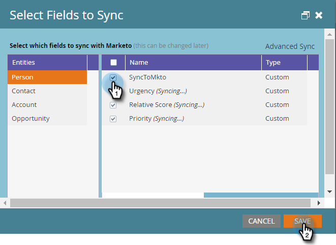

# 第3步（共3步）:連接Marketo和Dynamics（2013年內部部署） {#step-of-connect-marketo-and-dynamics-on-premises}

好吧！ 我們已安裝解決方案並配置了同步用戶。 接下來，我們需要連接Marketo和Dynamics。

>[!PREREQUISITES]
>
>* [第1步（共3步）:在Dynamics（2013內部部署）中安裝Marketo解決方案](/help/marketo/product-docs/crm-sync/microsoft-dynamics-sync/sync-setup/connecting-to-legacy-versions/step-1-of-3-install-2013.md)
>* [第2步（共3步）:為Marketo配置同步用戶（2013年內部部署）](/help/marketo/product-docs/crm-sync/microsoft-dynamics-sync/sync-setup/connecting-to-legacy-versions/step-2-of-3-configure-2013.md)

>[!NOTE]
>
>**需要管理權限**

## 輸入Dynamics同步用戶資訊 {#enter-dynamics-sync-user-information}

1. 登入Marketo，然後按一下 **管理**.

   

1. 按一下 **CRM**.

   

1. 選擇 **Microsoft**.

   

1. 按一下 **編輯** in **步驟1:輸入憑據**.

   

   >[!CAUTION]
   >
   >請確定您的憑證正確，因為提交後，我們無法還原後續的架構變更。 如果儲存的憑證不正確，您必須取得新的Marketo訂閱。

1. 輸入 **使用者名稱**, **密碼** 和Microsoft Dynamics **URL** 然後按一下 **儲存**.

   

   >[!NOTE]
   >
   >* Marketo中的使用者名稱必須符合CRM中同步使用者的使用者名稱。 格式可以是user@domain.com或DOMAIN\user。
   >* 如果您不知道URL, [在這裡了解如何找到](/help/marketo/product-docs/crm-sync/microsoft-dynamics-sync/sync-setup/view-the-organization-service-url.md).

## 選擇要同步的欄位 {#select-fields-to-sync}

現在，我們需要選取要同步的欄位。

1. 按一下 **編輯** in **步驟2:選擇要同步的欄位**.

   

1. 選取您要同步至Marketo的欄位，以便預先選取這些欄位。 按一下 **儲存**.

   

   >[!NOTE]
   >
   >Marketo會儲存要同步之欄位的參考。 如果您刪除Dynamics中的欄位，建議您使用 [已禁用同步](/help/marketo/product-docs/crm-sync/salesforce-sync/enable-disable-the-salesforce-sync.md). 然後編輯並儲存Marketo中的結構，以重新整理 [選擇要同步的欄位](/help/marketo/product-docs/crm-sync/microsoft-dynamics-sync/microsoft-dynamics-sync-details/microsoft-dynamics-sync-field-sync/editing-fields-to-sync-before-deleting-them-in-dynamics.md).

## 同步自訂篩選器的欄位 {#sync-fields-for-a-custom-filter}

如果您已建立自訂篩選器，請務必前往並選取要與Marketo同步的新欄位。

1. 前往「管理」並選取 **Microsoft Dynamics**.

   

1. 按一下 **編輯** 在欄位同步詳細資訊上。

   

1. 向下捲動至欄位並加以檢查。 實際名稱必須為new_synctomkto，但「顯示名稱」可以是任何值。 按一下 **儲存**.

   

## 啟用同步 {#enable-sync}

1. 按一下 **編輯** in **步驟3:啟用同步**.

   

   >[!CAUTION]
   >
   >Marketo不會針對Microsoft Dynamics同步或當您手動輸入人員或銷售機會時自動消除重複資料。

1. 閱讀快顯視窗中的所有內容，輸入您的電子郵件，然後按一下 **開始同步**.

   

1. 第一次同步可能需要數小時。 完成後，您會收到電子郵件通知。

   

幹得好！ 您剛剛釋放了Marketo和Microsoft Dynamics之間雙向同步的力量。 如果您已購買Marketo Sales Insight，則有更多樂趣可用：

>[!MORELIKETHIS]
>
>[在Microsoft Dynamics 2013中安裝及設定Marketo Sales Insight](/help/marketo/product-docs/marketo-sales-insight/msi-for-microsoft-dynamics/installing/install-and-configure-marketo-sales-insight-in-microsoft-dynamics-2013.md)
