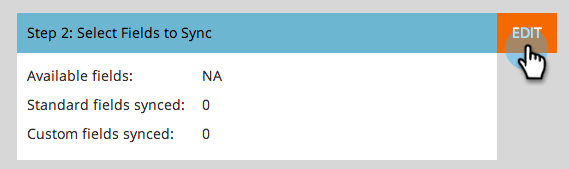

# 步驟3之3：連線Marketo Dynamics （2015年內部部署） {#step-of-connect-marketo-dynamics-on-premises-2015}

>[!PREREQUISITES]
>
>* [安裝適用於Microsoft Dynamics 2015內部部署的Marketo步驟1 （共3步）](/help/marketo/product-docs/crm-sync/microsoft-dynamics-sync/sync-setup/connecting-to-legacy-versions/step-1-of-3-install-2015.md){target="_blank"}
>* [安裝適用於Microsoft Dynamics 2015內部部署的Marketo步驟2 （共3步）](/help/marketo/product-docs/crm-sync/microsoft-dynamics-sync/sync-setup/connecting-to-legacy-versions/step-2-of-3-set-up-2015.md){target="_blank"}

>[!NOTE]
>
>**需要管理員許可權**

## 輸入Dynamics同步使用者資訊 {#enter-dynamics-sync-user-information}

1. 登入Marketo並按一下&#x200B;**[!UICONTROL Admin]**。

   

1. 按一下「**[!UICONTROL CRM]**」。

   

1. 選擇「**[!UICONTROL Microsoft]**」。

   

1. 在&#x200B;**[!UICONTROL Enter Credentials]**&#x200B;中按一下&#x200B;**[!UICONTROL Edit]**。

   

   >[!CAUTION]
   >
   >請確認您的認證正確無誤，因為提交後就無法回覆後續的結構描述變更。 如果儲存不正確的認證，您必須取得新的Marketo訂閱。

1. 輸入&#x200B;**[!UICONTROL Username]**、**[!UICONTROL Password]** Microsoft Dynamics **[!UICONTROL URL]**&#x200B;和&#x200B;**使用者端ID/密碼**。 完成時，按一下&#x200B;**[!UICONTROL Save]**。

   

   >[!NOTE]
   >
   >* 如果您的Marketo是在2020年10月之前布建，使用者端ID和密碼為選用欄位。 否則，這些是強制性的。 能否取得此資訊將取決於您使用的MSD版本。
   >* Marketo中的使用者名稱必須與CRM中同步處理使用者的使用者名稱相符。 格式可以是`user@domain.com`或DOMAIN\user。
   >* 如果您不知道該URL，[請在這裡瞭解如何找到它](/help/marketo/product-docs/crm-sync/microsoft-dynamics-sync/sync-setup/view-the-organization-service-url.md){target="_blank"}。

   >[!TIP]
   >
   >不知道URL？ 我們將在此說明如何尋找您的[Dynamics組織服務URL](/help/marketo/product-docs/crm-sync/microsoft-dynamics-sync/sync-setup/view-the-organization-service-url.md){target="_blank"}。

## 選取要同步的欄位 {#select-fields-to-sync}

1. 在&#x200B;**[!UICONTROL Select Fields to Sync]**&#x200B;中按一下&#x200B;**[!UICONTROL Edit]**。

   

1. 選取您要同步至Marketo的欄位，以便預先選取它們。 按一下「**[!UICONTROL Save]**」。

   

>[!NOTE]
>
>Marketo會儲存要同步之欄位的參考。 如果您刪除Dynamics中的欄位，我們建議您在停用[同步處理](/help/marketo/product-docs/crm-sync/salesforce-sync/enable-disable-the-salesforce-sync.md){target="_blank"}的情況下進行刪除。 接著，編輯並儲存[選取要同步處理的欄位](/help/marketo/product-docs/crm-sync/microsoft-dynamics-sync/microsoft-dynamics-sync-details/microsoft-dynamics-sync-field-sync/editing-fields-to-sync-before-deleting-them-in-dynamics.md){target="_blank"}，以重新整理Marketo中的結構描述。

## 自訂篩選器的同步欄位 {#sync-fields-for-a-custom-filter}

如果您已建立自訂篩選器，請務必前往並選取要與Marketo同步的新欄位。

1. 移至[管理]並選取&#x200B;**[!UICONTROL Microsoft Dynamics]**。

   

1. 按一下[欄位同步處理詳細資料]上的&#x200B;**[!UICONTROL Edit]**。

   

1. 向下捲動至欄位並進行核取。 實際名稱必須是new_synctomkto，但「顯示名稱」可以是任何內容。 按一下「**[!UICONTROL Save]**」。

   

## 啟用同步 {#enable-sync}

1. 在&#x200B;**[!UICONTROL Enable Sync]**&#x200B;中按一下&#x200B;**[!UICONTROL Edit]**。

   

   >[!CAUTION]
   >
   >Marketo不會針對Microsoft Dynamics同步作業或手動輸入人員時自動進行重複資料刪除。

1. 閱讀快顯視窗中的所有內容，輸入您的電子郵件，然後按一下&#x200B;**[!UICONTROL Start Sync]**。

   

1. 視記錄數量而定，初始同步可能需要數小時至數天的時間。 完成後，您將會收到電子郵件通知。

   
