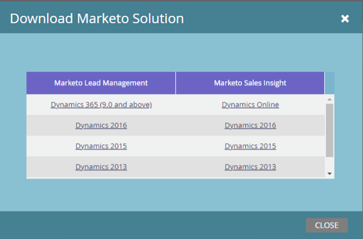

# 下載Marketo銷售機會管理解決方案 {#download-the-marketo-lead-management-solution}

>[!NOTE]
>
>**需要管理員許可權**

您必須下載並安裝Marketo解決方案至您的[!DNL Microsoft Dynamics]帳戶，才能開始同步。

>[!CAUTION]
>
>在執行任何升級之前&#x200B;_必須先下載最新的Marketo解決方案_。

>[!NOTE]
>
>Marketo目前僅支援與Java 7相容的SSL憑證。

1. 移至&#x200B;**[!UICONTROL Admin]**&#x200B;區域。

   

1. 按一下&#x200B;**[!UICONTROL CRM]**。

   

1. 選取&#x200B;**[!DNL Microsoft]**。

   

1. 選取&#x200B;**[!UICONTROL Download Marketo Solution]**。

   

1. 為您的[!DNL Microsoft Dynamics]版本選取適當的解決方案。

   

解決方案的zip檔案現在將下載至您的裝置。
