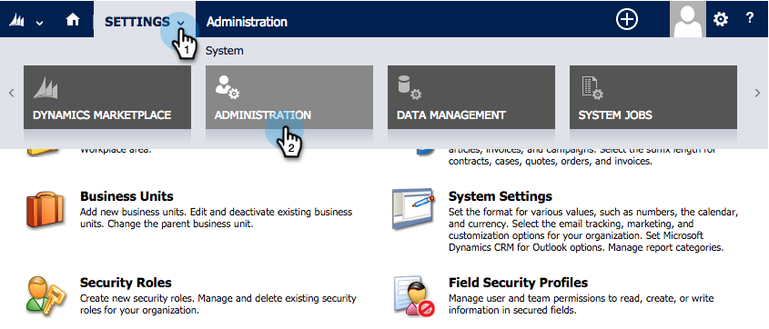

# 步驟2（共3步）:為Marketo設定同步使用者（2013年內部部署）{#step-of-configure-sync-user-for-marketo-on-premises}

完成前述步驟的出色工作，讓我們繼續進行。

>[!PREREQUISITES]
>
>[步驟1（共3步）:在Dynamics中安裝Marketo解決方案（2013年內部部署）](/help/marketo/product-docs/crm-sync/microsoft-dynamics-sync/sync-setup/microsoft-dynamics-2013-on-premises/step-1-of-3-install.md)

## 分配同步用戶角色{#assign-sync-user-role}

將「Marketo同步使用者」角色僅指派給「Marketto同步使用者」。 您不需要將它指派給任何其他使用者。

>[!NOTE]
>
>這適用於Marketo增效模組4.0.0.14版及更新版本。 對於舊版，所有使用者都必須具有同步使用者角色。 若要升級Marketo，請參閱[升級Microsoft Dynamics的Marketo解決方案](/help/marketo/product-docs/crm-sync/microsoft-dynamics-sync/sync-setup/update-the-marketo-solution-for-microsoft-dynamics.md)。

1. 在&#x200B;**Settings**&#x200B;下，按一下&#x200B;**Administration**。

   

1. 選擇&#x200B;**用戶**。

   

1. 您會在這裡看到使用者清單。 選擇您的專用Marketo Sync使用者，或聯絡您的[Active Directory Federation Services(AFDS)](https://msdn.microsoft.com/en-us/library/bb897402.aspx) [管理員以建立專用於Marketo的新使用者。](https://blogs.technet.com/b/askpfeplat/archive/2014/04/21/introduction-to-active-directory-federation-services-ad-fs-alternateloginid-feature.aspx)

   

1. 選擇同步用戶。 按一下並選擇&#x200B;**管理角色**

   

1. 勾選「**Marketo Sync User**」，然後按一下「確定&#x200B;**OK**」。

   

   >[!TIP]
   >
   >如果您看不到角色，請返回至3](/help/marketo/product-docs/crm-sync/microsoft-dynamics-sync/sync-setup/microsoft-dynamics-2013-on-premises/step-1-of-3-install.md)的[步驟1並匯入解決方案。

   >[!NOTE]
   >
   >同步使用者在您的CRM中進行的任何更新，都會將&#x200B;**not**&#x200B;同步回行銷人員。

## 設定Marketo解決方案{#configure-marketo-solution}

快搞定了！ 在移至下一篇文章之前，我們只有最後幾段設定。

1. 在「**Settings**」下方，按一下「Marketo Config **」。**

   

   >[!NOTE]
   >
   >如果&#x200B;**Marketo Config**&#x200B;遺失，請嘗試重新整理頁面。 如果問題持續存在，[會再次發佈Marketo解決方案](/help/marketo/product-docs/crm-sync/microsoft-dynamics-sync/sync-setup/microsoft-dynamics-2013-on-premises/step-1-of-3-install.md)，或嘗試登出並重新登入。

1. 按一下&#x200B;**Default**。

   

1. 按一下「**Marketo User**」欄位，並選取同步使用者。

   

1. 按一下右下角的以儲存變更。

   

1. 按一下&#x200B;**發佈所有自定義**。

   

## 繼續執行步驟3 {#before-proceeding-to-step}之前

* 如果您想要限制同步的記錄數，[現在設定自訂同步篩選](/help/marketo/product-docs/crm-sync/microsoft-dynamics-sync/create-a-custom-dynamics-sync-filter.md)。
* 運行[驗證Microsoft Dynamics Sync](/help/marketo/product-docs/crm-sync/microsoft-dynamics-sync/sync-setup/validate-microsoft-dynamics-sync.md)進程。 它會驗證您的初始設定是否正確完成。
* 在Microsoft Dynamics CRM中登入Marketo同步使用者。

幹得好！

>[!MORELIKETHIS]
>
>[步驟3（共3步）:Connect Marketo與Dynamics（2013年內部部署）](/help/marketo/product-docs/crm-sync/microsoft-dynamics-sync/sync-setup/microsoft-dynamics-2013-on-premises/step-3-of-3-connect.md)
