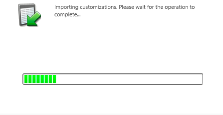

# 步驟1（共3步）:為Marketo（2015 On-Prem和2016 365 On-Prem）配置同步用戶{#step-of-configure-sync-user-for-marketo-on-premises-and-365}

您必須先在Dynamics中安裝Marketo解決方案，才能將Microsoft Dynamics 2015內部或2016(Dynamics 365)與Marketo同步。

>[!NOTE]
>
>將Marketo與CRM同步後，您無法將新CRM與現有的Marketo例項同步。

>[!PREREQUISITES]
>
>如果您使用Microsoft Dynamics On-Premise，則必須配置[Internet Facing Deployment](https://www.microsoft.com/en-us/download/confirmation.aspx?id=41701)(IFD)和[ Active Directory Federation Services](https://msdn.microsoft.com/en-us/library/bb897402.aspx) 2.0+(ADFS)。 注意：當您按一下連結時，IFD檔案會自動下載。
>
>[開始之前，請先下載Marketo](/help/marketo/product-docs/crm-sync/microsoft-dynamics-sync/sync-setup/download-the-marketo-lead-management-solution.md) 銷售機會管理解決方案。

>[!NOTE]
>
>**需要動態管理權限。**
>
>您需要CRM管理員權限才能執行此同步。

1. 登入&#x200B;**動態。** 按一下 **Microsoft Dynamics** CRM下拉式功能表，並選取「 **設定」**。

   

1. 在&#x200B;**Settings**&#x200B;下，選擇&#x200B;**Solutions**。

   

1. 按一下&#x200B;**Import**。

   

1. 按一下&#x200B;**瀏覽**&#x200B;並選擇您下載的[解決方案。 ](/help/marketo/product-docs/crm-sync/microsoft-dynamics-sync/sync-setup/download-the-marketo-lead-management-solution.md)按一下&#x200B;**Next**。

   

1. 查看解決方案資訊，然後按一下&#x200B;**查看解決方案包詳細資訊**。

   

1. 檢查完所有詳細資訊後，按一下&#x200B;**關閉**。

   

1. 返回「解決方案資訊」頁，按一下&#x200B;**Next**。

   

1. 請確定已選取「SDK選項」核取方塊。 按一下&#x200B;**Import**。

   

1. 等待匯入完成。

   >[!TIP]
   >
   >您必須啟用瀏覽器上的快顯視窗，才能完成安裝程式。

   

1. 下載日誌檔案（如果需要），然後按一下&#x200B;**Close**。

   >[!NOTE]
   >
   >您可能會看到一則訊息，指出「Marketo銷售線索管理已完成並發出警告」。 這完全是意料之中的。

   

1. Marketo銷售機會管理現在會顯示在&#x200B;**所有解決方案**&#x200B;頁面上。

   

1. 選擇Marketo解決方案，然後按一下&#x200B;**發佈所有自定義**。

   

   擊掌！ 安裝完成。

   >[!CAUTION]
   >
   >停用任何MarketoSDK傳訊程式將導致安裝中斷！

   >[!MORELIKETHIS]
   >
   >[安裝MarketoDynamics 2015 On-Prem和2016 365 On-Prem步驟2（共3步）](/help/marketo/product-docs/crm-sync/microsoft-dynamics-sync/sync-setup/microsoft-dynamics-2015-on-premises-2016-dynamics-365-on-premises/step-2-of-3-set-up.md)
