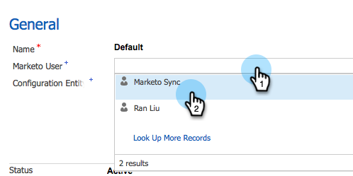

# 第2步（共3步）設立Marketo動力（2015年On-Prem和2016年365年On-Prem）{#step-of-set-up-for-marketo-on-premises-and-365}

完成上述步驟的出色工作。 讓我們繼續過去。

>[!PREREQUISITES]
>
>[安裝MarketoDynamics 2015 On-Prem和2016 365 On-Prem步驟1（共3步）](/help/marketo/product-docs/crm-sync/microsoft-dynamics-sync/sync-setup/microsoft-dynamics-2015-on-premises-2016-dynamics-365-on-premises/step-1-of-3-install.md)

## 分配同步用戶角色{#assign-sync-user-role}

將「Marketo同步用戶」角色僅分配給Marketo同步用戶。 您不需要將它指派給任何其他使用者。

>[!NOTE]
>
>這適用於Marketo4.0.0.14版及更新版本。 對於舊版，所有使用者都必須具有同步使用者角色。 要升級您的Marketo，請參閱[升級MarketoMicrosoft Dynamics解決方案](/help/marketo/product-docs/crm-sync/microsoft-dynamics-sync/sync-setup/update-the-marketo-solution-for-microsoft-dynamics.md)。

1. 在&#x200B;**Settings**&#x200B;下，按一下&#x200B;**Security**。

   

1. 按一下&#x200B;**用戶**。

   

1. 您會在這裡看到使用者清單。 選擇專用的Marketo同步用戶，或與[Active Directory聯合服務](https://msdn.microsoft.com/en-us/library/bb897402.aspx)(ADFS)管理員聯繫，以建立專用的Marketo用戶。

   

1. 選擇同步用戶。 按一下&#x200B;**管理角色**。

   

   選中「Marketo同步用戶」 ，然後按一下「確定」。

   

   >[!TIP]
   >
   >如果您看不到角色，請返回至3](/help/marketo/product-docs/crm-sync/microsoft-dynamics-sync/sync-setup/microsoft-dynamics-2015-on-premises-2016-dynamics-365-on-premises/step-1-of-3-install.md)的[步驟1並匯入解決方案。

   >[!NOTE]
   >
   >同步使用者在您的CRM中進行的任何更新，都會將&#x200B;**not**&#x200B;同步回Marketo。

## 配置Marketo解決方案{#configure-marketo-solution}

快搞定了！ 在移至下一篇文章之前，我們只有最後幾段設定。

1. 在&#x200B;**Settings**&#x200B;下，按一下&#x200B;**Marketo配置**。

   

   >[!NOTE]
   >
   >如果缺少「Marketo配置」，請嘗試刷新頁面。 如果問題持續存在，[將發佈Marketo解決方案](/help/marketo/product-docs/crm-sync/microsoft-dynamics-sync/sync-setup/microsoft-dynamics-2015-on-premises-2016-dynamics-365-on-premises/step-1-of-3-install.md)，或嘗試登出並返回。

1. 按一下&#x200B;**Default**。

   

1. 按一下&#x200B;**Marketo用戶**&#x200B;欄位並選擇同步用戶。

   

1. 按一下右下角的儲存圖示。

   

1. 按一下&#x200B;**發佈所有自定義**。

   

## 繼續執行步驟3 {#before-proceeding-to-step}之前

* 如果您想要限制同步的記錄數，[現在設定自訂同步篩選](/help/marketo/product-docs/crm-sync/microsoft-dynamics-sync/create-a-custom-dynamics-sync-filter.md)。
* 運行[驗證Microsoft Dynamics Sync](/help/marketo/product-docs/crm-sync/microsoft-dynamics-sync/sync-setup/validate-microsoft-dynamics-sync.md)進程。 它會驗證您的初始設定是否正確完成。
* 在Microsoft Dynamics CRM中登入「Marketo同步使用者」。

>[!MORELIKETHIS]
>
>[安裝MarketoDynamics 2015 On-Prem和2016 365 On-Prem步驟3（共3步）](/help/marketo/product-docs/crm-sync/microsoft-dynamics-sync/sync-setup/microsoft-dynamics-2015-on-premises-2016-dynamics-365-on-premises/step-3-of-3-connect.md)
