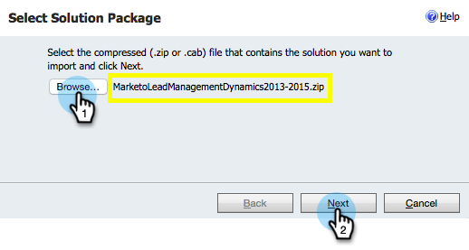

# 步驟3之1：為Marketo設定Sync使用者（2016內部部署/Dynamics 365內部部署） {#step-of-configure-sync-user-for-marketo-on-premises-2016}

您必須先在Dynamics中安裝Microsoft Dynamics解決方案，才能將內部部署Dynamics 2016/Dynamics 365與MarketoMarketo同步。

>[!NOTE]
>
>將Marketo同步至CRM後，新CRM就無法同步至現有的Marketo執行個體。

>[!PREREQUISITES]
>
>如果您使用Microsoft Dynamics內部部署，您必須擁有 [網際網路對向部署](https://www.microsoft.com/en-us/download/confirmation.aspx?id=41701) (IFD)與 [Active Directory同盟服務](https://msdn.microsoft.com/en-us/library/bb897402.aspx) 2.0+ (ADFS)已設定。 附註：當您按一下連結時，IFD檔案會自動下載。
>
>[下載Marketo銷售機會管理解決方案](/help/marketo/product-docs/crm-sync/microsoft-dynamics-sync/sync-setup/download-the-marketo-lead-management-solution.md) 開始之前。

>[!NOTE]
>
>**需要Dynamics管理員許可權。**
>
>您需要CRM系統管理員許可權才能執行此同步處理。

1. 登入 **動態。** 按一下 **Microsoft Dynamics CRM** 下拉式功能表並選取 **設定**.

   

1. 在 **設定**，選取 **解決方案**.

   

1. 按一下 **匯入**.

   

1. 按一下 **瀏覽** 並選取您的解決方案 [已下載](/help/marketo/product-docs/crm-sync/microsoft-dynamics-sync/sync-setup/download-the-marketo-lead-management-solution.md). 按一下 **下一個**.

   

1. 檢視解決方案資訊，然後按一下 **檢視解決方案套件詳細資料**.

   

1. 檢查完所有詳細資料後，按一下 **關閉**.

   

1. 返回「解決方案資訊」頁面，按一下 **下一個**.

   

1. 確認已選取SDK選項核取方塊。 按一下 **匯入**.

   

1. 等待匯入完成。

   >[!TIP]
   >
   >您必須啟用瀏覽器上的快顯視窗，才能完成安裝程式。

   

1. 下載記錄檔（如果您需要），然後按一下 **關閉**.

   >[!NOTE]
   >
   >您可能會看到顯示「Marketo銷售機會管理已完成，但有警告」的訊息。 這是完全正常的情況。

   

1. Marketo銷售機會管理現在會出現在 **所有解決方案** 頁面。

   

1. 選取Marketo解決方案並按一下 **發佈所有自訂**.

   

   擊掌！ 安裝完成。

   >[!CAUTION]
   >
   >停用任何Marketo SDK傳訊程式會導致安裝中斷！

   >[!MORELIKETHIS]
   >
   >[安裝Marketo for Dynamics 2015內部部署和2016 365內部部署步驟2/3](/help/marketo/product-docs/crm-sync/microsoft-dynamics-sync/sync-setup/microsoft-dynamics-2016-dynamics-365-on-premises/step-2-of-3-set-up.md)
