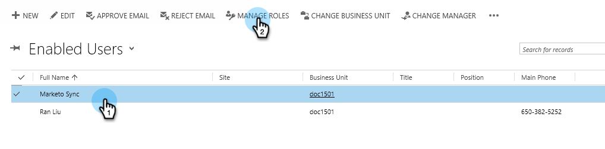

# Step 2 of 3 Set up Marketo for Dynamics (2016 On-Prem/Dynamics 365 On-Premises){#step-of-set-up-for-marketo-on-premises-2016}

Great job completing the previous steps. 讓我們繼續過去。

>[!PREREQUISITES]
>
>[Install Marketo for Microsoft Dynamics 2016/Dynamics 365 On-Premises Step 1 of 3](/help/marketo/product-docs/crm-sync/microsoft-dynamics-sync/sync-setup/microsoft-dynamics-2016-dynamics-365-on-premises/step-1-of-3-install.md)

## 分配同步用戶角色 {#assign-sync-user-role}

Assign the Marketo Sync User role only to the Marketo sync user. 您不需要將其指派給任何其他使用者。

>[!NOTE]
>
>This applies to Marketo version 4.0.0.14 and later. 對於較舊版本，所有使用者都必須具有同步使用者角色。 To upgrade your Marketo, see [Upgrade the Marketo Solution for Microsoft Dynamics](/help/marketo/product-docs/crm-sync/microsoft-dynamics-sync/sync-setup/update-the-marketo-solution-for-microsoft-dynamics.md).

>[!IMPORTANT]
>
>The language setting of the Sync User [should be set to English](https://portal.dynamics365support.com/knowledgebase/article/KA-01201/en-us).

1. 在 **設定**，按一下 **安全性**.

   

1. 按一下 **使用者**.

   

1. 您會在此處看到使用者清單。 選取專屬的Marketo Sync使用者，或聯絡您的 [Active Directory聯合身份驗證服務](https://msdn.microsoft.com/en-us/library/bb897402.aspx)(ADFS)管理員，為Marketo建立專用使用者。

   

1. 選擇同步用戶。 Click **Manage Roles**.

   

   檢查Marketo同步用戶，然後按一下確定。

   

   >[!TIP]
   >
   >如果您沒有看見角色，請返回 [步驟1至3](/help/marketo/product-docs/crm-sync/microsoft-dynamics-sync/sync-setup/microsoft-dynamics-2016-dynamics-365-on-premises/step-1-of-3-install.md) 並匯入解決方案。

   >[!NOTE]
   >
   >Any updates made in your CRM by the Sync User will **not** be synced back to Marketo.

## 設定Marketo解決方案 {#configure-marketo-solution}

快完成了！ 我們只有最後幾段配置，然後再轉到下一篇文章。

1. 在 **設定**，按一下 **Marketo設定**.

   

   >[!NOTE]
   >
   >如果缺少Marketo設定，請嘗試重新整理頁面。 如果問題持續存在， [發佈Marketo解決方案](/help/marketo/product-docs/crm-sync/microsoft-dynamics-sync/sync-setup/microsoft-dynamics-2016-dynamics-365-on-premises/step-1-of-3-install.md) 或嘗試登出再登入。

1. 按一下 **預設**.

   

1. 按一下 **Marketo使用者** 欄位，然後選取同步使用者。

   

1. 按一下右下角的儲存圖示。

   

1. 按一下 **發佈所有自訂**.

   

## Before Proceeding to Step 3 {#before-proceeding-to-step}

* 如果要限制同步的記錄數， [設定自訂同步篩選器](/help/marketo/product-docs/crm-sync/microsoft-dynamics-sync/create-a-custom-dynamics-sync-filter.md) 現在。
* 執行 [驗證Microsoft Dynamics同步](/help/marketo/product-docs/crm-sync/microsoft-dynamics-sync/sync-setup/validate-microsoft-dynamics-sync.md) 程式。 它會驗證您的初始設定是否正確執行。
* Log in to the Marketo Sync User in Microsoft Dynamics CRM.

>[!MORELIKETHIS]
>
>[安裝Marketo for Microsoft Dynamics 2016/Dynamics 365內部部署步驟3（共3步）](/help/marketo/product-docs/crm-sync/microsoft-dynamics-sync/sync-setup/microsoft-dynamics-2016-dynamics-365-on-premises/step-3-of-3-connect.md)
