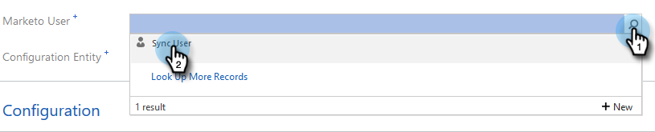

# 第2步（共3步）:使用資源擁有者密碼控制連線設定Marketo解決方案 {#step-2-of-3-set-up-the-marketo-solution-ropc}

讓我們透過建立使用者帳戶開始使用。

>[!PREREQUISITES]
>
>[第1步，共4步：安裝具有資源擁有者密碼控制連線的Marketo解決方案](/help/marketo/product-docs/crm-sync/microsoft-dynamics-sync/sync-setup/microsoft-dynamics-365-with-ropc-connection/step-1-of-4-install.md)

## 建立新使用者 {#create-a-new-user}

1. 登入Dynamics。 按一下「設定」圖示並選取 **進階設定**.

   

1. 按一下 **設定** 選取 **安全性**.

   

1. 按一下 **使用者**.

   

1. 按一下 **新增。**

   

1. 按一下 **添加和許可用戶** 在新視窗中。

   

1. 隨即開啟新索引標籤。 按一下 **管理** 頁面頂端。

   

1. 另一個新索引標籤隨即開啟。 按一下 **新增使用者**.

   

1. 輸入所有資訊。 完成後，按一下 **新增**.

   

   >[!NOTE]
   >
   >此名稱必須是專用的同步用戶，而不是現有CRM用戶的帳戶。 它不需要是實際的電子郵件地址。

1. 輸入要接收新用戶憑據的電子郵件，然後按一下 **傳送電子郵件並關閉**.

   

## 分配同步用戶角色 {#assign-sync-user-role}

僅將Marketo同步使用者角色指派給Marketo同步使用者。 您不需要將其指派給任何其他使用者。

>[!NOTE]
>
>這適用於Marketo 4.0.0.14版和更新版本。 對於較舊版本，所有使用者都必須具有同步使用者角色。 若要升級Marketo，請參閱 [升級Marketo Dynamics適用的Microsoft解決方案](/help/marketo/product-docs/crm-sync/microsoft-dynamics-sync/sync-setup/update-the-marketo-solution-for-microsoft-dynamics.md).

>[!IMPORTANT]
>
>同步用戶的語言設定 [應設為英文](https://portal.dynamics365support.com/knowledgebase/article/KA-01201/en-us).

1. 返回「已啟用的用戶」頁簽並刷新用戶清單。

   

1. 將滑鼠指標暫留在新建立的Marketo同步使用者旁，畫面就會顯示核取方塊。 按一下以選取。

   

1. 按一下 **管理角色**.

   

1. 檢查 **Marketo同步使用者** 按一下 **確定**.

   

   >[!NOTE]
   >
   >同步使用者在您的CRM中進行的任何更新都將 **not** 同步回Marketo。

## 設定Marketo解決方案 {#configure-marketo-solution}

快到了！ 我們只需將新使用者建立的相關資訊告知Marketo解決方案即可。

1. 返回「進階設定」區段，然後按一下  表徵圖，然後選擇 **Marketo設定**.

   

   >[!NOTE]
   >
   >如果你沒看到 **Marketo設定** 在「設定」功能表中，重新整理頁面。 如果那行不通，試試 [發佈Marketo解決方案](/help/marketo/product-docs/crm-sync/microsoft-dynamics-sync/sync-setup/microsoft-dynamics-365-with-ropc-connection/step-1-of-4-install.md) 再次登出或重新登入。

1. 按一下 **預設**.

   

1. 按一下 **Marketo使用者** 欄位，然後選取您建立的同步使用者。

   

1. 按一下  圖示以儲存變更。

   

1. 按一下 **X** 在右上方以關閉畫面。

   

1. 按一下  表徵圖，然後選擇 **解決方案**.

   

1. 按一下 **發佈所有自訂** 按鈕。

   

## 繼續執行步驟3之前 {#before-proceeding-to-step}

    *如果要限制同步的記錄數，請立即[設定自訂同步篩選器](/help/marketo/product-docs/crm-sync/microsoft-dynamics-sync/create-a-custom-dynamics-sync-filter.md)。
    *執行[驗證Microsoft Dynamics同步](/help/marketo/product-docs/crm-sync/microsoft-dynamics-sync/sync-setup/validate-microsoft-dynamics-sync.md)程式。 它會驗證您的初始設定是否正確執行。
    *在Microsoft Dynamics CRM中登入Marketo同步使用者。

>[!MORELIKETHIS]
>
>[第3步（共3步）:將Marketo解決方案與資源擁有者密碼控制連線連線](/help/marketo/product-docs/crm-sync/microsoft-dynamics-sync/sync-setup/microsoft-dynamics-365-with-ropc-connection/step-3-of-3-connect.md)
