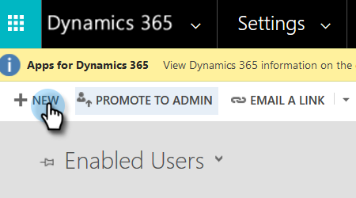
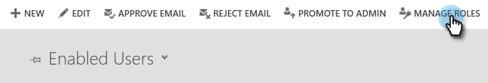

# 步驟4之2：使用資源擁有者密碼控制連線設定Marketo解決方案 {#step-2-of-4-set-up-the-marketo-solution-ropc}

讓我們從建立使用者帳戶開始。

>[!PREREQUISITES]
>
>[步驟4之1：安裝具有資源擁有者密碼控制連線的Marketo解決方案](/help/marketo/product-docs/crm-sync/microsoft-dynamics-sync/sync-setup/microsoft-dynamics-365-with-ropc-connection/step-1-of-4-install.md){target="_blank"}

## 建立新使用者 {#create-a-new-user}

1. 登入Dynamics。 按一下「設定」圖示並選取&#x200B;**[!UICONTROL 進階設定]**。

   

1. 按一下&#x200B;**[!UICONTROL 設定]**&#x200B;並選取&#x200B;**[!UICONTROL 安全性]**。

   

1. 按一下&#x200B;**[!UICONTROL 使用者]**。

   

1. 按一下&#x200B;**[!UICONTROL 新增]**。

   

1. 在新視窗中按一下&#x200B;**[!UICONTROL 新增並授權使用者]**。

   

1. 新標籤隨即開啟。 按一下頁面頂端的&#x200B;**[!UICONTROL 管理員]**。

   

1. 另一個新標籤隨即開啟。 按一下&#x200B;**[!UICONTROL 新增使用者]**。

   

   >[!IMPORTANT]
   >
   >同步使用者應該要有Marketo設定的讀取許可權。

1. 輸入您的所有資訊。 完成後，按一下&#x200B;**[!UICONTROL 新增]**。

   

   >[!NOTE]
   >
   >此名稱必須是專用的同步處理使用者，而非現有的CRM使用者帳戶。 它不需要是實際的電子郵件地址。

1. 輸入電子郵件以接收新的使用者認證，然後按一下&#x200B;**[!UICONTROL 傳送電子郵件並關閉]**。

   

## 指派同步使用者角色 {#assign-sync-user-role}

僅將Marketo同步使用者角色指派給Marketo同步使用者。 您不需要將其指派給任何其他使用者。

>[!NOTE]
>
>這適用於Marketo 4.0.0.14版和更新版本。 對於舊版，所有使用者都必須擁有同步使用者角色。 若要升級Marketo，請參閱[升級Microsoft Dynamics的Marketo解決方案](/help/marketo/product-docs/crm-sync/microsoft-dynamics-sync/sync-setup/update-the-marketo-solution-for-microsoft-dynamics.md){target="_blank"}。

>[!IMPORTANT]
>
>同步處理使用者[的語言設定應該設定為英文](https://portal.dynamics365support.com/knowledgebase/article/KA-01201/en-us){target="_blank"}。

1. 返回&#x200B;**[!UICONTROL 啟用的使用者]**&#x200B;索引標籤，然後重新整理使用者清單。

   

1. 將游標暫留在新建立的Marketo Sync使用者旁，核取方塊隨即出現。 按一下以選取它。

   

1. 按一下&#x200B;**[!UICONTROL 管理角色]**。

   

1. 檢查&#x200B;**[!UICONTROL Marketo Sync User]**&#x200B;並按一下&#x200B;**[!UICONTROL 確定]**。

   

   >[!NOTE]
   >
   >同步使用者在您的CRM中所做的任何更新將&#x200B;_不會_&#x200B;同步回Marketo。

## 設定Marketo解決方案 {#configure-marketo-solution}

即將完成！ 我們只剩下通知Marketo解決方案有關建立的新使用者。

1. 返回「進階設定」區段，按一下「設定」旁的圖示，然後選取&#x200B;**[!UICONTROL Marketo設定]**。

   

   >[!NOTE]
   >
   >如果您在[設定]功能表中看不到&#x200B;**[!UICONTROL Marketo設定]**，請重新整理頁面。 如果仍無法解決問題，請再試一次[發佈Marketo解決方案](/help/marketo/product-docs/crm-sync/microsoft-dynamics-sync/sync-setup/microsoft-dynamics-365-with-ropc-connection/step-1-of-4-install.md){target="_blank"}，或登出再重新登入。

1. 按一下&#x200B;**[!UICONTROL 預設]**。

   

1. 按一下&#x200B;**[!UICONTROL Marketo使用者]**&#x200B;欄位上的[搜尋]按鈕，然後選取您建立的同步使用者。

   

1. 按一下右下角的圖示以儲存變更。

   

1. 按一下右上角的&#x200B;**X**&#x200B;以關閉熒幕。

   

1. 按一下[設定]旁的圖示，然後選取&#x200B;**[!UICONTROL 解決方案]**。

   

1. 按一下&#x200B;**[!UICONTROL Publish所有自訂]**&#x200B;按鈕。

   

>[!MORELIKETHIS]
>
>[步驟4之3：使用資源擁有者密碼控制連線來連線Marketo解決方案](/help/marketo/product-docs/crm-sync/microsoft-dynamics-sync/sync-setup/microsoft-dynamics-365-with-ropc-connection/step-3-of-4-set-up.md){target="_blank"}
