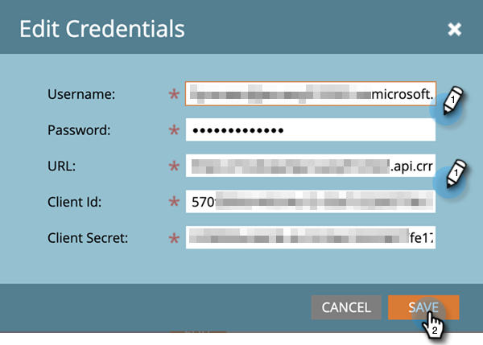

# 步驟4之4：使用資源擁有者密碼控制連線來連線Marketo解決方案 {#step-4-of-4-connect-the-marketo-solution-ropc}

這是同步的最後一個步驟。 您即將完成！

>[!PREREQUISITES]
>
>* [步驟4：使用資源擁有者密碼控制連線安裝Marketo解決方案](/help/marketo/product-docs/crm-sync/microsoft-dynamics-sync/sync-setup/microsoft-dynamics-365-with-ropc-connection/step-1-of-4-install.md)
>* [步驟2/4：使用資源擁有者密碼控制連線設定Marketo解決方案](/help/marketo/product-docs/crm-sync/microsoft-dynamics-sync/sync-setup/microsoft-dynamics-365-with-ropc-connection/step-2-of-4-set-up.md)
>* [步驟4之3：在MS Dynamics上設定使用者端應用程式](/help/marketo/product-docs/crm-sync/microsoft-dynamics-sync/sync-setup/microsoft-dynamics-365-with-ropc-connection/step-3-of-4-set-up.md)

>[!NOTE]
>
>**需要管理員許可權**

>[!NOTE]
>
>如果您要從基本驗證升級至OAuth，您可以使用 [本文](/help/marketo/product-docs/crm-sync/microsoft-dynamics-sync/sync-setup/reconfigure-dynamics-authentication-method.md) 以重新設定您的驗證。

## 輸入Dynamics同步使用者資訊 {#enter-dynamics-sync-user-information}

1. 登入Marketo並按一下 **管理員**.

   

1. 按一下 **CRM**.

   

1. 選取 **Microsoft**.

   

1. 按一下 **編輯** 在 **步驟1：輸入認證**.

   

   >[!CAUTION]
   >
   >請確定您的組織URL正確，因為我們在提交後無法回覆後續的結構描述變更。 如果使用不正確的組織URL，您必須取得新的Marketo訂閱。 如果您不知道URL， [在此處瞭解如何找到它](/help/marketo/product-docs/crm-sync/microsoft-dynamics-sync/sync-setup/view-the-organization-service-url.md).

   >[!NOTE]
   >
   >輸入新認證之前，您可以 [在這裡驗證它們](/help/marketo/product-docs/crm-sync/microsoft-dynamics-sync/sync-setup/validate-microsoft-dynamics-sync.md).

1. 輸入 **使用者名稱**， **密碼**， Microsoft Dynamics **URL**， **使用者端ID**、和 **使用者端密碼**. 按一下 **儲存** 完成時。

   

   >[!NOTE]
   >
   >Marketo中的使用者名稱必須與CRM中同步使用者的使用者名稱相符。 格式可以是 `user@domain.com` 或DOMAIN\user。

## 選取要同步的欄位 {#select-fields-to-sync}

1. 按一下 **編輯** 在 **步驟2：選取要同步的欄位**.

   

1. 選取您要同步至Marketo的欄位，以便預先選取它們。 按一下 **儲存**.

   

>[!NOTE]
>
>Marketo會儲存要同步之欄位的參考。 如果您刪除Dynamics中的欄位，建議您使用 [同步已停用](/help/marketo/product-docs/crm-sync/salesforce-sync/enable-disable-the-salesforce-sync.md). 然後編輯並儲存，重新整理Marketo中的結構描述 [選取要同步的欄位](/help/marketo/product-docs/crm-sync/microsoft-dynamics-sync/microsoft-dynamics-sync-details/microsoft-dynamics-sync-field-sync/editing-fields-to-sync-before-deleting-them-in-dynamics.md).

## 同步自訂篩選器的欄位 {#sync-fields-for-a-custom-filter}

如果您已建立自訂篩選器，請務必前往並選取要與Marketo同步的新欄位。

1. 前往「管理員」並選取「 」 **Microsoft Dynamics**.

   

1. 按一下 **編輯** 欄位同步詳細資訊。

   

1. 向下捲動至欄位並勾選它。 實際名稱必須是new_synctomkto，但「顯示名稱」可以是任何內容。 按一下 **儲存**.

   

## 啟用同步 {#enable-sync}

1. 按一下 **編輯** 在 **步驟3：啟用同步**.

   

   >[!CAUTION]
   >
   >Marketo不會針對Microsoft Dynamics同步處理或手動輸入人員或潛在客戶時自動進行重複資料刪除。

1. 閱讀快顯視窗中的所有內容，輸入您的電子郵件地址，然後按一下 **開始同步**.

   

1. 第一次同步可能需要幾個小時。 完成後，您將會收到電子郵件通知。

   

幹得好！

>[!MORELIKETHIS]
>
>[重新設定Dynamics驗證方法](/help/marketo/product-docs/crm-sync/microsoft-dynamics-sync/sync-setup/reconfigure-dynamics-authentication-method.md)