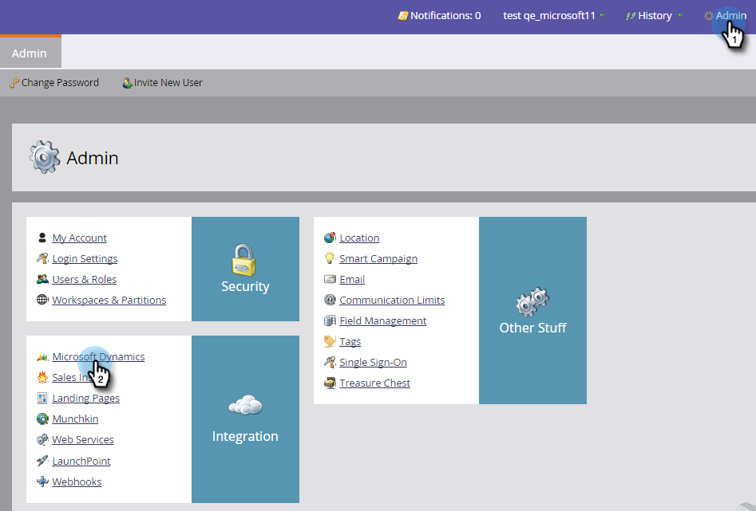

# 第4步（共4步）:將Marketo解決方案與資源所有者密碼控制連接連接 {#step-4-of-4-connect-the-marketo-solution-ropc}

這是同步的最後一步。 你快到了！

>[!PREREQUISITES]
>
>* [第1步（共4步）:安裝具有資源所有者密碼控制連接的Marketo解決方案](/help/marketo/product-docs/crm-sync/microsoft-dynamics-sync/sync-setup/microsoft-dynamics-365-with-ropc-connection/step-1-of-4-install.md)
>* [第2步（共4步）:設定具有資源所有者密碼控制連接的Marketo解決方案](/help/marketo/product-docs/crm-sync/microsoft-dynamics-sync/sync-setup/microsoft-dynamics-365-with-ropc-connection/step-2-of-4-set-up.md)
>* [第3步（共4步）:在MS Dynamics上設定客戶端應用](/help/marketo/product-docs/crm-sync/microsoft-dynamics-sync/sync-setup/microsoft-dynamics-365-with-ropc-connection/step-3-of-4-set-up.md)

>[!NOTE]
>
>**需要管理權限**

>[!NOTE]
>
>如果要從「基本身份驗證」升級到OAuth，則可以使用 [這篇文章](/help/marketo/product-docs/crm-sync/microsoft-dynamics-sync/sync-setup/reconfigure-dynamics-authentication-method.md) 重新配置身份驗證。

## 輸入Dynamics同步用戶資訊 {#enter-dynamics-sync-user-information}

1. 登錄Marketo並按一下 **管理**。

   

1. 按一下 **CRM**。

   

1. 選擇 **Microsoft**。

   

1. 按一下 **編輯** 在 **步驟1:輸入憑據**。

   

   >[!CAUTION]
   >
   >請確保您的組織URL正確，因為我們無法在提交後還原後續架構更改。 如果使用的組織URL不正確，則必須獲得新的Marketo訂閱。 如果你不知道URL, [瞭解如何在此處查找](/help/marketo/product-docs/crm-sync/microsoft-dynamics-sync/sync-setup/view-the-organization-service-url.md)。

   >[!NOTE]
   >
   >在輸入新憑據之前，您可以 [在此處驗證](/help/marketo/product-docs/crm-sync/microsoft-dynamics-sync/sync-setup/validate-microsoft-dynamics-sync.md)。

1. 輸入 **用戶名**。 **密碼**,Microsoft動力 **URL**。 **客戶端ID**, **客戶端密碼**。 按一下 **保存** 完成。

   

   >[!NOTE]
   >
   >Marketo的用戶名必須與CRM中同步用戶的用戶名匹配。 格式可以是 `user@domain.com` 或域\用戶。

## 選擇要同步的欄位 {#select-fields-to-sync}

1. 按一下 **編輯** 在 **步驟2:選擇要同步的欄位**。

   

1. 選擇要同步到Marketo的欄位，以便預選這些欄位。 按一下 **保存**。

   

>[!NOTE]
>
>Marketo儲存要同步的欄位的引用。 如果刪除Dynamics中的欄位，建議使用 [已禁用](/help/marketo/product-docs/crm-sync/salesforce-sync/enable-disable-the-salesforce-sync.md)。 然後通過編輯和保存在Marketo的架構 [選擇要同步的欄位](/help/marketo/product-docs/crm-sync/microsoft-dynamics-sync/microsoft-dynamics-sync-details/microsoft-dynamics-sync-field-sync/editing-fields-to-sync-before-deleting-them-in-dynamics.md)。

## 自定義篩選器的同步欄位 {#sync-fields-for-a-custom-filter}

如果已建立自定義篩選器，請確保進入並選擇要與Marketo同步的新欄位。

1. 轉到「管理」並選擇 **Microsoft動力**。

   

1. 按一下 **編輯** 欄位同步詳細資訊。

   

1. 向下滾動到欄位並檢查。 實際名稱必須為new_synctomkto，但「顯示名稱」可以是任何內容。 按一下 **保存**。

   

## 啟用同步 {#enable-sync}

1. 按一下 **編輯** 在 **第3步：啟用同步**。

   

   >[!CAUTION]
   >
   >Marketo不會針對MicrosoftDynamics同步或您手動輸入人員或線索時自動執行重複資料消除。

1. 閱讀彈出窗口中的所有內容，輸入您的電子郵件地址，然後按一下 **啟動同步**。

   

1. 第一次同步可能需要幾個小時。 完成後，您將收到電子郵件通知。

   

幹得漂亮！

>[!MORELIKETHIS]
>
>[重新配置Dynamics身份驗證方法](/help/marketo/product-docs/crm-sync/microsoft-dynamics-sync/sync-setup/reconfigure-dynamics-authentication-method.md)