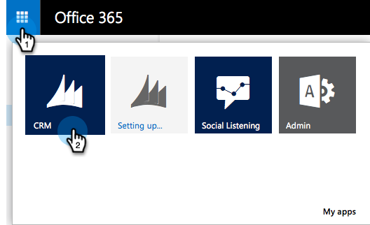

# 步驟3之1：安裝具有伺服器對伺服器連線的Marketo解決方案 {#step-1-of-3-install-the-marketo-solution-s2s}

在同步Microsoft Dynamics 365和Marketo之前，您必須先在Dynamics中安裝Marketo解決方案。 **需要Dynamics管理員許可權。**

>[!CAUTION]
>
>* 初始同步處理完成之前，請勿啟用自訂實體同步處理。 初始同步完成後，您將會收到電子郵件通知。

>[!NOTE]
>
>將Marketo同步至CRM後，如果不取代執行個體，就無法執行新的同步。

>[!PREREQUISITES]
>
>[下載Marketo銷售機會管理解決方案](/help/marketo/product-docs/crm-sync/microsoft-dynamics-sync/sync-setup/download-the-marketo-lead-management-solution.md)

1. 登入 **[Microsoft Office 365](https://login.microsoftonline.com/)**.

   

1. 按一下  功能表並選取 **CRM**.

   

1. 按一下  功能表。 在下拉式選單中選取 **設定** 然後選取 **解決方案**.

   

1. 按一下 **匯入。**

   

1. 按一下 **選擇檔案。** 選取您的Marketo銷售機會管理解決方案 [已下載](/help/marketo/product-docs/crm-sync/microsoft-dynamics-sync/sync-setup/download-the-marketo-lead-management-solution.md). 按一下 **下一個**.

   

1. 檢視解決方案資訊，然後按一下 **檢視解決方案套件詳細資料**.

   

1. 檢查完所有詳細資料後，按一下 **關閉**.

   

1. 現在，返回解決方案資訊頁面，按一下 **下一個**.

   

1. 確認已選取SDK選項核取方塊。 按一下 **匯入**.

   

   >[!TIP]
   >
   >您必須啟用瀏覽器上的快顯視窗，才能完成安裝程式。

1. 現在請等待匯入完成。 站起來做一些伸展。

   

1. 按一下 **關閉。**

   >[!NOTE]
   >
   >您可能會看到顯示「Marketo銷售機會管理已完成，但有警告」的訊息。 這是完全正常的情況。

   

1. Marketo銷售機會管理現在會出現在解決方案清單中。

   

1. 選取 **Marketo銷售機會管理** 並按一下 **發佈所有自訂。**

   

   擊掌！ 安裝完成。

   >[!MORELIKETHIS]
   >
   >[步驟3之2：使用S2S連線設定Marketo解決方案](/help/marketo/product-docs/crm-sync/microsoft-dynamics-sync/sync-setup/microsoft-dynamics-365-with-s2s-connection/step-2-of-3-set-up.md)
