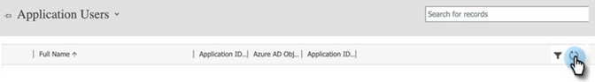
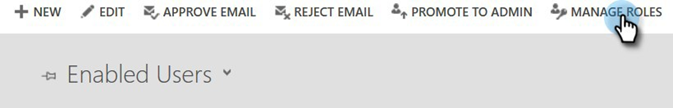
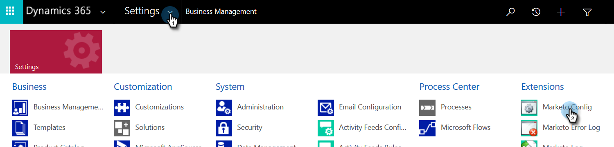

# 第2步（共3步）:使用伺服器對伺服器連線設定Marketo解決方案 {#step-2-of-3-set-up-marketo-sync-user-in-dynamics-s2s}

>[!PREREQUISITES]
>
>[第1步（共3步）:安裝具有伺服器對伺服器連線的Marketo解決方案](/help/marketo/product-docs/crm-sync/microsoft-dynamics-sync/sync-setup/microsoft-dynamics-365-with-s2s-connection/step-1-of-3-install.md)

## 在Azure AD中建立客戶端應用程式 {#create-client-application-in-azure-ad}

1. 導覽至 [這篇Microsoft文章](https://docs.microsoft.com/en-us/powerapps/developer/common-data-service/walkthrough-register-app-azure-active-directory#create-an-application-registration).

1. 請遵循所有步驟。 在步驟3中，輸入相關的應用程式名稱(例如「Marketo整合」)。 在「支援的帳戶類型」下，選擇 **僅此組織目錄中的帳戶**.

1. 記下應用程式ID(ClientId)和租用戶ID。 你以後要進Marketo。

1. 依照下列步驟授與管理員同意 [本文](/help/marketo/product-docs/crm-sync/microsoft-dynamics-sync/sync-setup/grant-consent-for-client-id-and-app-registration.md).

1. 按一下「 」，在管理中心產生用戶端密碼 **憑證與機密**.

   

1. 按一下 **新用戶端密碼** 按鈕。

   

1. 輸入客戶端密碼說明，然後按一下 **新增**.

   

>[!CAUTION]
>
>請務必記下「用戶端密碼」值（請見下方螢幕擷取畫面），因為您稍後會需要它。 它只顯示一次，您將無法再擷取它。

1. 請依照下列連結中的步驟操作： [在Microsoft中設定應用程式使用者](https://docs.microsoft.com/en-us/powerapps/developer/common-data-service/use-single-tenant-server-server-authentication#application-user-creation). 為應用程式使用者授予權限時，將其指派給「Marketo同步使用者角色」。

## Azure AD Federated與AD FS內部部署 {#azure-ad-federated-with-ad-fs-on-prem}

Federated Azure AD到ADFS Onprem需要為特定應用程式建立家庭領域發現策略。 使用此策略，Azure AD將驗證請求重定向到聯合身份驗證服務。 必須在AD Connect中為此啟用密碼哈希同步。 如需詳細資訊，請參閱 [OAuth與ROPC](https://docs.microsoft.com/en-us/azure/active-directory/develop/v2-oauth-ropc) 和 [為應用程式設定hrd策略](https://docs.microsoft.com/en-us/azure/active-directory/manage-apps/configure-authentication-for-federated-users-portal#example-set-an-hrd-policy-for-an-application).

其他參考 [可在此處找到](https://docs.microsoft.com/en-us/azure/active-directory/reports-monitoring/concept-all-sign-ins#:~:text=Interactive%20user%20sign%2Dins%20are,as%20the%20Microsoft%20Authenticator%20app.&amp;text=此%20report%20ass%20includes%20federated,are%20federated%20to%20Azure%20AD。).

## 分配同步用戶角色 {#assign-sync-user-role}

1. 僅將Marketo同步使用者角色指派給Marketo同步使用者。

>[!NOTE]
>
>這適用於Marketo 4.0.0.14版和更新版本。 對於較舊版本，所有使用者都必須具有同步使用者角色。 若要升級您的Marketo解決方案， [請參閱這篇文章](/help/marketo/product-docs/crm-sync/microsoft-dynamics-sync/sync-setup/update-the-marketo-solution-for-microsoft-dynamics.md).

1. 返回「應用程式用戶」頁簽並刷新用戶清單。

   

1. 將滑鼠指標暫留在新建立的「應用程式」使用者旁，便會顯示核取方塊。 按一下以選取。

   

1. 按一下 **管理角色**.

   

1. 檢查 **Marketo同步使用者** 按一下 **確定**.

   

## 設定Marketo解決方案 {#configure-marketo-solution}

快到了！ 我們只需將新使用者建立的相關資訊告知Marketo解決方案即可。

>[!IMPORTANT]
>
>如果您從基本驗證升級為OAuth，您需要聯絡 [Marketo支援](https://nation.marketo.com/t5/support/ct-p/Support) 以取得更新其他參數的協助。 啟用此功能將暫時停止同步，直到輸入新憑據並重新啟用同步為止。 如果您想要回復成舊的驗證模式，則可停用此功能（直到2022年4月）。

1. 返回「進階設定」區段，然後按一下  表徵圖，然後選擇 **Marketo設定**.

   

   >[!NOTE]
   >
   >如果你沒看到 **Marketo設定** 在「設定」功能表中，重新整理頁面。 如果那行不通，試試 [發佈Marketo解決方案](/help/marketo/product-docs/crm-sync/microsoft-dynamics-sync/sync-setup/microsoft-dynamics-365-with-s2s-connection/step-1-of-3-install.md) 再次登出或重新登入。

1. 按一下 **預設**.

   

1. 按一下 **Marketo使用者** 欄位，然後選取您建立的同步使用者。

   

1. 按一下  圖示以儲存變更。

   

1. 按一下 **X** 在右上方以關閉畫面。

   

1. 按一下  表徵圖，然後選擇 **解決方案**.

   

1. 按一下 **發佈所有自訂** 按鈕。

   

## 繼續執行步驟3之前 {#before-proceeding-to-step}

* 如果要限制同步的記錄數， [設定自訂同步篩選器](/help/marketo/product-docs/crm-sync/microsoft-dynamics-sync/create-a-custom-dynamics-sync-filter.md) 現在。
* 執行 [驗證Microsoft Dynamics同步](/help/marketo/product-docs/crm-sync/microsoft-dynamics-sync/sync-setup/validate-microsoft-dynamics-sync.md) 程式。 它會驗證您的初始設定是否正確執行。
* 登入Microsoft Dynamics CRM中的Marketo同步使用者。

>[!MORELIKETHIS]
>
>[第3步（共3步）:將Marketo解決方案與伺服器連線連線](/help/marketo/product-docs/crm-sync/microsoft-dynamics-sync/sync-setup/microsoft-dynamics-365-with-s2s-connection/step-3-of-3-connect.md)
