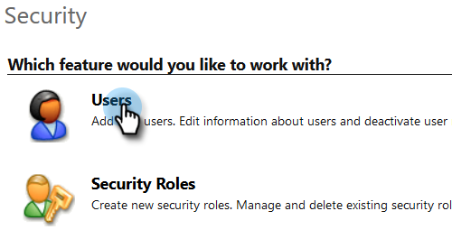
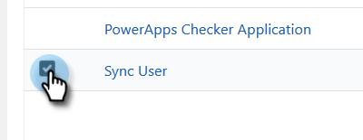

# 第2步（共3步）:在Dynamics {#step-of-set-up-marketo-sync-user-in-dynamics}中設定Marketo同步使用者

讓我們透過建立使用者帳戶開始使用。

>[!PREREQUISITES]
[第1步（共3步）:安裝Marketo解決方案（線上）](/help/marketo/product-docs/crm-sync/microsoft-dynamics-sync/sync-setup/microsoft-dynamics-365/step-1-of-3-install.md)>
>

## 建立新用戶{#create-a-new-user}

1. 登入Dynamics。 按一下「設定」表徵圖，然後選擇&#x200B;**高級設定**。

   

1. 按一下「**設定**」並選擇「**安全**」。

   

1. 按一下「**用戶**」。

   

1. 按一下「**新建」。**

   

1. 在新窗口中，按一下「**添加和許可用戶**」。

   

1. 隨即開啟新索引標籤。 按一下頁面頂端的&#x200B;**管理**。

   

1. 另一個新索引標籤隨即開啟。 按一下&#x200B;**新增使用者**。

   

1. 輸入所有資訊。 完成後，按一下&#x200B;**Add**。

   

   >[!NOTE]
   此名稱必須是專用的同步用戶，而不是現有CRM用戶的帳戶。 它不需要是實際的電子郵件地址。

1. 輸入要接收新用戶憑據的電子郵件，然後按一下「發送電子郵件並關閉&#x200B;**」。**

   

## 分配同步用戶角色{#assign-sync-user-role}

僅將Marketo同步使用者角色指派給Marketo同步使用者。 您不需要將其指派給任何其他使用者。

>[!NOTE]
這適用於Marketo 4.0.0.14版和更新版本。 對於較舊版本，所有使用者都必須具有同步使用者角色。 若要升級Marketo，請參閱[升級Microsoft Dynamics的Marketo解決方案](/help/marketo/product-docs/crm-sync/microsoft-dynamics-sync/sync-setup/update-the-marketo-solution-for-microsoft-dynamics.md)。

>[!IMPORTANT]
同步用戶[的語言設定應設定為English](https://portal.dynamics365support.com/knowledgebase/article/KA-01201/en-us)。

1. 返回「已啟用的用戶」頁簽並刷新用戶清單。

   

1. 將滑鼠指標暫留在新建立的Marketo同步使用者旁，畫面就會顯示核取方塊。 按一下以選取。

   

1. 按一下「**管理角色**」。

   

1. 檢查&#x200B;**Marketo同步用戶**，然後按一下&#x200B;**確定**。

   

   >[!NOTE]
   同步使用者在您的CRM中進行的任何更新都會&#x200B;**not**&#x200B;同步回Marketo。

## 配置Marketo解決方案{#configure-marketo-solution}

快到了！ 我們只需將新使用者建立的相關資訊告知Marketo解決方案即可。

1. 返回「高級設定」部分，按一下「設定」旁的表徵圖，然後選擇&#x200B;**Marketo配置**。

   

   >[!NOTE]
   如果您在「設定」功能表中未看到&#x200B;**Marketo設定**，請重新整理頁面。 如果無法運作，請嘗試再次[發佈Marketo解決方案](/help/marketo/product-docs/crm-sync/microsoft-dynamics-sync/sync-setup/microsoft-dynamics-365/step-1-of-3-install.md)或登出再登入。

1. 按一下&#x200B;**預設**。

   

1. 按一下&#x200B;**Marketo User**&#x200B;欄位上的搜索按鈕，然後選擇您建立的同步用戶。

   

1. 按一下右下角的圖示以儲存變更。

   

1. 按一下右上角的&#x200B;**X**&#x200B;以關閉畫面。

   

1. 按一下「設定」旁的圖示，然後選取&#x200B;**Solutions**。

   

1. 按一下&#x200B;**發佈所有自定義項**&#x200B;按鈕。

   

## 繼續執行步驟3之前{#before-proceeding-to-step}

    *如果要限制同步的記錄數，請立即[設定自訂同步篩選器](/help/marketo/product-docs/crm-sync/microsoft-dynamics-sync/create-a-custom-dynamics-sync-filter.md)。
    *運行[驗證Microsoft Dynamics同步](/help/marketo/product-docs/crm-sync/microsoft-dynamics-sync/sync-setup/validate-microsoft-dynamics-sync.md)進程。它會驗證您的初始設定是否正確執行。
    *在Microsoft Dynamics CRM中登入Marketo同步使用者。

>[!MORELIKETHIS]
[第3步（共3步）:將Microsoft Dynamics與Marketo連接（線上）](/help/marketo/product-docs/crm-sync/microsoft-dynamics-sync/sync-setup/microsoft-dynamics-365/step-3-of-3-connect.md)
