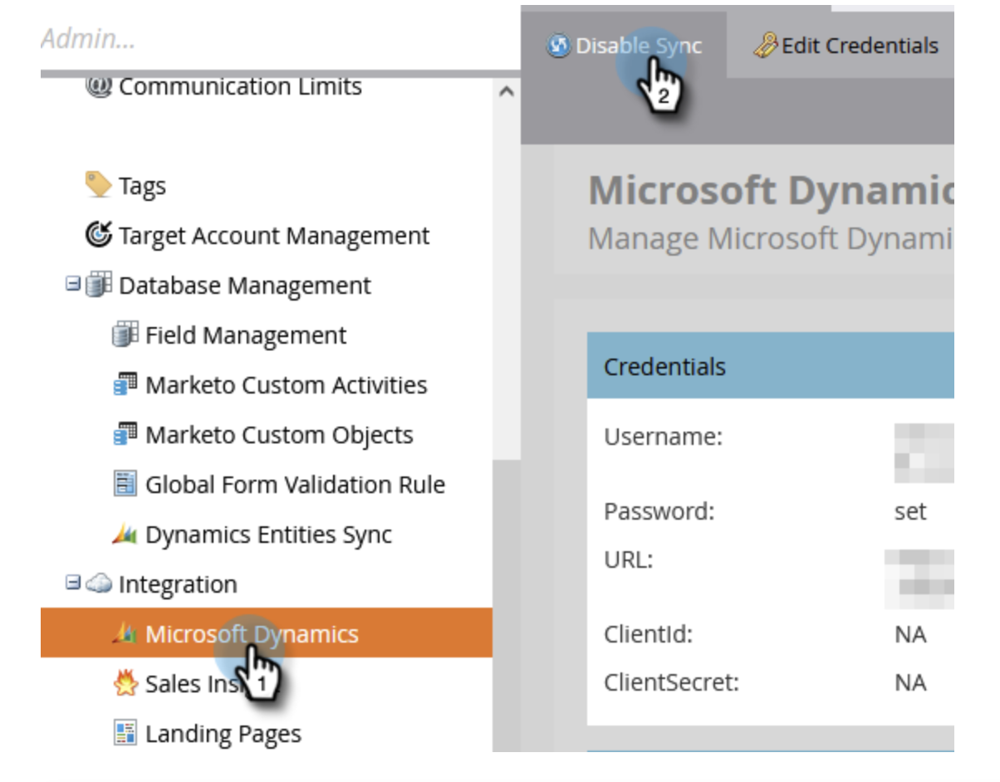
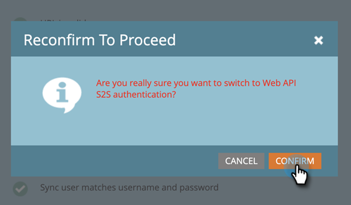

# 重新配置Dynamics身份驗證方法 {#reconfigure-dynamics-authentication-method}

請依照下列步驟更新Dynamics驗證方法。

>[!PREREQUISITES]
>
>使用下列任一文章中所需的驗證方法，在Microsoft Dynamics和Active Directory(Azure AD/ADFS)中設定應用程式：
>
>* [第2步（共3步）:使用伺服器對伺服器連線設定Marketo解決方案](/help/marketo/product-docs/crm-sync/microsoft-dynamics-sync/sync-setup/microsoft-dynamics-365-with-s2s-connection/step-2-of-3-set-up.md)
>* [第2步，共4步：使用資源擁有者密碼控制連線設定Marketo解決方案](/help/marketo/product-docs/crm-sync/microsoft-dynamics-sync/sync-setup/microsoft-dynamics-365-with-ropc-connection/step-2-of-4-set-up.md)

1. 在Marketo中按一下 **管理**.

   

1. 按一下 **Microsoft Dynamics**，然後 **禁用同步**.

   

   >[!NOTE]
   >
   >必須暫時禁用全局同步才能更新身份驗證方法。

1. 按一下 **重新設定新的驗證方法** 標籤。

   

1. 選取所需的新驗證方法（在此範例中，我們選擇Web API）。

   

1. 輸入新身份驗證方法所需的憑據，然後按一下 **驗證**.

   

   >[!NOTE]
   >
   >* 特定欄位會依所選的驗證方法而有所不同，且表單會根據先前的驗證方法自動更新。
   >* 如果您之前已同步，系統可能會預先填入上表格中的資料。 請重新輸入所有憑據以確保正確的值。

1. 如果一切正常，則「驗證同步」會產生所有綠色勾號 . 檢閱訊息，然後按一下 **交換機** 以更新驗證方法。

   

   >[!NOTE]
   >
   >如果您看到 ，此步驟會有問題。 請參閱 [修正Dynamics驗證同步問題](/help/marketo/product-docs/crm-sync/microsoft-dynamics-sync/sync-setup/validate-microsoft-dynamics-sync/fix-dynamics-validation-sync-issues.md) 來識別並解決問題。 然後重新執行同步驗證步驟，直到結果看起來像上圖。

1. 按一下 **確認** 繼續。

   

1. 按一下 **確認** 。

   

1. 按一下 **確定**.

   >[!IMPORTANT]
   >
   >系統需要15分鐘才能接受新的驗證模式。 請等待15分鐘，然後重新啟用同步。
