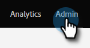

# 重新設定Dynamics驗證方法 {#reconfigure-dynamics-authentication-method}

請依照下列步驟更新您的Dynamics驗證方法。

>[!PREREQUISITES]
>
>使用以下任一文章中的所需驗證方法，在Microsoft Dynamics和Active Directory (Azure AD/ADFS)中設定應用程式：
>
>* [步驟3之2：設定具有伺服器對伺服器連線的Marketo解決方案](/help/marketo/product-docs/crm-sync/microsoft-dynamics-sync/sync-setup/microsoft-dynamics-365-with-s2s-connection/step-2-of-3-set-up.md)
>* [步驟4之2：使用資源擁有者密碼控制連線設定Marketo解決方案](/help/marketo/product-docs/crm-sync/microsoft-dynamics-sync/sync-setup/microsoft-dynamics-365-with-ropc-connection/step-2-of-4-set-up.md)

1. 在Marketo中按一下 **管理員**.

   

1. 按一下 **Microsoft Dynamics**，然後 **停用同步**.

   

   >[!NOTE]
   >
   >您必須暫時停用全域同步才能更新驗證方法。

1. 按一下 **重新設定新的驗證方法** 標籤。

   

1. 選取想要的新驗證方法（在此範例中，我們選擇Web API）。

   

1. 輸入新驗證方法所需的認證，然後按一下 **驗證**.

   

   >[!NOTE]
   >
   >* 特定欄位將因選擇的驗證方法而異，表單將根據之前的驗證方法自動更新。
   >* 如果您之前已同步，上述表單中的資料可能會預先填入。 請重新輸入所有認證，以確保值正確無誤。

1. 如果一切正常，驗證同步將會產生所有綠色核取標籤 . 檢閱訊息並按一下 **切換** 更新驗證方法。

   

   >[!NOTE]
   >
   >如果您看到 ，該步驟有一個問題。 另請參閱 [修正Dynamics驗證同步問題](/help/marketo/product-docs/crm-sync/microsoft-dynamics-sync/sync-setup/validate-microsoft-dynamics-sync/fix-dynamics-validation-sync-issues.md) 以找出並修正問題。 然後重新執行同步驗證步驟，直到結果如上圖所示。

1. 按一下 **確認** 以繼續進行。

   

1. 按一下 **確認** 再來一次。

   

1. 按一下 **確定**.

   >[!IMPORTANT]
   >
   >系統需要15分鐘的時間來接受新的驗證模式。 請於切換後等待15分鐘，再重新啟用同步處理。
