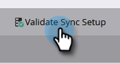

# 設定線上{#set-up-microsoft-dynamics-crm-app-for-online}的Microsoft Dynamics CRM應用程式

## 設定Microsoft Dynamics CRM線上應用程式{#set-up-microsoft-dynamics-crm-app-for-online}

1. 導覽至https://docs.microsoft.com/en-us/powerapps/developer/common-data-service/walkthrough-register-app-azure-active-directory#create-an-application-registration。

1. 請遵循所有步驟。 在步驟3中，輸入相關的應用程式名稱（例如「Marketo Integration」）。 在「受支援的帳戶類型」下，選取「僅限此組織目錄中的帳戶」。

1. 記下應用程式ID(ClientId)。 您稍後必須在Marketo中加入。

1. 依照本文[中的步驟，授與管理員同意。](/help/marketo/product-docs/crm-sync/microsoft-dynamics-sync/sync-setup/set-up-oauth-authentication-for-dynamics/grant-consent-for-client-id-and-app-registration.md)

1. 按一下「憑證與機密」****，在管理中心產生「用戶端機密」。

   

1. 按一下「**新客戶機密碼**」。

   

1. 新增用戶端密碼說明，然後按一下&#x200B;**Add**。

   

   >[!CAUTION]
   >
   >請務必記下「用戶端密碼」值（如下方的螢幕擷取所示），因為您稍後會需要它。 它只顯示一次，您將無法再擷取它。

   

Marketo會使用grant_type資源擁有者密碼認證(ROPC)，以OAuth驗證Azure AD。 此方案需要為特定應用程式建立「主領域搜索」策略。 使用此策略，Azure AD會將驗證請求重新導向至聯合服務。 必須在AD Connect中為此啟用口令散列同步。 如需詳細資訊，請參閱[OAuth with ROPC](https://docs.microsoft.com/en-us/azure/active-directory/develop/v2-oauth-ropc)和[設定應用程式的hrd原則](https://docs.microsoft.com/en-us/azure/active-directory/manage-apps/configure-authentication-for-federated-users-portal#example-set-an-hrd-policy-for-an-application)。

其他參考[可在此處找到](https://docs.microsoft.com/en-us/azure/active-directory/reports-monitoring/concept-all-sign-ins#:~:text=Interactive%20user%20sign%2Dins%20are,as%20the%20Microsoft%20Authenticator%20app.&amp;text=This%20report%20astle%20includes%20federated,are%20federated%20to%20Azure%20AD。)。

完成時，您應該&#x200B;**將Dynamics CRM產生的用戶端Id和密碼輸入Marketo**。

## 在Marketo {#enter-the-dynamics-crm-generated-client-id-and-secret-into-marketo}中輸入Dynamics CRM產生的用戶端Id和密碼

以下步驟適用於Online _和_ On-prem版本。

1. 在Marketo中，按一下&#x200B;**管理**。

   

1. 按一下&#x200B;**Microsoft Dynamics**。

   

1. 按一下&#x200B;**禁用同步**。

   

1. 在憑據旁，按一下&#x200B;**編輯**。

   

1. 輸入先前檢索到的&#x200B;**客戶端ID**&#x200B;和&#x200B;**客戶端密碼** ，然後按&#x200B;**保存**。

   

1. 按一下&#x200B;**驗證同步設定**。

   

1. 按一下&#x200B;**Next**。

   

1. 您應看到所有綠色勾號。 按一下&#x200B;**關閉**。

   

   >[!NOTE]
   >
   >如果您在綠色核取標籤中看到紅色X，請參閱[本文](/help/marketo/product-docs/crm-sync/microsoft-dynamics-sync/sync-setup/validate-microsoft-dynamics-sync/fix-dynamics-validation-sync-issues.md)以取得修正選項。

1. 按一下&#x200B;**啟用同步**。

   

就這樣！
