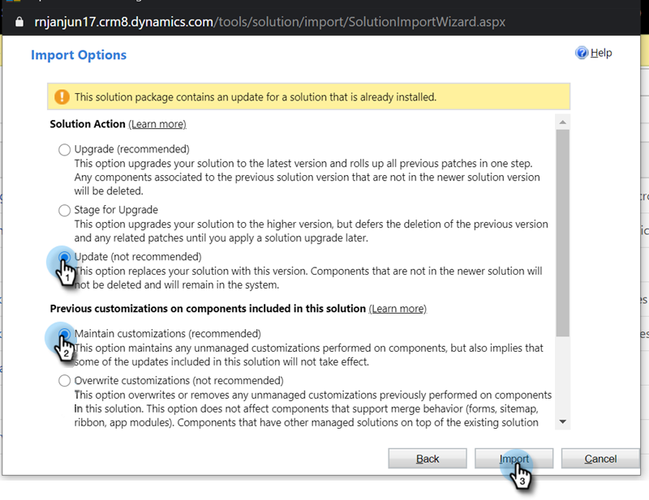

# 更新MarketoMicrosoft Dynamics解決方案{#update-the-marketo-solution-for-microsoft-dynamics}

當新的Microsoft Dynamics解決方案發行時，您可以從帳戶的「管理」區域下載升級。

>[!NOTE]
>
>**需要管理員權限**

>[!CAUTION]
>
>在執行任何升級之前，您必須先下載最新的Marketo解決方案&#x200B;_。_

1. 前往&#x200B;**Admin**&#x200B;區域。

   

1. 按一下&#x200B;**Microsoft Dynamics**。

   

1. 選擇&#x200B;**下載Marketo解決方案**。

   

1. 為您的Microsoft Dynamics版本選擇適當的解決方案。

   

   太棒了！ 解決方案的zip檔案現在會下載到您的裝置。 如果您不熟悉安裝步驟，請連絡您的動態管理員。

## 執行更新{#performing-the-update}

1. 匯入解決方案的最新版本，而不是Dynamics CRM的現有版本(例如：如果您的Dynamics CRM有1.4版，而最新版是1.5版，您應匯入&#x200B;_over_ 1.4版。

1. 您會看到下列快顯視窗。 選擇「**更新**&#x200B;和&#x200B;**維護自定義**」，然後按一下「導入&#x200B;**」。**

   

>[!CAUTION]
>
>選擇「升級」而非「更新」可能會在Dynamics環境中導致資料損毀。 **請務必在「導入選** 項」下選擇更新。
