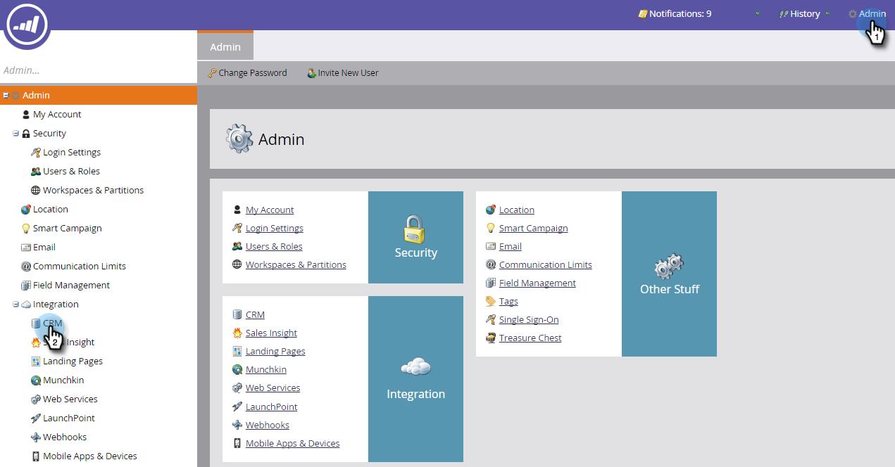

# 驗證Microsoft Dynamics同步 {#validate-microsoft-dynamics-sync}

>[!CAUTION]
>
>如果您的Dynamics同步處理已啟用多重驗證(MFA)，您必須停用它才能讓Dynamics正確與Marketo同步。 如需其他資訊，請聯絡 [Marketo支援](https://nation.marketo.com/t5/Support/ct-p/Support).

## 在Marketo中執行驗證同步 {#run-validate-sync-in-marketo}

執行「驗證同步」工具是非常重要的事，在兩者之間建立最終連線之前，請確定您的Microsoft Dynamics與Marketo同步已正確設定。 此程式會產生包含七個設定步驟的核對清單，以找出問題的所在。 驗證這些操作是否正確完成，可於稍後節省許多時間。

1. 按一下 **管理員** 標籤然後按一下 **Microsoft Dynamics** 整合區域中的連結。

   

1. 選取 **Microsoft**.

   

1. 按一下 **驗證同步處理設定** 標籤。

   

1. 輸入您的使用者名稱、密碼和URL （使用者端ID和使用者端密碼為選用）。 按一下 **下一個** 完成時。

   

   >[!NOTE]
   >
   >如果您之前已同步， **CRM** 在左側樹狀結構中將讀取 **Microsoft Dynamics**，上述表單中的資料可能會預先填入。

1. 如果一切正常，「驗證同步」會產生一個包含綠色核取記號的檢查清單 .

   

1. 如果您看到 ，則該步驟有一個問題。 另請參閱 [修正Dynamics驗證同步問題](/help/marketo/product-docs/crm-sync/microsoft-dynamics-sync/sync-setup/validate-microsoft-dynamics-sync/fix-dynamics-validation-sync-issues.md) 以識別及修正問題。 然後重新執行同步驗證步驟，直到結果看起來像上面的影像。

   >[!CAUTION]
   >
   >我們目前不支援Marketo Dynamics Sync的沙箱重新整理。 如果您需要重新整理Dynamics CRM沙箱，則需要新的Marketo沙箱。 如需其他詳細資訊，請聯絡Adobe客戶團隊（您的客戶經理）。

>[!MORELIKETHIS]
>
>[修正Dynamics驗證同步問題](/help/marketo/product-docs/crm-sync/microsoft-dynamics-sync/sync-setup/validate-microsoft-dynamics-sync/fix-dynamics-validation-sync-issues.md)
