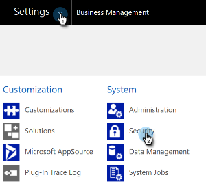

# 修復Dynamics驗證同步問題 {#fix-dynamics-validation-sync-issues}

## 驗證同步工具結果 {#validate-sync-tool-results}

運行Dynamics驗證同步時，它將生成報告。 如果有  在步驟旁邊，請參閱下面的選項以確定並解決問題。 然後，重新運行同步驗證步驟，直到結果顯示的只是綠色複選標籤。

## URL有效 {#url-is-valid}

如果你有  在此處，驗證URL是否有效。 在開發人員資源中找到它，然後查看組織服務。 URL可能由於多個原因無效。

1. 登錄到Dynamics。 按一下「設定」表徵圖，然後選擇 **高級設定**。

   

1. 按一下「設定」並選擇 **自定義**。

   

1. 按一下 **開發人員資源**。

   

1. 可以在服務終結點下找到組織服務URL。

   

## 用戶名和密碼有效 {#username-and-password-are-valid}

如果你有  在此，驗證您的Microsoft動態憑據是否有效。 對於Web API S2S身份驗證，Marketo中的用戶名必須與 [電子郵件地址](https://docs.microsoft.com/en-us/power-platform/admin/manage-application-users#view-or-edit-the-details-of-an-application-user) 的子目錄。 對於其他類型，它應與同步用戶的用戶名匹配。

## 同步用戶已分配給Marketo同步用戶角色 {#sync-user-is-assigned-to-the-marketo-sync-user-role}

如果你有  這裡，它可能是下面三個問題之一。

**選項一 — 驗證Marketo同步用戶角色是否已在MicrosoftDynamics中選中**:

1. 在Dynamics中，按一下「設定」表徵圖，然後選擇 **高級設定**。

   

1. 按一下 **設定** 選擇 **安全**。

   

1. 按一下 **用戶。**

   

1. 按一下同步用戶的連結。

   

1. 按一下 **管理角色**。

   

1. 驗證是否選中了Marketo同步用戶角色。 否則，檢查並按一下 **好。**

   

**選項二 — 確認授權同意**:

1. 查看 [授予客戶端ID和應用程式註冊的許可](/help/marketo/product-docs/crm-sync/microsoft-dynamics-sync/sync-setup/grant-consent-for-client-id-and-app-registration.md) 確認應用具有調用API的管理員許可。

**選項三 — 同步用戶**:

1. 驗證同步用戶是否已添加到Marketo配置。

## Marketo解決方案已正確安裝 {#marketo-solution-is-properly-installed}

如果你有  在此，轉到Microsoft動態，驗證Marketo安裝是否在。 請參閱MicrosoftDynamics設定文檔的步驟1。

1. 在Dynamics中，按一下「設定」表徵圖，然後選擇 **高級設定**。

   

1. 按一下 **設定** 選擇 **解決方案。**

   

1. 驗證是否已列出解決方案。

   

## 解決方案中的所有步驟都已啟用 {#all-steps-in-the-solution-are-enabled}

如果你有  在此，驗證是否未停用任何預設步驟。 所有步驟都在安裝時自動啟用，但可以在自定義期間停用。

## 同步用戶已分配給Marketo解決方案 {#sync-user-is-assigned-to-the-marketo-solution}

如果你有  在此，確保在MicrosoftDynamics的「Marketo預設」頁面上分配了「同步」用戶。

1. 在Dynamics中，按一下「設定」表徵圖，然後選擇 **高級設定**。

   

1. 按一下 **設定** 選擇 **Marketo配置**。

   

1. 驗證是否將同步用戶指定為預設值。

   

## 同步用戶與用戶名和密碼匹配 {#sync-user-matches-username-and-password}

如果你有  在此，請確保在MicrosoftDynamics的「Marketo配置預設設定」步驟的「Marketo用戶」欄位中分配正確的同步用戶。

>[!MORELIKETHIS]
>
>[驗證MicrosoftDynamics同步](/help/marketo/product-docs/crm-sync/microsoft-dynamics-sync/sync-setup/validate-microsoft-dynamics-sync.md)
