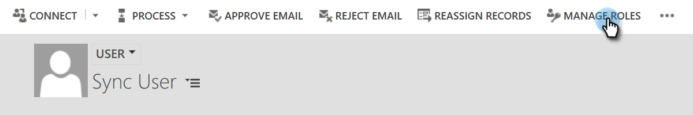

# 修正動態驗證同步問題{#fix-dynamics-validation-sync-issues}

## 驗證同步工具結果{#validate-sync-tool-results}

當您執行動態驗證同步時，它會產生此報表。 如果步驟旁有，請參閱以下以識別並修正問題。 然後重新執行同步驗證步驟，直到結果只顯示複選標籤。

## URL有效{#url-is-valid}

如果您在此處有，請確認URL有效。 請在「開發人員資源」中尋找，並參閱組織服務。 URL可能因多種原因而無效。

1. 登入Dynamics。 按一下「設定」圖示，然後選取「**進階設定」**。

   

1. 按一下「設定」並選擇「**自定義**」。

   

1. 按一下「**開發人員資源**」。

   

1. 可在「服務端點」下找到「組織服務URL」。

   

## 用戶名和密碼有效{#username-and-password-are-valid}

如果您有，請確認您的Microsoft Dynamics使用者名稱和密碼有效。

## 同步用戶被分配給Marketo同步用戶角色{#sync-user-is-assigned-to-the-marketo-sync-user-role}

如果您在此處有，則需要驗證是否已在Microsoft Dynamics中選中「Marketo同步用戶」角色。 請參閱MIcrosoft Dynamics安裝文檔的步驟2。

1. 在Dynamics中，按一下「設定」表徵圖，然後選擇&#x200B;**「高級設定」**。

   

1. 按一下&#x200B;**Settings**&#x200B;並選擇&#x200B;**Security**。

   

1. 按一下&#x200B;**用戶。**

   

1. 按一下同步使用者的連結。

   

1. 按一下&#x200B;**管理角色**。

   

1. 驗證是否已選中「Marketo同步用戶」角色。 如果沒有，請選中它並按一下&#x200B;**確定。**

   

## Marketo解決方案已正確安裝{#marketo-solution-is-properly-installed}

如果您有，請前往Microsoft Dynamics，確認Marketo安裝是否在此。 請參閱MIcrosoft Dynamics安裝文檔的步驟1。

1. 在Dynamics中，按一下「設定」表徵圖，然後選擇&#x200B;**「高級設定」**。

   

1. 按一下&#x200B;**Settings**&#x200B;並選擇&#x200B;**Solutions.**

   

1. 確認已列出解決方案。

   

## 解決方案中的所有步驟都已啟用{#all-steps-in-the-solution-are-enabled}

如果您有，請確認所有預設步驟皆未停用。 所有步驟在安裝時都會自動啟用，但可在自訂時停用。

## 將同步用戶分配給Marketo解決方案{#sync-user-is-assigned-to-the-marketo-solution}

如果您在此處有，請確保在Microsoft Dynamics的「Marketo預設」頁面上分配了同步用戶。

1. 在Dynamics中，按一下「設定」表徵圖，然後選擇&#x200B;**「高級設定」**。

   

1. 按一下&#x200B;**Settings**&#x200B;並選擇&#x200B;**Marketo配置**。

   

1. 驗證是否將同步用戶指定為預設用戶。

   

## 同步用戶與用戶名和密碼{#sync-user-matches-username-and-password}匹配

如果您在此處有，請務必在Microsoft Dynamics的「Marketo配置預設設定」步驟的「Marketo用戶」欄位中指定正確的同步用戶。

>[!MORELIKETHIS]
>
>[驗證Microsoft Dynamics Sync](/help/marketo/product-docs/crm-sync/microsoft-dynamics-sync/sync-setup/validate-microsoft-dynamics-sync.md)
