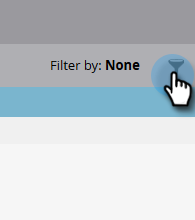

# [!DNL Salesforce]個同步處理錯誤 {#salesforce-sync-errors}

檢視同步處理期間遇到的錯誤摘要。 這包括同步處理不相容資料失敗所造成的錯誤。

>[!NOTE]
>
>**需要管理員權限**

## 檢視同步處理錯誤 {#view-sync-errors}

1. 按一下「**[!UICONTROL Admin]**」。

   

1. 在[整合]下，按一下&#x200B;**Salesforce**，然後按一下&#x200B;**[!UICONTROL Sync Errors]**&#x200B;標籤。

   

>[!NOTE]
>
>所列的錯誤範圍介於目前時間到目前同步之前5天。

| 欄位 | 說明 |
|---|---|
| 失敗於 | 記錄等級&#x200B;_或_&#x200B;工作等級 |
| 失敗的日期/時間 | 錯誤詳細資料 |
| 錯誤型別 | SFDC回傳訊息 |

>[!TIP]
>
>按一下記錄層級記錄會顯示相關物件的Marketo和[!DNL Salesforce] ID。 在某些情況下，記錄上的訊息和工作層級錯誤是直接來自[!DNL Salesforce]。 線上搜尋可能會提供其他詳細資料。

## 篩選器同步錯誤 {#filter-sync-errors}

1. 若要篩選資料，請按一下頁面最右側的篩選圖示。

   

1. 選取您的日期與時間範圍，然後依「錯誤型別」（「工作層次」或「記錄層次」）進行篩選。 完成後請按一下 **[!UICONTROL Apply]**。

   

**選擇性步驟**：若要匯出同步錯誤，請按一下&#x200B;**[!UICONTROL Export]**。 資料將會匯出為CSV檔。

