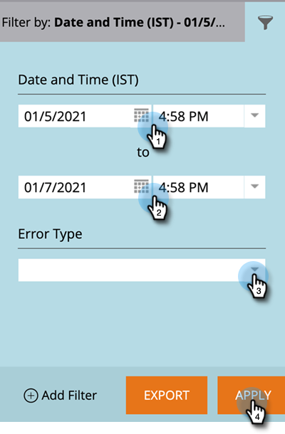

# Salesforce同步錯誤 {#salesforce-sync-errors}

檢視同步處理期間遇到的錯誤摘要。 這包括同步不相容資料失敗所導致的錯誤。

>[!NOTE]
>
>**需要管理員許可權**

## 檢視同步錯誤 {#view-sync-errors}

1. 按一下 **管理員**.

   

1. 在整合底下，按一下 **Salesforce**，然後 **同步錯誤** 標籤。

   

>[!NOTE]
>
>列出的錯誤範圍從目前時間到目前同步前五天。

| 欄位 | 說明 |
|---|---|
| 失敗日期 | 記錄層級 _或_ 工作層級 |
| 失敗的日期/時間 | 錯誤詳細資料 |
| 錯誤型別 | SFDC傳回訊息 |

>[!TIP]
>
>按一下記錄層級記錄，會顯示相關物件的Marketo和Salesforce ID。 在某些情況下，記錄上的訊息和工作層級錯誤是直接來自Salesforce。 線上搜尋可能會提供其他詳細資訊。

## 篩選器同步錯誤 {#filter-sync-errors}

1. 若要篩選資料，請按一下頁面最右側的篩選圖示。

   

1. 選取您的日期與時間範圍，然後依「錯誤型別」（「工作層次」或「記錄層次」）進行篩選。 按一下 **套用** 完成時。

   

**選擇性步驟**：若要匯出同步錯誤，請按一下 **匯出**. 資料將會匯出為CSV。

