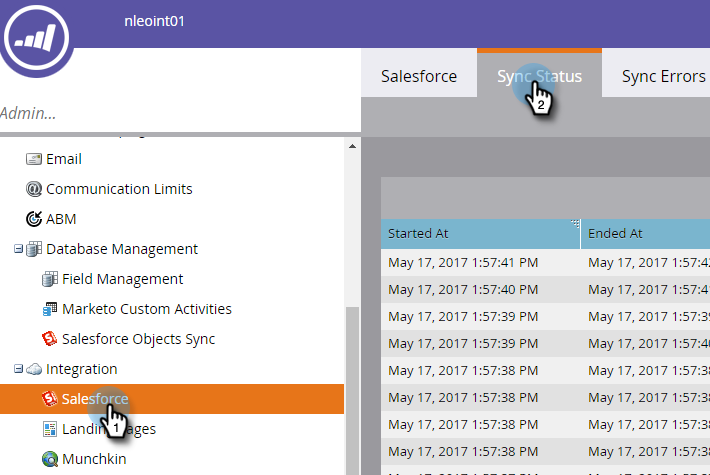

# Salesforce同步狀態{#salesforce-sync-status}

使用「同步狀態控制面板」，檢視同步統計資料作為同步步驟及其成功狀態的一部分。

「同步」步驟反映對象模式和資料本身的每個對象類型的推送或提取操作。 統計資料涵蓋同步期間的新記錄、更新、刪除和失敗計數。 使用者可依日期、作業類型或物件類型來篩選。 「同步狀態控制面板」顯示過去五天的同步週期狀態。

>[!NOTE]
>
>需要管理員權限

## 查看同步狀態{#view-sync-status}

1. 按一下&#x200B;**管理**。

   

1. 在「整合」下，按一下「Salesforce」，然後按一下「同步狀態」標籤。

   

依預設，統計資料會依最近開始的順序排序。 您可以按一下排序圖示，依「開始於」或「結束於」（從最近到最舊）排序。

## 篩選同步狀態{#filter-sync-status}

1. 若要篩選資料，請按一下頁面最右側的篩選圖示。

   

1. 選擇您的日期和時間範圍，然後按一下下拉式清單，依「物件類型」、「作業類型」和／或「狀態類型」進行篩選。

   

1. 按一下&#x200B;**Apply**。

   

**可選步驟**:要導出同步錯誤，請按一下「導 **出」**。資料將匯出為CSV。

## 同步狀態欄位{#sync-status-fields}

<table> 
 <colgroup> 
  <col> 
  <col> 
  <col> 
 </colgroup> 
 <tbody> 
  <tr> 
   <th>欄位</th> 
   <th>說明</th> 
   <th>列舉值</th> 
  </tr> 
  <tr> 
   <td colspan="1">開始於</td> 
   <td colspan="1">同步週期開始日期／時間（用戶的時區）</td> 
   <td colspan="1"></td> 
  </tr>  
  <tr> 
   <td colspan="1">結束於</td> 
   <td colspan="1">同步週期結束日期／時間（使用者的時區）</td> 
   <td colspan="1"></td> 
  </tr> 
  <tr> 
   <td colspan="1">物件</td> 
   <td colspan="1">物件類型</td> 
   <td colspan="1">聯繫人、人員、任務、機會、銷售線索等，如下所示</td> 
  </tr>  
  <tr> 
   <td colspan="1">操作</td> 
   <td colspan="1">操作類型</td> 
   <td colspan="1">操作類型如下</td> 
  </tr>  
  <tr> 
   <td colspan="1">狀態</td> 
   <td colspan="1">批的狀態</td> 
   <td colspan="1">成功、失敗、不完整、正在處理中、已清理*</td> 
  </tr>
  <tr> 
   <td colspan="1">新增</td> 
   <td colspan="1">新記錄計數</td> 
   <td colspan="1"></td> 
  </tr>  
  <tr> 
   <td colspan="1">已更新</td> 
   <td colspan="1">更新記錄計數</td> 
   <td colspan="1"></td> 
  </tr>  
  <tr> 
   <td colspan="1">已刪除</td> 
   <td colspan="1">已刪除記錄的計數</td> 
   <td colspan="1"></td> 
  </tr> 
  <tr> 
   <td colspan="1">失敗項目</td> 
   <td colspan="1">同步失敗的記錄數</td> 
   <td colspan="1"> </td> 
  </tr>  
  <tr> 
   <td colspan="1">已跳過</td> 
   <td colspan="1">由於同步的目標欄位沒有更改，所以跳過的記錄計數</td> 
   <td colspan="1"></td> 
  </tr>  
 </tbody> 
</table>

*同步步驟失敗後，資料會回復至先前的完整性狀態。

## 對象類型{#object-type}

<table> 
 <colgroup> 
  <col> 
 </colgroup> 
 <tbody> 
  <tr> 
   <td colspan="1">帳戶</td> 
  </tr>  
  <tr> 
   <td colspan="1">帳戶類型</td> 
  </tr> 
  <tr> 
   <td colspan="1">自訂物件</td> 
  </tr>  
  <tr> 
   <td colspan="1">促銷活動</td> 
  </tr>  
  <tr> 
   <td colspan="1">促銷活動成員狀態</td> 
  </tr>
  <tr> 
   <td colspan="1">聯絡人</td> 
  </tr>  
  <tr> 
   <td colspan="1">電子郵件範本</td> 
  </tr>  
  <tr> 
   <td colspan="1">事件</td> 
  </tr> 
  <tr> 
   <td colspan="1">人員(Lead)</td> 
  </tr>  
  <tr> 
   <td colspan="1">機會</td> 
  </tr>  
  <tr> 
   <td colspan="1">機會聯繫人角色</td> 
  </tr>  
  <tr> 
   <td colspan="1">任務</td> 
  </tr>  
  <tr> 
   <td colspan="1">使用者</td> 
  </tr>  
 </tbody> 
</table>

## 操作類型{#operation-type}

<table> 
 <colgroup> 
  <col> 
  <col> 
  <col>
  <col> 
 </colgroup> 
 <tbody> 
  <tr> 
   <th>操作類型</th> 
   <th>找到這些對象</th> 
   <th>注釋</th> 
   <th>操作類型</th>
  </tr> 
  <tr> 
   <td colspan="1">Init連結與Program</td> 
   <td colspan="1">促銷活動</td> 
   <td colspan="1">將促銷活動連結至方案</td> 
   <td colspan="1">更新</td>
  </tr>  
  <tr> 
   <td colspan="1">提取轉換</td> 
   <td colspan="1">人員（銷售機會）*</td> 
   <td colspan="1">從SFDC向Marketo提取轉換操作。 件數（數字）是將銷售線索轉換為聯繫人的銷售線索</td> 
   <td colspan="1">更新、失敗項目或已跳過</td>
  </tr> 
  <tr> 
   <td colspan="1">提取刪除</td> 
   <td colspan="1">聯繫人、人員（銷售機會）、業務機會、促銷活動、促銷活動成員、業務機會聯繫人、自定義對象、促銷活動、促銷活動成員狀態、業務機會聯繫人角色</td> 
   <td colspan="1">已刪除與Marketo同步的SFDC記錄</td> 
   <td colspan="1">已刪除、失敗項目或已跳過</td>
  </tr>  
  <tr> 
   <td colspan="1">提取更新</td> 
   <td colspan="1">Task 、 Person(Lead)、Person(Lead)Queue 、 Contact 、 Event 、 Opportunity 、 Account 、 Account Type 、 Campaign Members 、 Custom Objects 、 Campaign 、 Campaign Member Status 、 Persontity 、 Opportunity Contact Role</td> 
   <td colspan="1">SFDC中的更新或新記錄與Marketo同步，將事件作為活動提取</td> 
   <td colspan="1">新建、更新、失敗項目或已跳過</td>
  </tr>  
  <tr> 
   <td colspan="1">推播新功能</td> 
   <td colspan="1">任務，電子郵件模板</td> 
   <td colspan="1">推送任務（活動）</td> 
   <td colspan="1"></td>
  </tr>
  <tr> 
   <td colspan="1">推播更新</td> 
   <td colspan="1">工作、電子郵件範本、人員、連絡人、促銷活動</td> 
   <td colspan="1">推送更新至SFDC並刪除</td> 
   <td colspan="1">更新、失敗項目或已跳過</td>
  </tr>  
  <tr> 
   <td colspan="1">同步架構</td> 
   <td colspan="1">促銷活動成員、自訂物件、促銷活動、促銷活動成員狀態、工作、人員、機會、機會連絡角色、使用者</td> 
   <td colspan="1">同步不同物件的中繼資料，以決定下一個週期要同步的新欄位</td> 
   <td colspan="1"></td>
  </tr>  
  <tr> 
   <td colspan="1">與程式同步</td> 
   <td colspan="1">促銷活動</td> 
   <td colspan="1">Syncs Marketo計畫與SFDC促銷活動同步</td> 
   <td colspan="1">新增、更新、失敗或跳過</td>
  </tr> 
  <tr> 
   <td colspan="1">更新活動</td> 
   <td colspan="1">任務</td> 
   <td colspan="1">從Salesforce提取活動</td> 
   <td colspan="1"></td>
  </tr>  
  <tr> 
   <td colspan="1">更新FKS</td> 
   <td colspan="1">全部</td> 
   <td colspan="1">更新所有對象的外鍵</td> 
   <td colspan="1">不適用</td>
  </tr>  
 </tbody> 
</table>

*訂閱層級的品牌設定會決定報表中的標籤- 「潛在客戶」或「人員」。
