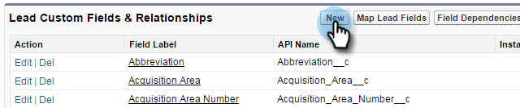
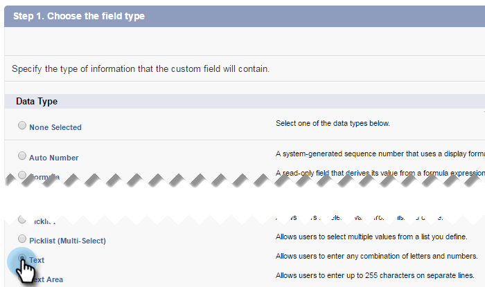

# 步驟3之1：將Marketo欄位新增至Salesforce (Enterprise/Unlimited) {#step-of-add-marketo-fields-to-salesforce-enterprise-unlimited}

>[!PREREQUISITES]
>
>您必須有權存取Salesforce API，才能在Marketo與Salesforce之間同步。

Marketo使用一組欄位來擷取特定型別的行銷相關資訊。 如果您想在Salesforce中使用此資料，請遵循下列指示。

1. 在銷售機會和聯絡人物件的Salesforce中建立三個自訂欄位：分數、贏取方案和贏取日期。
1. 在銷售機會和聯絡人之間對應這些自訂欄位，以便在Salesforce中的轉換時值能延續。
1. 如有需要，您可以建立其他欄位（請參閱下表）。

所有這些自訂欄位都是選用欄位，不需要用來同步Marketo和Salesforce。 根據最佳實務，建議您建立「分數」、「贏取方案」和「贏取日期」欄位。

## 將Marketo欄位新增至Salesforce {#add-marketo-fields-to-salesforce}

在以上列出的Salesforce中的潛在客戶與聯絡人物件上新增三個自訂欄位。 如果您想要新增更多欄位，請參閱本區段末尾的可用欄位表。

對三個自訂欄位中的每個欄位執行下列步驟來新增它們。 從分數開始。

1. 登入Salesforce並按一下 **設定**.

   

1. 在左側的「建置」功能表中，按一下 **自訂** 並選取 **銷售機會**. 按一下 **欄位**.

   

1. 按一下 **新增** 在頁面底部的「自訂欄位和關係」區段中。

   

1. 選擇適當的欄位型別（針對分數 — 數字；贏取方案 — 文字；贏取日期 — 日期/時間）。

   

1. 按一下 **下一個**.

   

1. 輸入欄位的「欄位標籤」、「長度」和「欄位名稱」，如下表所示。

<table> 
 <thead> 
  <tr> 
   <th> 
    

      欄位標籤 
    
</th> 
   <th> 
    

      欄位名稱 
    
</th> 
   <th> 
    

      資料類型 
    
</th> 
   <th> 
    

      欄位屬性 
    
</th> 
  </tr> 
 </thead> 
 <tbody> 
  <tr> 
   <td>分數</td> 
   <td>mkto71_Lead_Score</td> 
   <td>數字</td> 
   <td>長度10 小數位數0 </td> 
  </tr> 
  <tr> 
   <td>獲取日期</td> 
   <td>mkto71_Acquisition_Date</td> 
   <td>日期/時間</td> 
   <td> </td> 
  </tr> 
  <tr> 
   <td>贏取方案</td> 
   <td>mkto71_Acquisition_Program</td> 
   <td>文字</td> 
   <td>長度255</td> 
  </tr> 
 </tbody> 
</table>

>[!NOTE]
>
>Salesforce在用來建立API名稱時，會將__c附加至欄位名稱。

>[!NOTE]
>
>文字和數字欄位需要長度，但日期/時間欄位不需要。說明為選用。

1. 按一下 **下一個**.

   

1. 指定存取設定，然後按一下 **下一個**：

   * 將所有角色設為 **可見** 和 **唯讀**

   * 清除 **唯讀** 同步使用者設定檔的核取方塊：

      * 如果您的使用者具有的設定檔 _系統管理員_ 以同步使用者身分，清除 **唯讀** 系統管理員設定檔的核取方塊（如下所示）
      * 如果您已建立 _自訂設定檔_ 對於同步使用者，請清除 **唯讀** 該自訂設定檔的核取方塊

   

1. 選擇應顯示欄位的頁面配置。

   

1. 按一下 **儲存並新增** 返回並建立其他兩個自訂欄位。 按一下 **儲存** 您已全部完成。

   

1. 在左側的「建置」功能表中，按一下 **自訂** 並選取連絡人。 按一下「欄位」。
1. 針對連絡人物件的「分數」、「贏取日期」和「贏取方案」欄位，執行步驟3到10，就像您對潛在客戶物件所做的一樣。
1. 或者，您可以將此程式用於此表格的任何其他自訂欄位。

<table> 
 <thead> 
  <tr> 
   <th> 
    

      欄位標籤 
    
</th> 
   <th> 
    

      欄位名稱 
    
</th> 
   <th> 
    

      資料類型 
    
</th> 
   <th> 
    

      欄位屬性 
    
</th> 
  </tr> 
 </thead> 
 <tbody> 
  <tr> 
   <td>贏取方案ID</td> 
   <td>mkto71_Acquisition_Program_Id</td> 
   <td>數字</td> 
   <td>長度18 小數位數0 </td> 
  </tr> 
  <tr> 
   <td>原始反向連結</td> 
   <td>mkto71_Original_Referrer</td> 
   <td>文字</td> 
   <td>長度255</td> 
  </tr> 
  <tr> 
   <td>原始搜尋引擎</td> 
   <td>mkto71_Original_Search_Engine</td> 
   <td>文字</td> 
   <td>長度255</td> 
  </tr> 
  <tr> 
   <td>原始搜尋片語</td> 
   <td>mkto71_Original_Search_Phrase</td> 
   <td>文字</td> 
   <td>長度255</td> 
  </tr> 
  <tr> 
   <td>原始來源資訊</td> 
   <td>mkto71_Original_Source_Info</td> 
   <td>文字</td> 
   <td>長度255</td> 
  </tr> 
  <tr> 
   <td>原始來源類型</td> 
   <td>mkto71_Original_Source_Type</td> 
   <td>文字</td> 
   <td>長度255</td> 
  </tr> 
  <tr> 
   <td>推斷的城市</td> 
   <td>mkto71_Inferred_City</td> 
   <td>文字</td> 
   <td>長度255</td> 
  </tr> 
  <tr> 
   <td>推斷的公司</td> 
   <td>mkto71_Inferred_Company</td> 
   <td>文字</td> 
   <td>長度255</td> 
  </tr> 
  <tr> 
   <td>推斷的國家</td> 
   <td>mkto71_Inferred_Country</td> 
   <td>文字</td> 
   <td>長度255</td> 
  </tr> 
  <tr> 
   <td>推斷的大都會區</td> 
   <td>mkto71_Inferred_Metropolitan_Area</td> 
   <td>文字</td> 
   <td>長度255</td> 
  </tr> 
  <tr> 
   <td>推斷的電話區碼</td> 
   <td>mkto71_Inferred_Phone_Area_Code</td> 
   <td>文字</td> 
   <td>長度255</td> 
  </tr> 
  <tr> 
   <td>推斷的郵遞區號</td> 
   <td>mkto71_Inferred_Postal_Code</td> 
   <td>文字</td> 
   <td>長度255</td> 
  </tr> 
  <tr> 
   <td>推斷的州別區域</td> 
   <td>mkto71_Inferred_State_Region</td> 
   <td>文字</td> 
   <td>長度255</td> 
  </tr> 
 </tbody> 
</table>

>[!NOTE]
>
>建立新欄位後，Marketo自動指派的欄位值將無法立即在Salesforce中使用。 Marketo會在下次更新任一系統上的記錄時(即更新在Marketo和Salesforce之間同步的任何欄位)，將資料同步至Salesforce。

## 對應自訂欄位以進行轉換 {#map-custom-fields-for-conversions}

Salesforce中潛在客戶物件上的自訂欄位應該對應到聯絡人物件上的聯絡人欄位，以便在轉換發生時傳遞資料。

1. 在右上角，按一下 **設定**.

   

1. 在導覽搜尋中輸入「欄位」，不按Enter鍵。 欄位會顯示在不同的物件下；按一下 **欄位** 在潛在客戶底下。

   

1. 前往「潛在客戶自訂欄位和關係」區段，然後按一下 **對應潛在客戶欄位**.

   

1. 按一下您要對應的欄位旁邊的下拉式清單。

   

1. 選取對應的連絡人自訂欄位。

   

1. 對您已建立的任何其他欄位重複上述步驟。

1. 按一下 **儲存** 完成時。

   很簡單，對吧？

>[!MORELIKETHIS]
>
>[步驟2之3：建立Marketo的Salesforce使用者(Enterprise/Unlimited)](/help/marketo/product-docs/crm-sync/salesforce-sync/setup/enterprise-unlimited-edition/step-2-of-3-create-a-salesforce-user-for-marketo-enterprise-unlimited.md)
