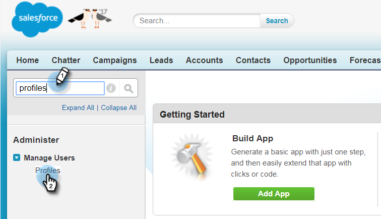

# 步驟2（共3步）:建立適用於Marketo的Salesforce使用者（企業版／無限製版）{#step-of-create-a-salesforce-user-for-marketo-enterprise-unlimited}

>[!NOTE]
>
>這些步驟必須由Salesforce管理員完成

>[!PREREQUISITES]
>
>* [步驟1（共3步）:將行銷人員欄位新增至Salesforce（企業版／無限製版）](step-1-of-3-add-marketo-fields-to-salesforce-enterprise-unlimited.md)

>

在本文中，您將在Salesforce設定檔中設定使用者權限，並建立Marketo-Salesforce整合帳戶。

## 建立配置檔案{#create-a-profile}

1. 按一下&#x200B;**Setup**。

   

1. 在Nav搜索欄中鍵入&quot;profiles&quot;，然後按一下&#x200B;**Profiles**&#x200B;連結。

   

1. 按一下&#x200B;**新建**。

   

1. 選擇&#x200B;**標準使用者**，將描述檔命名為&quot;Marketo-Salesforce Sync&quot;，然後按一下&#x200B;**儲存**。

   

## 設定描述檔權限{#set-profile-permissions}

1. 按一下&#x200B;**編輯**&#x200B;以設定安全權限。

   

1. 在&#x200B;**管理權限**&#x200B;區段下，請確定已勾選下列方塊：

   * 啟用API
   * 編輯HTML範本
   * 管理公開檔案
   * 管理公用範本

   

   >[!TIP]
   >
   >請務必選中&#x200B;**密碼永不過期**&#x200B;框。

1. 在「一般使用者權限」區段下，請確定已勾選下列方塊：

   * 轉換銷售線索
   * 編輯事件
   * 編輯任務

   

1. 在「標準物件權限」區段下，請確定已勾選「讀取」、「建立」、「編輯」和「刪除」權限：

   * 帳戶
   * 促銷活動
   * 聯絡人
   * 銷售線索
   * 機會

   >[!NOTE]
   >
   >如果您打算使用「促銷活動同步」，請授予「促銷活動」權限。

   

1. 完成後，按一下頁面底部的&#x200B;**Save**。

   

## 設定欄位權限{#set-field-permissions}

1. 與行銷人員討論，以瞭解同步所需的自訂欄位。

   >[!NOTE]
   >
   >此步驟可防止您不需要的欄位在Marketo中顯示，如此可減少雜亂並加速同步。

1. 在描述檔詳細資訊頁面中，前往&#x200B;**Field-Level Security**&#x200B;區段。 按一下&#x200B;**View**&#x200B;可編輯對象的輔助功能：

   * `Lead`
   * `Contact`
   * `Account`
   * `Opportunity`

   >[!TIP]
   >
   >您可以根據組織的需要配置其他對象。

   

1. 對於每個對象，按一下&#x200B;**編輯**。

   

1. 找出不需要的欄位，確定未勾選「**讀取存取&#x200B;**」和「編輯存取**」。**&#x200B;完成時，按一下「儲存」。****

   >[!NOTE]
   >
   >**提醒**
   >
   >
   >僅編輯自訂欄位的協助功能。

   

1. 在禁用完所有不需要的欄位後，必須選中**讀訪問和編輯訪問**以查看以下對象欄位。 完成時，按一下「儲存」。****

<table> 
 <tbody> 
  <tr> 
   <th colspan="1" rowspan="1">
物件
</th> 
   <th colspan="1" rowspan="1">
欄位
</th> 
  </tr> 
  <tr> 
   <td colspan="1" rowspan="1">
帳戶
</td> 
   <td colspan="1" rowspan="1">
類型欄位
</td> 
  </tr> 
  <tr> 
   <td colspan="1" rowspan="1">
事件
</td> 
   <td colspan="1" rowspan="1">
所有欄位
</td> 
  </tr> 
  <tr> 
   <td colspan="1" rowspan="1">
任務
</td> 
   <td colspan="1" rowspan="1">
所有欄位
</td> 
  </tr> 
 </tbody> 
</table>

## 建立Marketo-Salesforce同步帳戶{#create-marketo-salesforce-sync-account}

>[!TIP]
>
>建立專屬的Salesforce帳戶(例如[`[email protected]`](http://docs.marketo.com/cdn-cgi/l/email-protection#89e4e8fbe2ecfde6c9f0e6fcfbeae6e4f9e8e7f0a7eae6e4))，以區分Marketo和其他Salesforce使用者所做的變更。

1. 在導覽列中輸入「管理使用者」，然後按一下「**使用者**」。 按一下&#x200B;**New User**。

   

1. 填寫必填欄位。 然後，選擇&#x200B;**用戶許可證：Salesforce**&#x200B;和您先前建立的設定檔。 完成時，按一下「儲存」。****

   

步驟2（共2步）已完成。

>[!NOTE]
>
>**相關文章**
>
>* [步驟3（共3步）:將行銷人員連線至Salesforce（企業版／無限製版）](step-3-of-3-connect-marketo-and-salesforce-enterprise-unlimited.md)

>

