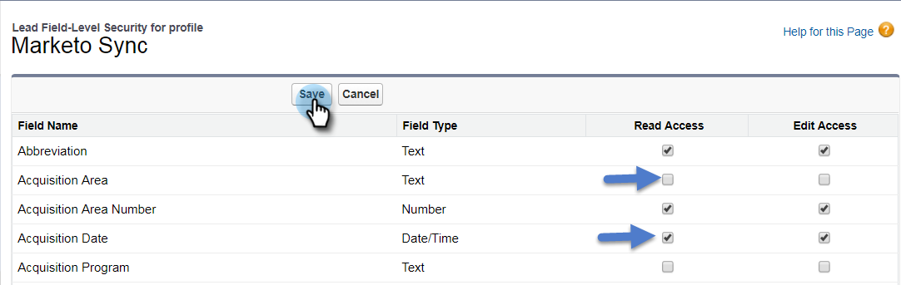

# 步驟2之3：建立Marketo的Salesforce使用者(Enterprise/Unlimited) {#step-of-create-a-salesforce-user-for-marketo-enterprise-unlimited}

>[!NOTE]
>
>這些步驟必須由Salesforce管理員完成

>[!PREREQUISITES]
>
>[步驟3之1：將Marketo欄位新增至Salesforce (Enterprise/Unlimited)](/help/marketo/product-docs/crm-sync/salesforce-sync/setup/enterprise-unlimited-edition/step-1-of-3-add-marketo-fields-to-salesforce-enterprise-unlimited.md)

在本文中，您將會在Salesforce設定檔中設定使用者許可權，並建立Marketo-Salesforce整合帳戶。

## 建立設定檔 {#create-a-profile}

1. 按一下 **設定**.

   

1. 在導覽搜尋列中輸入「設定檔」，然後按一下 **設定檔** 連結。

   

1. 按一下 **新增**.

   

1. 選取 **標準使用者**，將設定檔命名為「Marketo-Salesforce Sync」，然後按一下 **儲存**.

   

## 設定設定檔許可權 {#set-profile-permissions}

1. 按一下 **編輯** 以設定安全性許可權。

   

1. 在 **管理許可權** 區段，確定已勾選下列方塊：

   * API已啟用
   * 編輯HTML範本
   * 管理公開檔案
   * 管理公開範本

   

   >[!TIP]
   >
   >請務必檢視 **密碼永不過期** 方塊。

1. 在「一般使用者許可權」區段下，確定已勾選下列方塊：

   * 轉換潛在客戶
   * 編輯事件
   * 編輯任務

   

1. 在「標準物件許可權」區段下，確定已勾選「讀取」、「建立」、「編輯」和「刪除」許可權：

   * 帳戶
   * 行銷活動
   * 連絡人
   * 銷售機會
   * 機會

   >[!NOTE]
   >
   >如果您打算使用Campaign Sync，請授與Campaigns的許可權。

   

1. 完成後，按一下 **儲存** ，位於頁面底部。

   

## 設定欄位許可權 {#set-field-permissions}

1. 與您的行銷人員討論，找出同步所需的自訂欄位。

   >[!NOTE]
   >
   >此步驟將防止您不需要的欄位顯示在Marketo中，這將減少雜亂並加快同步速度。

1. 在設定檔詳細資訊頁面中，前往 **欄位層級安全性** 區段。 按一下 **檢視** 若要編輯物件的協助工具：

   * 銷售機會
   * 連絡人
   * 帳戶
   * 機會

   >[!TIP]
   >
   >您可以根據組織的需求設定其他物件。

   

1. 對於每個物件，按一下 **編輯**.

   

1. 找到不需要的欄位，確認 **讀取許可權** 和 **編輯存取權** 已取消勾選。 按一下 **儲存** 完成時。

   >[!NOTE]
   >
   >僅編輯自訂欄位的協助工具。

   

1. 停用完所有不需要的欄位後，您必須檢查 **讀取許可權與編輯許可權** 用於下列物件欄位。 按一下 **儲存** 完成時。

<table> 
 <tbody> 
  <tr> 
   <th colspan="1" rowspan="1">
物件
</th> 
   <th colspan="1" rowspan="1">
欄位
</th> 
  </tr> 
  <tr> 
   <td colspan="1" rowspan="1">
帳戶
</td> 
   <td colspan="1" rowspan="1">
型別欄位
</td> 
  </tr> 
  <tr> 
   <td colspan="1" rowspan="1">
Event
</td> 
   <td colspan="1" rowspan="1">
所有欄位
</td> 
  </tr> 
  <tr> 
   <td colspan="1" rowspan="1">
任務
</td> 
   <td colspan="1" rowspan="1">
所有欄位
</td> 
  </tr> 
 </tbody> 
</table>

## 建立Marketo-Salesforce同步帳戶 {#create-marketo-salesforce-sync-account}

>[!TIP]
>
>建立專用的Salesforce帳戶(例如marketo@yourcompany.com)，以區分Marketo與其他Salesforce使用者所做的變更。

1. 在導覽搜尋列中輸入「管理使用者」，然後按一下 **使用者**. 按一下 **新使用者**.

   

1. 填寫必填欄位。 然後，選取 **使用者授權： Salesforce** 以及您先前建立的設定檔。 按一下 **儲存** 完成時。

   

步驟2之2已完成。

>[!NOTE]
>
>[步驟3之3：連線Marketo與Salesforce (Enterprise/Unlimited)](/help/marketo/product-docs/crm-sync/salesforce-sync/setup/enterprise-unlimited-edition/step-3-of-3-connect-marketo-and-salesforce-enterprise-unlimited.md)
