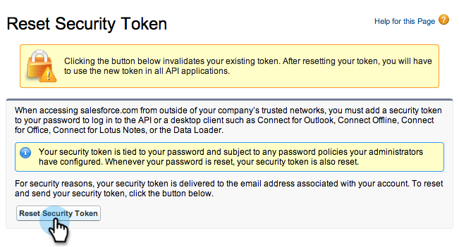
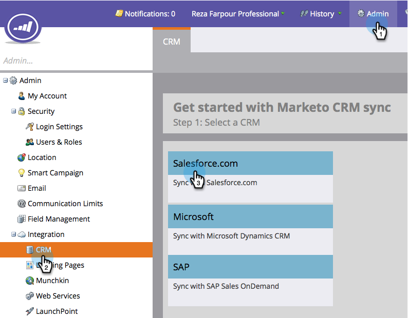
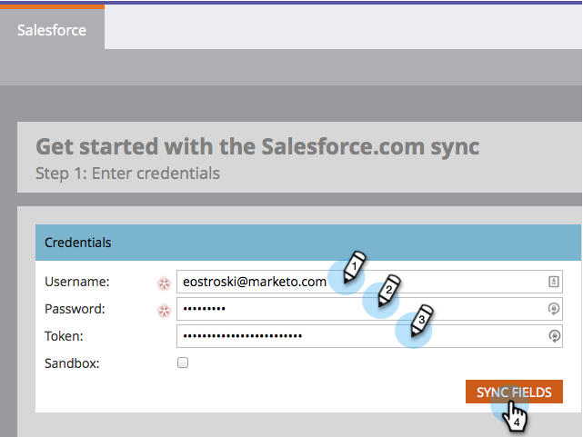
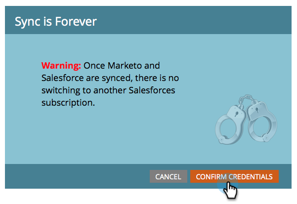
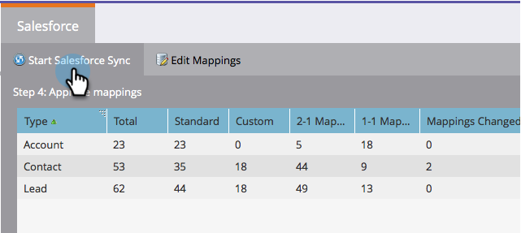
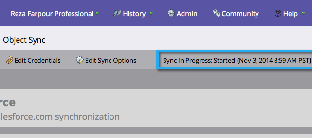

# 步驟3之3：連線Marketo和[!DNL Salesforce] (Enterprise/Unlimited) {#step-of-connect-marketo-and-salesforce-enterprise-unlimited}

在本文中，您將設定Marketo與您設定的[!DNL Salesforce]執行個體同步。

>[!PREREQUISITES]
>
>* [步驟3之1：將Marketo欄位新增至 [!DNL Salesforce]  (Enterprise/Unlimited)](/help/marketo/product-docs/crm-sync/salesforce-sync/setup/enterprise-unlimited-edition/step-1-of-3-add-marketo-fields-to-salesforce-enterprise-unlimited.md)
>* [步驟2之3：建立Marketo (Enterprise/Unlimited)的 [!DNL Salesforce] 使用者](/help/marketo/product-docs/crm-sync/salesforce-sync/setup/enterprise-unlimited-edition/step-2-of-3-create-a-salesforce-user-for-marketo-enterprise-unlimited.md)

## 擷取同步處理使用者安全性權杖 {#retrieve-sync-user-security-token}

>[!TIP]
>
>如果您已經有安全性權杖，請直接進入「設定同步使用者認證」和「稱號」進行準備！

1. 使用Marketo Sync User登入[!DNL Salesforce]，按一下同步使用者名稱，然後按&#x200B;**[!UICONTROL My Settings]**。

   

1. 在快速尋找中，輸入「reset」並按一下&#x200B;**[!UICONTROL Reset My Security Token]**。

   

1. 按一下「**[!UICONTROL Reset Security Token]**」。

   

   安全性權杖將會透過電子郵件傳送給您。

## 設定同步使用者認證 {#set-sync-user-credentials}

1. 在Marketo中，移至&#x200B;**[!UICONTROL Admin]**，選取&#x200B;**CRM**，然後按一下&#x200B;**[!UICONTROL Sync with Salesforce.com]**

   

   >[!NOTE]
   >
   >[在按一下&#x200B;**[!UICONTROL Sync Fields]**&#x200B;之前，先從同步使用者隱藏所有您不需要的欄位](/help/marketo/product-docs/crm-sync/salesforce-sync/sfdc-sync-details/hide-a-salesforce-field-from-the-marketo-sync.md) （在Marketo中）。 一旦您按一下[!UICONTROL Sync Fields]，使用者可以看到的所有欄位將會在Marketo中永久建立且無法刪除。

1. 輸入在[!DNL Salesforce]組態（[Professional](/help/marketo/product-docs/crm-sync/salesforce-sync/setup/professional-edition/step-2-of-3-create-a-salesforce-user-for-marketo-professional.md)或[Enterprise](/help/marketo/product-docs/crm-sync/salesforce-sync/setup/enterprise-unlimited-edition/step-2-of-3-create-a-salesforce-user-for-marketo-enterprise-unlimited.md)）的第2部分建立的[!DNL Salesforce]同步使用者認證，然後按一下&#x200B;**[!UICONTROL Sync Fields]** （只有在您將Marketo沙箱同步到[!DNL Salesforce]沙箱時，才核取&#x200B;**[!UICONTROL Sandbox]**）。

   

   >[!CAUTION]
   >
   >如果您看到「登入[!DNL Salesforce]」按鈕而非使用者名稱/密碼/權杖欄位，表示您的Marketo訂閱已啟用OAuth。 [請參閱此文章](/help/marketo/product-docs/crm-sync/salesforce-sync/log-in-using-oauth-2-0.md)。 只要同步開始使用一組認證，**就不會切換[!DNL Salesforce]認證或訂閱**。 如果您想要使用基本驗證，請聯絡您的帳戶管理員。

1. 閱讀警告，然後按一下&#x200B;**[!UICONTROL Confirm Credentials]**。

   

   >[!CAUTION]
   >
   >如果您想檢視[對應並加以自訂](/help/marketo/product-docs/crm-sync/salesforce-sync/setup/optional-steps/edit-initial-field-mappings.md)，這是您唯一的機會了！ 按一下「[!UICONTROL Start  Salesforce Sync]」即完成。

## 開始[!DNL Salesforce]同步 {#start-salesforce-sync}

1. 按一下&#x200B;**[!UICONTROL Start  Salesforce Sync]**&#x200B;開始持續性Marketo-[!DNL Salesforce]同步處理。

   

   >[!CAUTION]
   >
   >Marketo不會針對[!DNL Salesforce]同步處理或手動輸入潛在客戶時，自動進行重複資料刪除。

1. 按一下「**[!UICONTROL Start Sync]**」。

   

   >[!NOTE]
   >
   >完成初始同步的時間會因資料庫的大小和複雜度而有所不同。

## 驗證同步 {#verify-sync}

Marketo在管理區域提供[!DNL Salesforce]同步處理的狀態訊息。 您可以按照以下步驟驗證同步是否正常運作。

1. 在Marketo中，按一下&#x200B;**[!UICONTROL Admin]**，然後按&#x200B;**[!UICONTROL Salesforce]**。

   

1. 同步狀態會顯示在右上角。 它會顯示下列三個訊息之一： **[!UICONTROL Last Synced]**、**[!UICONTROL Sync in Progress]**&#x200B;或&#x200B;**[!UICONTROL Failed]**。

   

   

   

您已完成設定Marketo其中一項最強大的功能。

>[!MORELIKETHIS]
>
>* [步驟3之1：將Marketo欄位新增至 [!DNL Salesforce]  (Enterprise/Unlimited)](/help/marketo/product-docs/crm-sync/salesforce-sync/setup/enterprise-unlimited-edition/step-1-of-3-add-marketo-fields-to-salesforce-enterprise-unlimited.md)
>* [步驟2之3：建立Marketo (Enterprise/Unlimited)的 [!DNL Salesforce] 使用者](/help/marketo/product-docs/crm-sync/salesforce-sync/setup/enterprise-unlimited-edition/step-2-of-3-create-a-salesforce-user-for-marketo-enterprise-unlimited.md)
>* [在 [!DNL Salesforce] AppExchange](/help/marketo/product-docs/marketo-sales-insight/msi-for-salesforce/installation/install-marketo-sales-insight-package-in-salesforce-appexchange.md)中安裝Marketo Sales Insight套件
>* [在 [!DNL Salesforce] Enterprise/Unlimited](/help/marketo/product-docs/marketo-sales-insight/msi-for-salesforce/configuration/configure-marketo-sales-insight-in-salesforce-enterprise-unlimited.md)中設定Marketo Sales Insight
