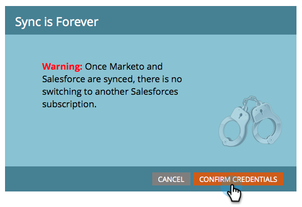

# 第3步（共3步）:Connect Marketo和Salesforce（企業版/無限製版） {#step-of-connect-marketo-and-salesforce-enterprise-unlimited}

在本文中，您會將Marketo設定為與您設定的Salesforce例項同步。

>[!PREREQUISITES]
>
>* [第1步（共3步）:將Marketo欄位新增至Salesforce（企業版/無限製版）](/help/marketo/product-docs/crm-sync/salesforce-sync/setup/enterprise-unlimited-edition/step-1-of-3-add-marketo-fields-to-salesforce-enterprise-unlimited.md)
>* [第2步（共3步）:建立Marketo的Salesforce使用者（企業版/無限製版）](/help/marketo/product-docs/crm-sync/salesforce-sync/setup/enterprise-unlimited-edition/step-2-of-3-create-a-salesforce-user-for-marketo-enterprise-unlimited.md)

## 檢索同步用戶安全令牌 {#retrieve-sync-user-security-token}

>[!TIP]
>
>如果您已擁有安全令牌，請直接繼續設定同步用戶憑據和kudo以準備！

1. 使用Marketo同步使用者登入Salesforce，按一下同步使用者的名稱，然後 **我的設定**.

   

1. 在快速查找中，鍵入&quot;reset&quot;，然後按一下 **重設我的安全令牌**.

   

1. 按一下 **重設安全令牌**.

   

   安全性代號會透過電子郵件傳送給您。

## 設定同步用戶憑據 {#set-sync-user-credentials}

1. 在Marketo中，前往 **管理**，選取 **CRM**，然後按一下 **與同步 [Salesforce.com](https://Salesforce.com)**

   

   >[!NOTE]
   >
   >一定要 [隱藏所有不需要的欄位](/help/marketo/product-docs/crm-sync/salesforce-sync/sfdc-sync-details/hide-a-salesforce-field-from-the-marketo-sync.md) 在Marketo中按一下 **同步欄位**. 按一下「同步欄位」後，使用者可看見的所有欄位都會在Marketo中建立，且無法刪除。

1. 輸入在Salesforce配置的第2部分中建立的Salesforce同步用戶憑據([專業](/help/marketo/product-docs/crm-sync/salesforce-sync/setup/professional-edition/step-2-of-3-create-a-salesforce-user-for-marketo-professional.md) 或 [企業](/help/marketo/product-docs/crm-sync/salesforce-sync/setup/enterprise-unlimited-edition/step-2-of-3-create-a-salesforce-user-for-marketo-enterprise-unlimited.md))，然後按一下 **同步欄位** （檢查） **沙箱** 只有在您將Marketo沙箱同步至Salesforce沙箱時才會發生)。

   

   >[!CAUTION]
   >
   >如果您看到「登入Salesforce」按鈕（而非「使用者名稱/密碼/代號」欄位），表示您的Marketo訂閱已針對OAuth啟用。 請 [請參閱本文章](/help/marketo/product-docs/crm-sync/salesforce-sync/log-in-using-oauth-2-0.md). 一旦開始使用一組憑據， **沒有切換Salesforce憑據或訂閱**. 如果您想使用基本驗證，請洽詢您的客戶成功經理。

1. 閱讀警告，然後按一下 **確認憑證**.

   

   >[!CAUTION]
   >
   >如果您想查看 [映射和自定義](/help/marketo/product-docs/crm-sync/salesforce-sync/setup/optional-steps/edit-initial-field-mappings.md)，這是你唯一的機會！ 按一下「啟動Salesforce同步」後，即可完成。

## 啟動Salesforce同步 {#start-salesforce-sync}

1. 按一下 **啟動Salesforce同步** 開始持續的Marketo-Salesforce同步。

   

   >[!CAUTION]
   >
   >Marketo不會針對Salesforce同步或當您手動輸入銷售機會時自動消除重複資料。

1. 按一下 **開始同步**.

   

   >[!NOTE]
   >
   >完成初始同步的時間會根據資料庫的大小和複雜性而有所不同。

## 驗證同步 {#verify-sync}

Marketo會在「管理」區域中提供Salesforce同步的狀態訊息。 您可以依照下列步驟來驗證同步是否正確運作。

1. 在Marketo中，按一下 **管理**，然後 **Salesforce**.

   

1. 同步狀態顯示在右上角。 它將顯示三條消息之一： **上次同步**, **正在同步**，或 **失敗**.

   

   

   

哇，您剛剛完成了Marketo最強大的功能之一的配置！

>[!MORELIKETHIS]
>
>* [第1步（共3步）:將Marketo欄位新增至Salesforce（企業版/無限製版）](/help/marketo/product-docs/crm-sync/salesforce-sync/setup/enterprise-unlimited-edition/step-1-of-3-add-marketo-fields-to-salesforce-enterprise-unlimited.md)
>* [第2步（共3步）:建立Marketo的Salesforce使用者（企業版/無限製版）](/help/marketo/product-docs/crm-sync/salesforce-sync/setup/enterprise-unlimited-edition/step-2-of-3-create-a-salesforce-user-for-marketo-enterprise-unlimited.md)
>* [在SalesforceAppExchange中安裝Marketo Sales Insight套件](/help/marketo/product-docs/marketo-sales-insight/msi-for-salesforce/installation/install-marketo-sales-insight-package-in-salesforce-appexchange.md)
>* [在Salesforce Enterprise/Unlimited中設定Marketo Sales Insight](/help/marketo/product-docs/marketo-sales-insight/msi-for-salesforce/configuration/configure-marketo-sales-insight-in-salesforce-enterprise-unlimited.md)

