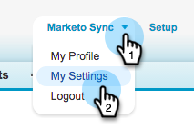

# 步驟3之3：連線Marketo與Salesforce (Enterprise/Unlimited) {#step-of-connect-marketo-and-salesforce-enterprise-unlimited}

在本文中，您將設定Marketo Engage以與您設定的Salesforce執行個體同步。

>[!PREREQUISITES]
>
>* [步驟3之1：將Marketo欄位新增至Salesforce (Enterprise/Unlimited)](/help/marketo/product-docs/crm-sync/salesforce-sync/setup/enterprise-unlimited-edition/step-1-of-3-add-marketo-fields-to-salesforce-enterprise-unlimited.md){target="_blank"}
>* [步驟2之3：建立Marketo (Enterprise/Unlimited)的Salesforce使用者](/help/marketo/product-docs/crm-sync/salesforce-sync/setup/enterprise-unlimited-edition/step-2-of-3-create-a-salesforce-user-for-marketo-enterprise-unlimited.md){target="_blank"}

## 擷取同步處理使用者安全性權杖 {#retrieve-sync-user-security-token}

>[!TIP]
>
>如果您已經有安全性權杖，請直接進入「設定同步使用者認證」和「稱號」進行準備！

1. 使用Marketo Sync User登入Salesforce，按一下同步使用者名稱，然後按&#x200B;**[!UICONTROL 我的設定]**。

   

1. 在快速尋找中，輸入[重設]並按一下[重設我的安全性權杖]。****

   

1. 按一下&#x200B;**[!UICONTROL 重設安全性權杖]**。

   

   安全性權杖將會透過電子郵件傳送給您。

## 設定同步使用者認證 {#set-sync-user-credentials}

1. 在Marketo中，移至&#x200B;**[!UICONTROL 管理員]**，選取&#x200B;**[!UICONTROL CRM]**，然後按一下&#x200B;**與[Salesforce.com](https://Salesforce.com)**&#x200B;同步

   

   >[!NOTE]
   >
   >在按一下&#x200B;**[!UICONTROL 同步欄位]**&#x200B;之前，請務必[隱藏Marketo中不需要的所有欄位](/help/marketo/product-docs/crm-sync/salesforce-sync/sfdc-sync-details/hide-a-salesforce-field-from-the-marketo-sync.md){target="_blank"}，不讓同步使用者看到。 按一下「同步欄位」後，使用者看見的所有欄位將會在Marketo中永久建立，且無法刪除。

1. 輸入在Salesforce組態（[Professional](/help/marketo/product-docs/crm-sync/salesforce-sync/setup/professional-edition/step-2-of-3-create-a-salesforce-user-for-marketo-professional.md){target="_blank"}或[Enterprise](/help/marketo/product-docs/crm-sync/salesforce-sync/setup/enterprise-unlimited-edition/step-2-of-3-create-a-salesforce-user-for-marketo-enterprise-unlimited.md){target="_blank"}）的第2部分建立的Salesforce Sync User認證，然後按一下&#x200B;**[!UICONTROL 同步欄位]** (只有在您將Marketo沙箱同步到Salesforce沙箱時，才核取&#x200B;**[!UICONTROL 沙箱]**)。

   

   >[!CAUTION]
   >
   >如果您看到「登入Salesforce」按鈕而非使用者名稱/密碼/權杖欄位，表示您的Marketo訂閱已啟用OAuth。 請[參考本文章](/help/marketo/product-docs/crm-sync/salesforce-sync/log-in-using-oauth-2-0.md){target="_blank"}。 使用一組認證開始同步時，_不會切換Salesforce認證或訂閱_。 如果您想要使用基本驗證，請聯絡Adobe客戶團隊（您的客戶經理）。

1. 閱讀警告，然後按一下&#x200B;**[!UICONTROL 確認認證]**。

   

   >[!CAUTION]
   >
   >如果您想檢視[對應並加以自訂](/help/marketo/product-docs/crm-sync/salesforce-sync/setup/optional-steps/edit-initial-field-mappings.md){target="_blank"}，這是您唯一的機會了！ 按一下「開始Salesforce同步處理」即可完成。

## 開始Salesforce同步 {#start-salesforce-sync}

1. 按一下&#x200B;**[!UICONTROL 開始Salesforce同步處理]**，開始持續的Marketo-Salesforce同步處理。

   

   >[!CAUTION]
   >
   >Marketo不會針對Salesforce同步作業或手動輸入潛在客戶時，自動進行重複資料刪除。

1. 按一下&#x200B;**[!UICONTROL 開始同步]**。

   

   >[!NOTE]
   >
   >完成初始同步的時間會因資料庫的大小和複雜度而有所不同。

## 驗證同步 {#verify-sync}

Marketo會在管理區域提供Salesforce同步的狀態訊息。 您可以按照以下步驟驗證同步是否正常運作。

1. 在Marketo中，按一下&#x200B;**[!UICONTROL 管理員]**，然後按&#x200B;**Salesforce**。

   

1. 同步狀態會顯示在右上角。 它會顯示下列三個訊息之一： **[!UICONTROL 上次同步處理]**、**[!UICONTROL 同步處理進行中]**&#x200B;或&#x200B;**[!UICONTROL 失敗]**。

   

   

   

您剛剛完成設定Marketo其中一項最強大的功能，現在就開始！

>[!MORELIKETHIS]
>
>* [步驟3之1：將Marketo欄位新增至Salesforce (Enterprise/Unlimited)](/help/marketo/product-docs/crm-sync/salesforce-sync/setup/enterprise-unlimited-edition/step-1-of-3-add-marketo-fields-to-salesforce-enterprise-unlimited.md){target="_blank"}
>* [步驟2之3：建立Marketo (Enterprise/Unlimited)的Salesforce使用者](/help/marketo/product-docs/crm-sync/salesforce-sync/setup/enterprise-unlimited-edition/step-2-of-3-create-a-salesforce-user-for-marketo-enterprise-unlimited.md){target="_blank"}
>* [在SalesforceAppExchange中安裝Marketo Sales Insight套件](/help/marketo/product-docs/marketo-sales-insight/msi-for-salesforce/installation/install-marketo-sales-insight-package-in-salesforce-appexchange.md){target="_blank"}
>* [在Salesforce Enterprise/Unlimited中設定Marketo Sales Insight](/help/marketo/product-docs/marketo-sales-insight/msi-for-salesforce/configuration/configure-marketo-sales-insight-in-salesforce-enterprise-unlimited.md){target="_blank"}
