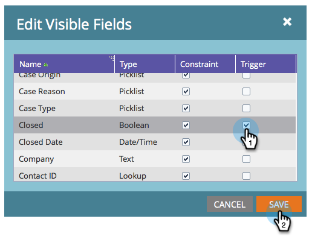

# 將自定義對象欄位添加／刪除為智慧清單／觸發器約束{#add-remove-custom-object-field-as-smart-list-trigger-constraints}

Marketo提供Salesforce自訂物件同步的精細控制。 這可讓您在自訂物件篩選條件中選取可用作限制的欄位，並將它們用作智慧型促銷活動的觸發器。

>[!NOTE]
>
>**需要管理員權限**

1. 按一下&#x200B;**管理。**

   

1. 按一下「**管理員**」，然後按一下「Salesforce物件同步」。****

   

1. **Salesforce物件** 會在左欄中同步。

   

1. 選擇要修改的對象。

   

1. 按一下「編輯可見欄位」 ****。

   >[!TIP]
   >
   >如果&#x200B;**編輯可見欄位**&#x200B;按鈕呈灰色，則該對象當前正在智慧清單或智慧促銷活動中使用。 移除所有關聯以繼續。

   

1. 如果全局同步已啟用，請按一下&#x200B;**禁用全局同步**。

   

1. 選中所需過濾器／觸發器約束旁的框，然後按一下&#x200B;**保存**。

   

   >[!NOTE]
   >
   >預設情況下，所有欄位都被選為篩選器的約束。

1. 按一下&#x200B;**欄位**&#x200B;標籤以確認變更。

   

   >[!NOTE]
   >
   >別忘了重新啟用全域同步！

哇！ 現在，您的智慧清單和智慧型宣傳活動的威力更大。

>[!MORELIKETHIS]
>
>[啟用／停用自訂物件同步](/help/marketo/product-docs/crm-sync/salesforce-sync/setup/optional-steps/enable-disable-custom-object-sync.md)
