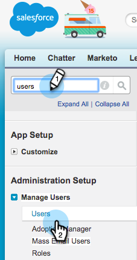
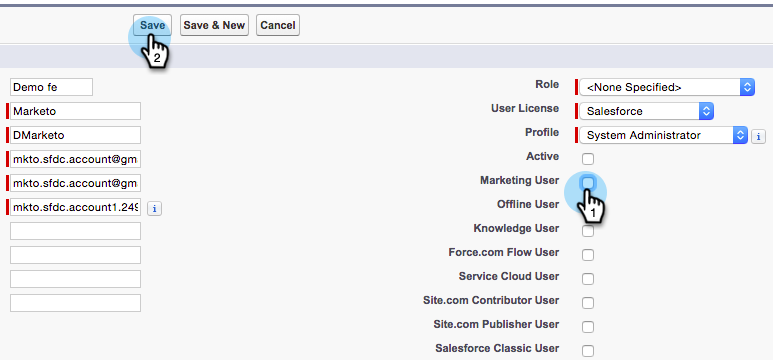

# 讓Marketo將使用者同步為行銷使用者 {#make-marketo-sync-user-a-marketing-user}

Marketo [同步使用者必須是Salesforce促銷活動同步的Marketing使用者](../../../../../../product-docs/crm-sync/salesforce-sync/setup/enterprise-unlimited-edition/step-2-of-3-create-a-salesforce-user-for-marketo-enterprise-unlimited.md) ，才能正常運作。 以下是如何在Salesforce中讓使用者成為行銷使用者的方法。

>[!NOTE]
>
>**需要管理員權限**

1. 登入Salesforce。 在左搜尋列中搜尋使用者，然後按一下「管 **理使用者** 」 **下的「使用者」**。

   

1. 尋找您的同步使用者，然後按一下其名稱。

   

1. 按一 **下編輯**。

   

1. 勾選「行 **銷使用者** 」核取方塊，然後按一 **下「儲存」**。

   

   太好了！ 此Marketo同步使用者現在是行銷使用者。

