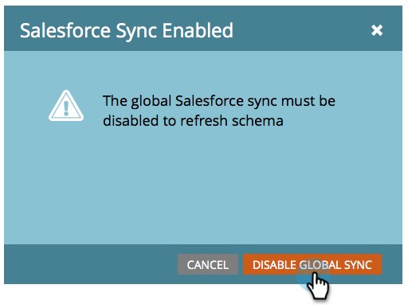

# 啟用/停用自訂物件同步 {#enable-disable-custom-object-sync}

在Salesforce例項中建立的自訂物件也可以是Marketo Engage的一部分。 以下說明設定方法。

## 啟用/停用自訂物件同步 {#enable-disable-custom-object-sync-1}

>[!NOTE]
>
>**需要管理員許可權**

1. 按一下&#x200B;**[!UICONTROL 管理員]**。

   

1. 在[資料庫管理]功能表中，按一下&#x200B;**[!UICONTROL Salesforce Objects Sync]**。

   

1. 如果這是您的第一個自訂物件，請按一下&#x200B;**[!UICONTROL 同步結構描述]**。 否則，請按一下[重新整理結構描述]****，確保您擁有最新的結構描述。

   

1. 如果您正在執行全域同步處理，您必須按一下[停用全域同步處理]****&#x200B;來停用它。

   

   >[!NOTE]
   >
   >同步Salesforce自訂物件結構描述可能需要幾分鐘的時間。

1. 按一下&#x200B;**[!UICONTROL 重新整理結構描述]**。

   

1. 選取您要同步處理的物件，然後按一下[啟用同步處理]。****

   >[!TIP]
   >
   >Marketo只有在與Salesforce中的Lead、Contact或Account物件有直接關係時，才能同步自訂物件。

   

1. 再按一下&#x200B;**[!UICONTROL 啟用同步]**。

   

1. 返回&#x200B;**[!DNL Salesforce]**&#x200B;標籤，然後按一下&#x200B;**[!UICONTROL 啟用同步]**。

   

## 使用您的自訂物件 {#using-your-custom-objects}

>[!NOTE]
>
>您無法在Smart Campaigns中搭配觸發器使用自訂物件。

1. 在您的智慧清單中，拖曳至&#x200B;**[!UICONTROL Has Opportunity]**&#x200B;篩選器，並設為&#x200B;**[!UICONTROL true]**。

   

1. 然後，使用篩選條件限制來縮小焦點。

   

   太好了！ 您現在可以在智慧行銷活動和智慧清單中使用此自訂物件的資料。

>[!MORELIKETHIS]
>
>[新增/移除自訂物件欄位做為智慧列示/觸發條件約束](/help/marketo/product-docs/crm-sync/salesforce-sync/setup/optional-steps/add-remove-custom-object-field-as-smart-list-trigger-constraints.md){target="_blank"}
