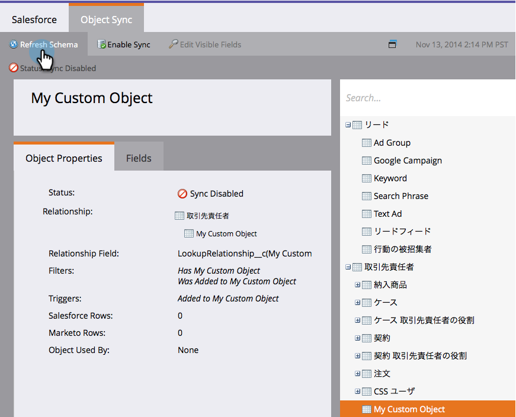

# 啟用非英語自訂物件同步 {#enable-non-english-custom-object-sync}

如果您的Marketo同步使用者設為英文以外的語言，當您嘗試啟用自訂物件同步時，可能會發生錯誤。

## 如何修正 {#how-to-fix}

1. 使用marketo同步使用者登入[!DNL Salesforce]。

   

1. 按一下使用者名稱下拉式清單，然後選取&#x200B;**[!UICONTROL Setup]**。

   

1. 在&#x200B;**[!UICONTROL Personal Information]**&#x200B;底下，按一下&#x200B;**[!UICONTROL My Personal Information]**。

   

1. 按一下「**[!UICONTROL Edit]**」。

   

1. 將&#x200B;**[!UICONTROL Language]**&#x200B;變更為&#x200B;**[!UICONTROL English]**。

   

1. 按一下「**[!UICONTROL Save]**」。

   

1. 在您的[Adobe帳戶設定檔](https://account.adobe.com/tw/profile){target="_blank"}中，向下捲動至&#x200B;**[!UICONTROL Preferred languages]**，並確定您的第一語言已設定為英文。

   

1. 在Marketo Engage中，導覽至&#x200B;**[!UICONTROL Admin]** > **[!UICONTROL Salesforce]** > **[!UICONTROL Objects]**。 按一下「**[!UICONTROL Refresh Schema]**」。

   

1. 這會拉出英文的物件清單。 選取您選擇的物件並按一下&#x200B;**[!UICONTROL Enable Sync]**。

   

1. 您的自訂物件現在已啟用且正在同步。

   

1. 返回[!DNL Salesforce]並使用上述步驟將同步使用者變回您偏好的語言。

>[!NOTE]
>
>最後一次重新整理綱要，將物件拉回您的語言。
