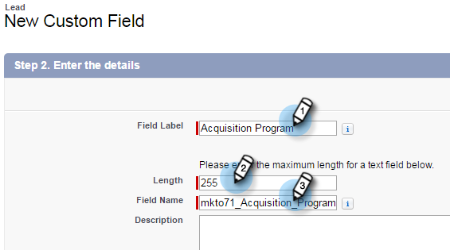

# 步驟1（共3步）:將Marketo欄位新增至Salesforce（專業版）{#step-of-add-marketo-fields-to-salesforce-professional}

>[!PREREQUISITES]
>
>您的Salesforce例項必須擁有Salesforce API的存取權，才能在Marketo和Salesforce之間同步資料。

Marketo使用一組欄位來擷取特定類型的行銷相關資訊。 如果您想要在Salesforce中取得此資料，請依照下列指示進行。

1. 在銷售機會和連絡人物件上，在Salesforce中建立三個自訂欄位：分數、贏取計畫和贏取日期。
1. 在銷售機會和聯絡人之間映射這些自訂欄位，以便在Salesforce中轉換時，值會延續。
1. 如有必要，您可以建立其他欄位（請參閱下表）。

所有這些自訂欄位都是選用欄位，不需要同步Marketo和Salesforce。 建議您為「分數」、「贏取計畫」和「贏取日期」建立欄位，這是最佳實務。

## 將Marketo欄位新增至Salesforce {#add-marketo-fields-to-salesforce}

在上述Salesforce中，新增三個自訂欄位至銷售機會和連絡人物件。 如果您想要新增更多，請參閱本節結尾的可用欄位表格。

對三個自訂欄位中的每個欄位執行下列步驟，以新增這些欄位。 從&#x200B;**分數**&#x200B;開始。

1. 登入Salesforce，然後按一下「設定」。****

   

1. 在左側的「生成」菜單中，按一下「自定義&#x200B;****」並選擇「銷售線索」。 ****&#x200B;按一下&#x200B;**欄位**。

   

1. 在頁面底部的「自訂欄位與關係」區段中，按一下「**新增**」。

   

1. 選擇適當的欄位類型(適用於「分數」— **number**;收購計畫— **text**;收購日期— **日期／時間**)。

   

1. 按一下&#x200B;**Next**。

   

1. 輸入欄位的欄位標籤、長度和欄位名稱，如下表所示。

<table> 
 <thead> 
  <tr> 
   <th> 
    

      欄位標籤 
    
</th> 
   <th> 
    

      欄位名稱 
    
</th> 
   <th> 
    

      資料類型 
    
</th> 
   <th> 
    

      欄位屬性 
    
</th> 
  </tr> 
 </thead> 
 <tbody> 
  <tr> 
   <td>分數</td> 
   <td>mkto71_Lead_Score</td> 
   <td>數字</td> 
   <td>長度10 小數位數0 </td> 
  </tr> 
  <tr> 
   <td>收購日期</td> 
   <td>mkto71_Acquisition_Date</td> 
   <td>日期／時間</td> 
   <td> </td> 
  </tr> 
  <tr> 
   <td>贏取計畫</td> 
   <td>mkto71_Acquisition_Program</td> 
   <td>文字</td> 
   <td>長度255</td> 
  </tr> 
 </tbody> 
</table>

>[!NOTE]
>
>當Salesforce使用欄位名稱來建立API名稱時，會附加__c。

>[!NOTE]
>
>文字和數字欄位需要長度，但日期／時間欄位則不需要。說明是選用的。

1. 按一下&#x200B;**Next**。

   

1. 指定訪問設定並按一下&#x200B;**Next**:

   * 將所有角色設定為&#x200B;**Visible**&#x200B;和&#x200B;**只讀**

   * 清除同步用戶配置檔案的&#x200B;**只讀**&#x200B;複選框：

      * 如果用戶的配置檔案為&#x200B;_系統管理員_&#x200B;作為同步用戶，請清除系統管理員配置檔案的&#x200B;**只讀**&#x200B;複選框（如下所示）

      * 如果為同步用戶建立了&#x200B;_自定義配置檔案_，請清除該自定義配置檔案的&#x200B;**只讀**&#x200B;複選框

   

1. 選擇應顯示欄位的頁面版面。

   

1. 按一下「儲存並新增」，返回並建立其他兩個自訂欄位。 ****&#x200B;按一下「保存」(Save)**，您將完成這三個操作。**

   

1. 在左側的「生成」菜單中，按一下「自定義」**，然後選擇「聯繫人」**。 ****&#x200B;按一下&#x200B;**欄位**。
1. 對連絡人物件上的「分數」、「贏取日期」和「贏取程式」欄位執行步驟3至10，就像您對潛在客戶物件所做的一樣。
1. （可選）對此表中的任何其他自定義欄位使用上述過程。

<table> 
 <tbody> 
  <tr> 
   <th>欄位標籤</th> 
   <th>欄位名稱</th> 
   <th>資料類型</th> 
   <th>欄位屬性</th> 
  </tr> 
  <tr> 
   <td>贏取計畫ID</td> 
   <td>mkto71_Acquisition_Program_Id</td> 
   <td>數字</td> 
   <td>長度18 小數位數0 </td> 
  </tr> 
  <tr> 
   <td>原始反向連結</td> 
   <td>mkto71_Original_Referrer</td> 
   <td>文字</td> 
   <td>長度255</td> 
  </tr> 
  <tr> 
   <td>原始搜尋引擎</td> 
   <td>mkto71_Original_Search_Engine</td> 
   <td>文字</td> 
   <td>長度255</td> 
  </tr> 
  <tr> 
   <td>原始搜尋片語</td> 
   <td>mkto71_Original_Search_Phrase</td> 
   <td>文字</td> 
   <td>長度255</td> 
  </tr> 
  <tr> 
   <td>原始來源資訊</td> 
   <td>mkto71_Original_Source_Info</td> 
   <td>文字</td> 
   <td>長度255</td> 
  </tr> 
  <tr> 
   <td>原始來源類型</td> 
   <td>mkto71_Original_Source_Type</td> 
   <td>文字</td> 
   <td>長度255</td> 
  </tr> 
  <tr> 
   <td>推斷城市</td> 
   <td>mkto71_Intermited_City</td> 
   <td>文字</td> 
   <td>長度255</td> 
  </tr> 
  <tr> 
   <td>推斷公司</td> 
   <td>mkto71_Intermited_Company</td> 
   <td>文字</td> 
   <td>長度255</td> 
  </tr> 
  <tr> 
   <td>推斷國家</td> 
   <td>mkto71_Intermited_Country</td> 
   <td>文字</td> 
   <td>長度255</td> 
  </tr> 
  <tr> 
   <td>推斷的都市區</td> 
   <td>mkto71_Intermited_Metropolitan_Area</td> 
   <td>文字</td> 
   <td>長度255</td> 
  </tr> 
  <tr> 
   <td>推斷的電話區號</td> 
   <td>mkto71_Intermited_Phone_Area_Code</td> 
   <td>文字</td> 
   <td>長度255</td> 
  </tr> 
  <tr> 
   <td>推斷的郵遞區號</td> 
   <td>mkto71_Intermited_Postal_Code</td> 
   <td>文字</td> 
   <td>長度255</td> 
  </tr> 
  <tr> 
   <td>推斷的州區</td> 
   <td>mkto71_Intermited_State_Region</td> 
   <td>文字</td> 
   <td>長度255</td> 
  </tr> 
 </tbody> 
</table>

## 映射轉換的自訂欄位{#map-custom-fields-for-conversions}

Salesforce中銷售機會物件上的自訂欄位應對應至連絡人物件上的連絡人欄位，以便在發生轉換時傳送資料。

1. 在右上角按一下「設定」。

   

1. 在「導覽搜尋」中輸入「欄位」，毋需按Enter鍵。 欄位會顯示在不同的物件下；按一下Leads下的Fields。

   

1. 轉至「銷售線索自訂欄位與關係」區段，然後按一下「對應銷售線索欄位」。

   

1. 按一下您要對應之欄位旁的下拉式清單。

   

1. 選擇對應的聯繫人自訂欄位。

   

1. 對您已建立的任何其他欄位重複上述步驟。
1. 完成後，按一下「儲存」。

夠輕鬆的吧？

>[!NOTE]
>
>以下是整個程式的[視頻，應該能夠清晰顯示！](https://nation.marketo.com/videos/1475)

>[!MORELIKETHIS]
>
>[步驟2（共3步）:為Marketo（專業）建立Salesforce使用者](/help/marketo/product-docs/crm-sync/salesforce-sync/setup/professional-edition/step-2-of-3-create-a-salesforce-user-for-marketo-professional.md)
