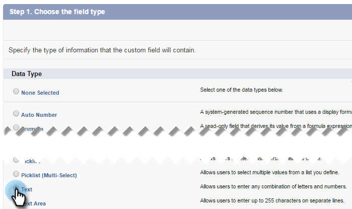

# 第1步（共3步）:將Marketo欄位添加到Salesforce(Professional) {#step-of-add-marketo-fields-to-salesforce-professional}

>[!PREREQUISITES]
>
>您的Salesforce執行個體必須能存取Salesforce API，以在Marketo和Salesforce之間同步資料。

Marketo使用一組欄位來擷取特定類型的行銷相關資訊。 若要在Salesforce中使用此資料，請遵循下列指示。

1. 在銷售機會和聯繫人對象的Salesforce中建立三個自定義欄位：分數、贏取計畫和贏取日期。
1. 映射銷售機會和聯繫人之間的這些自定義欄位，使得在Salesforce中進行轉換時，這些值會繼續存在。
1. 如有需要，您可以建立其他欄位（請參閱下表）。

所有這些自訂欄位均為選用欄位，且不是同步Marketo和Salesforce的必要欄位。 建議您為「分數」、「贏取方案」和「贏取日期」建立欄位，作為最佳實務。

## 將Marketo欄位新增至Salesforce {#add-marketo-fields-to-salesforce}

在上面所列的Salesforce中，在銷售機會和聯繫人對象上添加三個自定義欄位。 如果您想要新增更多，請參閱本區段結尾的可用欄位表格。

對三個自訂欄位中的每個欄位執行下列步驟以新增它們。 以&#x200B;**分數**&#x200B;開始。

1. 登錄Salesforce，然後按一下「**設定」。**

   

1. 在左側的「生成」菜單中，按一下「**自定義**」並選擇「**銷售機會**」。 按一下「**欄位**」。

   

1. 在頁面底部的「自訂欄位與關係」區段中，按一下「**新增**」。

   

1. 選擇適當的欄位類型(對於分數 — **number**;贏取方案 — **text**;贏取日期 — **日期/時間**)。

   

1. 按一下&#x200B;**Next**。

   

1. 輸入欄位的欄位標籤、長度和欄位名稱，如下表所示。

<table> 
 <thead> 
  <tr> 
   <th> 
    

      欄位標籤 
    
</th> 
   <th> 
    

      欄位名稱 
    
</th> 
   <th> 
    

      資料類型 
    
</th> 
   <th> 
    

      欄位屬性 
    
</th> 
  </tr> 
 </thead> 
 <tbody> 
  <tr> 
   <td>分數</td> 
   <td>mkto71_Lead_Score</td> 
   <td>數字</td> 
   <td>長度10 小數位數0 </td> 
  </tr> 
  <tr> 
   <td>贏取日期</td> 
   <td>mkto71_Acquisition_Date</td> 
   <td>日期/時間</td> 
   <td> </td> 
  </tr> 
  <tr> 
   <td>贏取計畫</td> 
   <td>mkto71_Acquisition_Program</td> 
   <td>文字</td> 
   <td>長255</td> 
  </tr> 
 </tbody> 
</table>

>[!NOTE]
>
>Salesforce使用欄位名稱建立API名稱時，會將__c附加至欄位名稱。

>[!NOTE]
>
>文字和數字欄位需要長度，但日期/時間欄位不需要。說明為選用。

1. 按一下&#x200B;**Next**。

   

1. 指定訪問設定，然後按一下&#x200B;**Next**:

   * 將所有角色設定為&#x200B;**Visible**&#x200B;和&#x200B;**只讀**

   * 清除同步用戶配置檔案的&#x200B;**只讀**&#x200B;複選框：

      * 如果用戶的配置檔案為&#x200B;_系統管理員_，則清除系統管理員配置檔案的&#x200B;**只讀**&#x200B;複選框（如下所示）

      * 如果為同步用戶建立了&#x200B;_自定義配置檔案_，請清除該自定義配置檔案的&#x200B;**只讀**&#x200B;複選框

   

1. 選擇應顯示欄位的頁面配置。

   

1. 按一下「**儲存並新增**」，返回並建立其他兩個自訂欄位中的每個欄位。 按一下「**儲存**」，三者皆完成。

   

1. 在左側的「生成」菜單中，按一下「**自定義**」並選擇「**聯繫人**」。 按一下「**欄位**」。
1. 對聯繫對象的「分數」、「贏取日期」和「贏取程式」欄位執行步驟3到步驟10，就像您對潛在客戶對象所做的一樣。
1. （可選）對此表中的任何其他自定義欄位使用上述過程。

<table> 
 <tbody> 
  <tr> 
   <th>欄位標籤</th> 
   <th>欄位名稱</th> 
   <th>資料類型</th> 
   <th>欄位屬性</th> 
  </tr> 
  <tr> 
   <td>贏取方案Id</td> 
   <td>mkto71_Acquisition_Program_Id</td> 
   <td>數字</td> 
   <td>長度18 小數位數0 </td> 
  </tr> 
  <tr> 
   <td>原始反向連結</td> 
   <td>mkto71_Original_Referrer</td> 
   <td>文字</td> 
   <td>長255</td> 
  </tr> 
  <tr> 
   <td>原始搜尋引擎</td> 
   <td>mkto71_Original_Search_Engine</td> 
   <td>文字</td> 
   <td>長255</td> 
  </tr> 
  <tr> 
   <td>原始搜索片語</td> 
   <td>mkto71_Original_Search_Phrase</td> 
   <td>文字</td> 
   <td>長255</td> 
  </tr> 
  <tr> 
   <td>原始源資訊</td> 
   <td>mkto71_Original_Source_Info</td> 
   <td>文字</td> 
   <td>長255</td> 
  </tr> 
  <tr> 
   <td>原始源類型</td> 
   <td>mkto71_Original_Source_Type</td> 
   <td>文字</td> 
   <td>長255</td> 
  </tr> 
  <tr> 
   <td>推斷城市</td> 
   <td>mkto71_Exterified_City</td> 
   <td>文字</td> 
   <td>長255</td> 
  </tr> 
  <tr> 
   <td>推斷公司</td> 
   <td>mkto71_Exterified_Company</td> 
   <td>文字</td> 
   <td>長255</td> 
  </tr> 
  <tr> 
   <td>推斷國家</td> 
   <td>mkto71_Exterified_Country</td> 
   <td>文字</td> 
   <td>長255</td> 
  </tr> 
  <tr> 
   <td>推斷的都市區</td> 
   <td>mkto71_Exterited_Metropolitan_Area</td> 
   <td>文字</td> 
   <td>長255</td> 
  </tr> 
  <tr> 
   <td>推斷電話區號</td> 
   <td>mkto71_Exterified_Phone_Area_Code</td> 
   <td>文字</td> 
   <td>長255</td> 
  </tr> 
  <tr> 
   <td>推斷郵遞區號</td> 
   <td>mkto71_Exterited_Postal_Code</td> 
   <td>文字</td> 
   <td>長255</td> 
  </tr> 
  <tr> 
   <td>推斷的州區</td> 
   <td>mkto71_Exterified_State_Region</td> 
   <td>文字</td> 
   <td>長255</td> 
  </tr> 
 </tbody> 
</table>

>[!NOTE]
>
>建立新欄位後，Marketo自動指派的欄位中的值將不會立即在Salesforce中使用。 Marketo會在下次更新至任一系統的記錄時，將資料同步至Salesforce(亦即，更新至Marketo和Salesforce之間同步的任何欄位)。

## 映射轉換的自訂欄位  {#map-custom-fields-for-conversions}

Salesforce中潛在客戶物件上的自訂欄位應對應至聯繫人物件上的聯絡欄位，以便在轉換發生時傳遞資料。

1. 按一下右上角的「設定」 。

   

1. 在導覽搜尋中輸入「欄位」，而不按Enter鍵。 欄位會顯示在不同的物件下；按一下銷售機會下的欄位。

   

1. 轉至銷售機會自訂欄位和關係區段，然後按一下對應銷售機會欄位。

   

1. 按一下您要對應之欄位旁的下拉式清單。

   

1. 選擇相應的聯繫人自定義欄位。

   

1. 對您建立的任何其他欄位重複上述步驟。
1. 完成後，按一下「儲存」 。

夠輕鬆的，對吧？

>[!NOTE]
>
>以下是整個過程的[視頻，應該讓它清晰明瞭！](https://nation.marketo.com/videos/1475)

>[!MORELIKETHIS]
>
>[第2步（共3步）:建立Marketo的Salesforce使用者（專業版）](/help/marketo/product-docs/crm-sync/salesforce-sync/setup/professional-edition/step-2-of-3-create-a-salesforce-user-for-marketo-professional.md)
