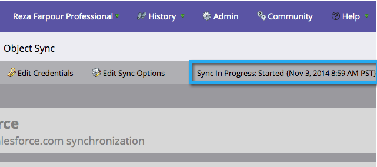

# 第3步（共3步）:連接Marketo和Salesforce（專業版） {#step-of-connect-marketo-and-salesforce-professional}

在本文中，您會將Marketo設定為與您設定的Salesforce例項同步。

>[!PREREQUISITES]
>
>* [第1步（共3步）:將Marketo欄位添加到Salesforce(Professional)](/help/marketo/product-docs/crm-sync/salesforce-sync/setup/professional-edition/step-1-of-3-add-marketo-fields-to-salesforce-professional.md)
>* [第2步（共3步）:建立Marketo的Salesforce使用者（專業版）](/help/marketo/product-docs/crm-sync/salesforce-sync/setup/professional-edition/step-2-of-3-create-a-salesforce-user-for-marketo-professional.md)

## 檢索同步用戶安全令牌 {#retrieve-sync-user-security-token}

>[!TIP]
>
>如果您已擁有安全令牌，請直接繼續設定同步用戶憑據和kudo以準備！

1. 使用Marketo同步用戶登錄Salesforce，按一下同步用戶的名稱，然後按一下&#x200B;**我的設定**。

   

1. 在導覽列中，輸入「reset」，然後按一下&#x200B;**「重設我的安全權杖」**。

   

1. 按一下「**重設安全令牌**」。

   

   安全性代號會透過電子郵件傳送給您。

## 設定同步用戶憑據 {#set-sync-user-credentials}

1. 在Marketo中，前往&#x200B;**Admin**，選取&#x200B;**CRM**，然後按一下「與[Salesforce.com](https://Salesforce.com)**同步」。**

   

   >[!NOTE]
   >
   >在按一下&#x200B;**同步欄位**&#x200B;之前，請務必在Marketo中隱藏您不需要的所有欄位。 按一下「同步欄位」後，使用者可看見的所有欄位都會在Marketo中建立，且無法刪除。

1. 輸入在Salesforce配置的第2部分([Professional](/help/marketo/product-docs/crm-sync/salesforce-sync/setup/professional-edition/step-2-of-3-create-a-salesforce-user-for-marketo-professional.md)、[Enterprise](/help/marketo/product-docs/crm-sync/salesforce-sync/setup/enterprise-unlimited-edition/step-2-of-3-create-a-salesforce-user-for-marketo-enterprise-unlimited.md)中建立的Salesforce同步用戶憑據，然後按一下&#x200B;**Sync Fields**。

   

   >[!NOTE]
   >
   >如果您正在將Marketo沙箱同步至Salesforce沙箱，請檢查&#x200B;**沙箱**。

1. 閱讀警告，然後按一下&#x200B;**確認憑據**。

   

   >[!CAUTION]
   >
   >如果您想查看[對應並自訂](/help/marketo/product-docs/crm-sync/salesforce-sync/setup/optional-steps/edit-initial-field-mappings.md)，這是您唯一的機會！ 按一下「啟動Salesforce同步」後，即可完成。

## 啟動Salesforce同步 {#start-salesforce-sync}

1. 按一下&#x200B;**啟動Salesforce同步**&#x200B;以開始持續的Marketo-Salesforce同步。

   

   >[!CAUTION]
   >
   >Marketo不會針對Salesforce同步或當您手動輸入銷售機會時自動消除重複資料。

1. 按一下&#x200B;**開始同步**。

   

   >[!NOTE]
   >
   >完成初始同步的時間會根據資料庫的大小和複雜性而有所不同。

## 驗證同步 {#verify-sync}

Marketo會在「管理」區域中提供Salesforce同步的狀態訊息。 您可以依照下列步驟來驗證同步是否正確運作。

1. 在Marketo中，按一下&#x200B;**Admin**，然後按一下&#x200B;**Salesforce**。

   

1. 同步狀態顯示在右上角。 它將顯示三條消息之一：**上次同步**、**正在同步**&#x200B;或&#x200B;**失敗**。

   

   

   

哇，您剛剛完成了Marketo最強大的功能之一的配置！

>[!MORELIKETHIS]
>
>* [在SalesforceAppExchange中安裝Marketo Sales Insight套件](/help/marketo/product-docs/marketo-sales-insight/msi-for-salesforce/installation/install-marketo-sales-insight-package-in-salesforce-appexchange.md)
>* [在Salesforce Professional Edition中設定Marketo Sales Insight](/help/marketo/product-docs/marketo-sales-insight/msi-for-salesforce/configuration/configure-marketo-sales-insight-in-salesforce-professional-edition.md)

