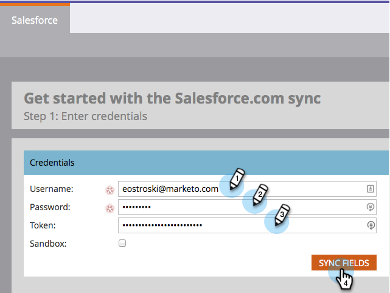

# 步驟3（共3步）:連接Marketo和Salesforce（專業版）{#step-of-connect-marketo-and-salesforce-professional}

在本文中，您會將Marketo設定為與您設定的Salesforce例項同步。

>[!PREREQUISITES]
>
>* [步驟1（共3步）:將Marketo欄位新增至Salesforce（專業版）](/help/marketo/product-docs/crm-sync/salesforce-sync/setup/professional-edition/step-1-of-3-add-marketo-fields-to-salesforce-professional.md)
>* [步驟2（共3步）:為Marketo（專業）建立Salesforce使用者](/help/marketo/product-docs/crm-sync/salesforce-sync/setup/professional-edition/step-2-of-3-create-a-salesforce-user-for-marketo-professional.md)

## 擷取同步使用者安全性Token {#retrieve-sync-user-security-token}

>[!TIP]
>
>如果您已擁有安全性Token，請直接前往「設定同步使用者憑證」和「kudos」進行準備！

1. 使用「Marketo同步使用者」登入Salesforce，按一下同步使用者的名稱，然後按一下「我的設定」**。**

   

1. 在導覽搜尋列中，輸入「reset」，然後按一下「**重設我的安全性Token**」。

   

1. 按一下「重設安全性Token」。****

   

   安全性Token將會以電子郵件寄送給您。

## 設定同步用戶憑據{#set-sync-user-credentials}

1. 在Marketo，前往&#x200B;**Admin**，選擇&#x200B;**CRM**，然後按一下「與[Salesforce.com](https://Salesforce.com)**同步」。**

   

   >[!NOTE]
   >
   >在按一下「同步欄位」之前，請務必在Marketo隱藏您不需要的所有欄位（在同步用戶中）。 ****&#x200B;在您按一下「同步欄位」後，使用者可看見的所有欄位都將永久建立在Marketo，而且無法刪除。

1. 輸入在Salesforce設定第2部分([Professional](/help/marketo/product-docs/crm-sync/salesforce-sync/setup/professional-edition/step-2-of-3-create-a-salesforce-user-for-marketo-professional.md)、[Enterprise](/help/marketo/product-docs/crm-sync/salesforce-sync/setup/enterprise-unlimited-edition/step-2-of-3-create-a-salesforce-user-for-marketo-enterprise-unlimited.md)中建立的Salesforce同步使用者憑證，然後按一下「同步欄位&#x200B;**」。**

   

   >[!NOTE]
   >
   >如果您要將Marketo沙盒同步至Salesforce沙盒，請勾選&#x200B;**沙盒**。

1. 閱讀警告，然後按一下「確認認證&#x200B;**」。**

   

   >[!CAUTION]
   >
   >如果您想要查看[映射並自定義它們](/help/marketo/product-docs/crm-sync/salesforce-sync/setup/optional-steps/edit-initial-field-mappings.md)，這是您唯一這樣做的機會！ 按一下「開始Salesforce同步」後，就完成。

## 啟動Salesforce同步{#start-salesforce-sync}

1. 按一下「啟動Salesforce Sync **」以開始持續的Marketo-Salesforce同步。**

   

   >[!CAUTION]
   >
   >Marketo不會針對Salesforce同步或當您手動輸入銷售機會時自動消除重複資料。

1. 按一下&#x200B;**開始同步**。

   

   >[!NOTE]
   >
   >完成初始同步的時間視資料庫的大小和複雜性而定。

## 驗證同步{#verify-sync}

Marketo在「管理」區域中提供Salesforce同步的狀態訊息。 您可以遵循下列步驟來驗證同步是否正常運作。

1. 在Marketo，按一下「**管理員**」，然後按一下「**Salesforce**」。

   

1. 同步狀態顯示在右上角。 它將顯示以下三條消息之一：**上次同步**、**正在同步**&#x200B;或&#x200B;**失敗**。

   

   

   

哇，您剛剛完成Marketo最強大功能之一的設定，您就去！

>[!MORELIKETHIS]
>
>* [在SalesforceAppExchange中安裝Marketo銷售分析套件](/help/marketo/product-docs/marketo-sales-insight/msi-for-salesforce/installation/install-marketo-sales-insight-package-in-salesforce-appexchange.md)
>* [在Salesforce Professional Edition中設定Marketo銷售分析](/help/marketo/product-docs/marketo-sales-insight/msi-for-salesforce/configuration/configure-marketo-sales-insight-in-salesforce-professional-edition.md)

