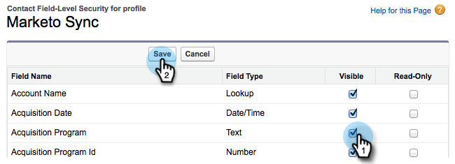

# 將現有Salesforce欄位新增至Marketo同步 {#add-an-existing-salesforce-field-to-the-marketo-sync}

>[!NOTE]
>
>**需要管理員許可權**

通常，Salesforce中的新自訂欄位會自動同步至Marketo。 如果沒有，Marketo Sync使用者可能無法看見這些欄位。 以下說明修正方法。

1. 按一下您的名稱，然後選取 **設定**.

   

1. 輸入 **設定檔** ，然後按一下 **設定檔** 在 **管理使用者**.

   

1. 按一下同步處理使用者的設定檔。

   

1. 在 **欄位層級安全性** 區段，按一下 **檢視** 位於包含欄位的物件旁。

   

1. 按一下 **編輯**.

   

1. 檢查 **可見** 要新增至同步處理之欄位的核取方塊，然後按一下 **儲存**.

   

   真貼心！ 在下一個同步處理週期中，Marketo將會看見該欄位並開始施展魔術。

   >[!NOTE]
   >
   > 如果欄位在Salesforce中已有值，則這些值要等到下次記錄更新時才會同步至Marketo。
