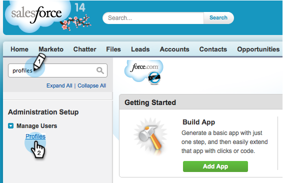

# 隱藏Marketo同步中的[!DNL Salesforce]欄位 {#hide-a-salesforce-field-from-the-marketo-sync}

>[!NOTE]
>
>**需要管理員許可權**

Salesforce並非每個欄位都適合行銷使用。 您可以僅包含您需要的欄位，以最佳化同步效能。 以下說明如何從Marketo Engage隱藏欄位。

1. 按一下您的名稱功能表並選取&#x200B;**[!UICONTROL Setup]**。

   

1. 在搜尋列中輸入「設定檔」，然後按一下&#x200B;**[!UICONTROL Profiles]**&#x200B;底下的&#x200B;**[!UICONTROL Manage Users]**。

   

1. 按一下同步處理使用者的設定檔。

   

1. 在&#x200B;**[!UICONTROL Field-Level Security]**&#x200B;區段下，按一下包含目標欄位之物件旁的&#x200B;**[!UICONTROL View]**。

   

1. 按一下「**[!UICONTROL Edit]**」。

   

1. 取消勾選您要隱藏之欄位旁的&#x200B;**[!UICONTROL Visible]**&#x200B;核取方塊。 按一下「**[!UICONTROL Save]**」。

   

   >[!NOTE]
   >
   >如果您在[!DNL Salesforce]中隱藏的欄位已經與Marketo同步，如果您不想使用，也需要在Marketo中隱藏該欄位。

   完成了！下次同步完成後，您將無法在Marketo中看到此欄位。

   >[!MORELIKETHIS]
   >
   >[隱藏和取消隱藏欄位](/help/marketo/product-docs/administration/field-management/hide-and-unhide-a-field.md){target="_blank"}
