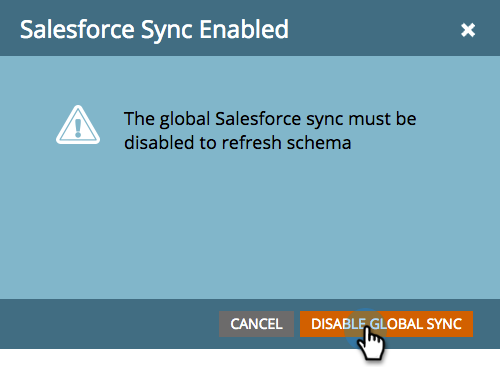
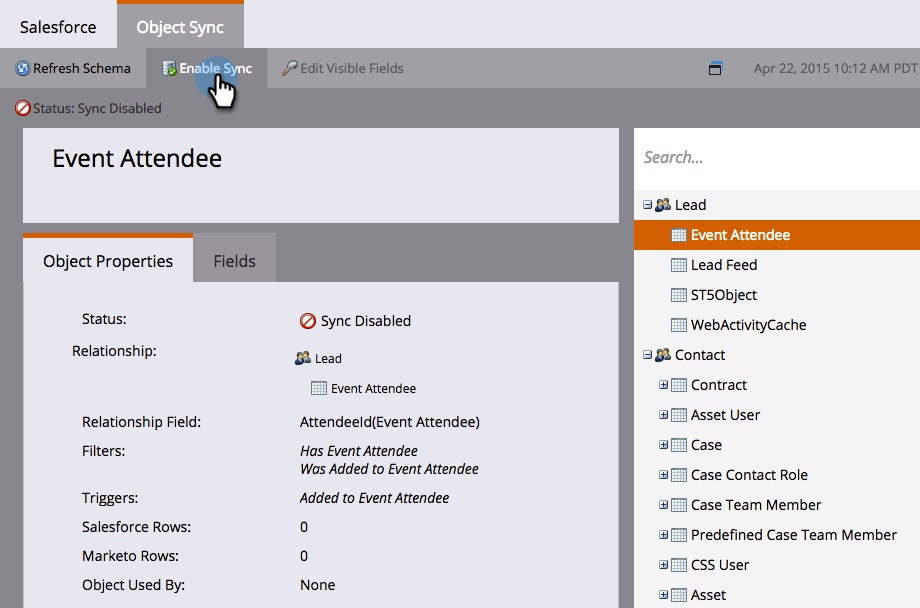
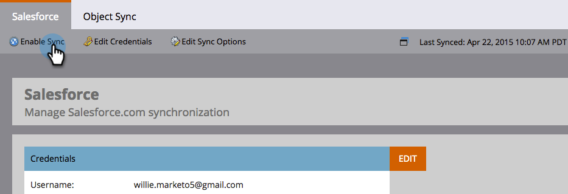

# SFDC同步：自定義對象同步 {#sfdc-sync-custom-object-sync}

在Salesforce實例中建立的自定義對象也可以是Marketo的一部分。  下面是如何設定。

>[!NOTE]
>
>**需要管理權限**

>[!PREREQUISITES]
>
>要使用自定義對象，它必須與 [鉛](/help/marketo/product-docs/crm-sync/salesforce-sync/sfdc-sync-details/sfdc-sync-field-sync.md)。 [聯繫](/help/marketo/product-docs/crm-sync/salesforce-sync/sfdc-sync-details/sfdc-sync-contact-sync.md)或 [帳戶](/help/marketo/product-docs/crm-sync/salesforce-sync/sfdc-sync-details/sfdc-sync-account-sync.md) Salesforce中的對象。

## 啟用自定義對象  {#enable-custom-object}

1. 按一下 **管理** 和 **Salesforce對象同步** 的子菜單。

   。

1. 如果這是您的第一個自定義對象，請按一下 **同步架構**。

   

1. 按一下 **禁用全局同步**。

   

   >[!NOTE]
   >
   >Salesforce自定義對象架構的初始同步可能需要幾分鐘時間。

   

1. 將要同步的自定義對象拖到畫布中。

   

   >[!NOTE]
   >
   >自定義對象必須具有唯一的名稱。 Marketo不支援兩個同名的不同自定義對象。

1. 按一下 **啟用同步**。

   

1. 按一下 **啟用同步** 的雙曲餘切值。

   

   >[!NOTE]
   >
   >不要忘記重新啟用全局同步！

1. 返回 **Salesforce** 頁籤。

   

1. 按一下 **啟用同步**。

   

1. 要查看所有Salesforce自定義對象，請按一下 **管理** 和 **Salesforce對象同步** 連結（與上面步驟1相同）。

   

   >[!NOTE]
   >
   >Marketo僅支援與標準實體連結的一個或兩個深度的定製實體。

### 下一步： {#whats-next}

[添加/刪除自定義對象欄位作為智慧清單/觸發器約束](/help/marketo/product-docs/crm-sync/salesforce-sync/setup/optional-steps/add-remove-custom-object-field-as-smart-list-trigger-constraints.md)

太棒了！ 您現在可以在智慧市場活動和智慧清單中使用此自定義對象的資料。
