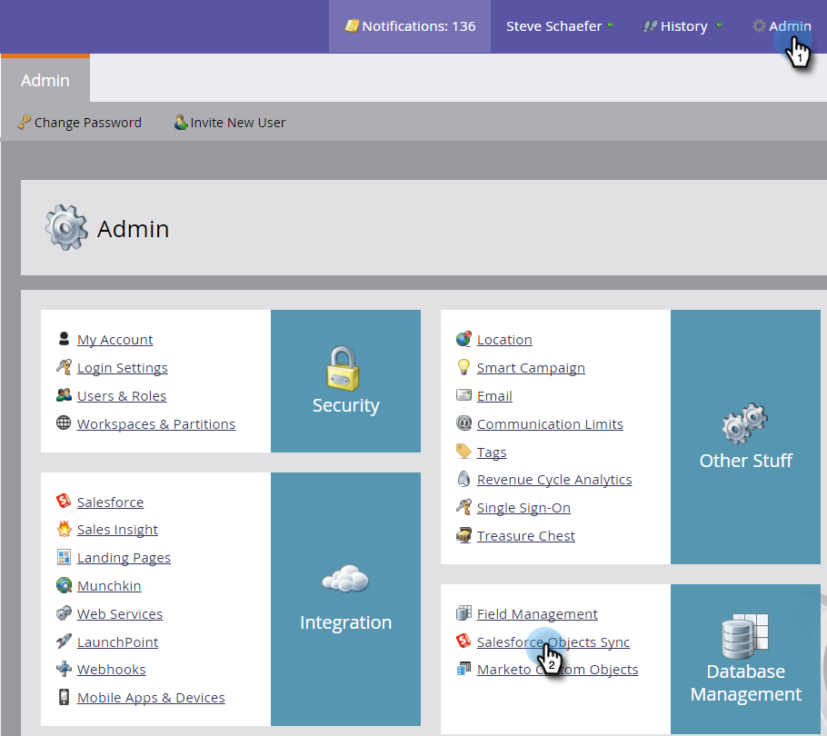

# SFDC同步：自訂物件同步{#sfdc-sync-custom-object-sync}

在Salesforce例項中建立的自訂物件也可以是Marketo的一部分。  這是如何設定的。

>[!NOTE]
>
>**需要管理員權限**

>[!PREREQUISITES]
>
>若要使用自訂物件，它必須與Salesforce中的[lead](/help/marketo/product-docs/crm-sync/salesforce-sync/sfdc-sync-details/sfdc-sync-field-sync.md)、[contact](/help/marketo/product-docs/crm-sync/salesforce-sync/sfdc-sync-details/sfdc-sync-contact-sync.md)或[account](/help/marketo/product-docs/crm-sync/salesforce-sync/sfdc-sync-details/sfdc-sync-account-sync.md)物件相關聯。

## 啟用自訂物件{#enable-custom-object}

1. 按一下「**管理員**」和「**Salesforce物件同步**」連結。

   .

1. 如果這是您的第一個自定義對象，請按一下&#x200B;**同步方案**。

   

1. 按一下&#x200B;**禁用全局同步**。

   

   >[!NOTE]
   >
   >Salesforce自訂物件架構的初始同步可能需要幾分鐘的時間。

   

1. 將您要同步的自訂物件拖曳至畫布中。

   

   >[!NOTE]
   >
   >自訂物件必須有唯一的名稱。 Marketo不支援兩個同名的不同自訂物件。

1. 按一下&#x200B;**啟用同步**。

   

1. 再次按一下&#x200B;**啟用同步**。

   

   >[!NOTE]
   >
   >別忘了重新啟用全域同步！

1. 返回&#x200B;**Salesforce**&#x200B;標籤。

   

1. 按一下&#x200B;**啟用同步**。

   

1. 若要檢視所有Salesforce自訂物件，請按一下&#x200B;**Admin**&#x200B;和&#x200B;**Salesforce物件同步**&#x200B;連結（與上述步驟1相同）。

   

   >[!NOTE]
   >
   >Marketo僅支援連結至一或兩層深之標準實體的自訂實體。

### 下一步：{#whats-next}

[將自定義對象欄位添加／刪除為智慧清單／觸發器約束](/help/marketo/product-docs/crm-sync/salesforce-sync/setup/optional-steps/add-remove-custom-object-field-as-smart-list-trigger-constraints.md)

太棒了！ 您現在可以在智慧型促銷活動和智慧型清單中使用此自訂物件的資料。
