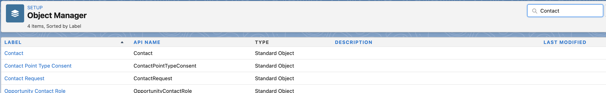

# 步驟1/3：將Marketo欄位新增至Veeva CRM {#step-1-of-3-add-marketo-fields-to-veeva-crm}

>[!PREREQUISITES]
>
>您的Veeva CRM執行個體必須能存取Salesforce API，才能在Marketo Engage和Veeva CRM之間同步資料。

Marketo Engage會使用一組欄位來擷取特定型別的行銷相關資訊。 如果您想在Veeva CRM中使用此資料，請遵循下列指示。

`1.` 在連絡人物件的Veeva CRM中建立自訂欄位：分數

`2.` 如有需要，您可以建立其他欄位（請參閱下表）。

所有這些自訂欄位都是選用欄位，不需要用來同步Marketo Engage和Veeva CRM。

## 將Marketo欄位新增至Veeva CRM {#add-marketo-fields-to-veeva-crm}

在上面列出的Veeva CRM中，在潛在客戶與聯絡人物件上新增自訂欄位。 如果您想要新增更多欄位，請參閱本區段末尾的可用欄位表。

對「分數」欄位執行下列步驟以將其新增。

1. 登入Veeva CRM並按一下 **設定**.

   

1. 按一下「物件與欄位」，然後選取「物件管理員」。

   

1. 在搜尋列中搜尋連絡人。

   

1. 按一下Contact物件。

1. 選取欄位與關係。

1. 按一下 **新增**.

   

1. 選擇適當的欄位型別（針對分數 — 數字）。

   

1. 按一下 **下一個**.

   

1. 輸入欄位的欄位標籤、長度和欄位名稱，如下表所示。

<table>
 <tbody>
  <tr>
   <th>欄位標籤
   <th>欄位名稱
   <th>資料類型
   <th>欄位屬性
  </tr>
  <tr>
   <td>分數</td>
   <td>mkto71_Lead_Score</td>
   <td>數字</td>
   <td>長度10 
小數位數0</td>
  </tr>
 </tbody>
</table>

>[!NOTE]
>
>Veeva CRM在建立API名稱時，會將__c附加至欄位名稱。

>[!NOTE]
>
>文字和數字欄位需要長度，但日期/時間欄位不需要。說明為選用。

1. 按一下 **下一個**.

   

1. 指定存取設定，然後按一下 **下一個**.

1. 將所有角色設定為可見和唯讀。

1. 清除同步使用者設定檔的「唯讀」核取方塊：

* 如果您有系統管理員設定檔的使用者作為同步使用者，請清除系統管理員設定檔的[唯讀]核取方塊（如下所示）。
* 如果您為同步使用者建立了自訂設定檔，請清除該自訂設定檔的「唯讀」核取方塊。

  

1. 選擇應顯示欄位的頁面配置。

1. 按一下 **儲存並新增** 返回並建立其他兩個自訂欄位。

1. 按一下 **儲存** 完成所有這三項之後。

   

>[!NOTE]
>
>透過將欄位新增至聯絡人物件，這些欄位也會新增至個人帳戶物件。

可選：對下表中的任何其他自訂欄位使用上述程式。

<table>
 <tbody>
  <tr>
   <th>欄位標籤
   <th>欄位名稱
   <th>資料類型
   <th>欄位屬性
  </tr>
  <tr>
   <td>推斷的城市</td>
   <td>mkto71_Inferred_City</td>
   <td>文字</td>
   <td>長度255</td>
  </tr>
  <tr>
   <td>推斷的公司</td>
   <td>mkto71_Inferred_Company</td>
   <td>文字</td>
   <td>長度255</td>
  </tr>
  <tr>
   <td>推斷的國家</td>
   <td>mkto71_Inferred_Country</td>
   <td>文字</td>
   <td>長度255</td>
  </tr>
  <tr>
   <td>推斷的大都會區</td>
   <td>mkto71_Inferred_Metropolitan_Area</td>
   <td>文字</td>
   <td>長度255</td>
  </tr>
  <tr>
   <td>推斷的電話區碼</td>
   <td>mkto71_Inferred_Phone_Area_Code</td>
   <td>文字</td>
   <td>長度255</td>
  </tr>
  <tr>
   <td>推斷的郵遞區號</td>
   <td>mkto71_Inferred_Postal_Code</td>
   <td>文字</td>
   <td>長度255</td>
  </tr>
  <tr>
   <td>推斷的州別區域</td>
   <td>mkto71_Inferred_State_Region</td>
   <td>文字</td>
   <td>長度255</td>
  </tr>
 </tbody>
</table>

>[!NOTE]
>
>建立新欄位後，Marketo自動指派的欄位中的值將無法立即在Veeva CRM中使用。 在任何一個系統上的記錄下一次更新時(即對Marketo和Veeva CRM之間同步的任何欄位的更新)，Marketo會將資料同步到Veeva CRM。
