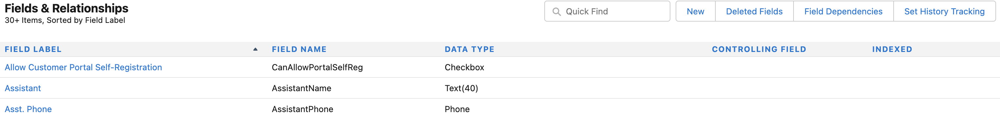

# 第1步（共3步）:新增Marketo欄位至Veva CRM {#step-1-of-3-add-marketo-fields-to-veeva-crm}

>[!PREREQUISITES]
>
>您的Veva CRM例項必須能存取Salesforce API，以在Marketo Engage與Veva CRM之間同步資料。

Marketo Engage使用一組欄位來擷取特定類型的行銷相關資訊。 若要在Veva CRM中使用此資料，請遵循下列指示。

`1.` 在Veva CRM中建立連絡人物件的自訂欄位：分數

`2.` 您可以視需要建立其他欄位（請參閱下表）。

這些自訂欄位均為選用欄位，且不是同步Marketo Engage和Veeva CRM的必要欄位。

## 新增Marketo欄位至Veva CRM {#add-marketo-fields-to-veeva-crm}

在上述Veva CRM的銷售機會和連絡人物件上新增自訂欄位。 如果您想要新增更多，請參閱本區段結尾的可用欄位表格。

執行下列步驟以將「分數」欄位新增。

1. 登入Veva CRM，然後按一下 **設定**.

   

1. 按一下「對象和欄位」並選擇「對象管理器」。

   

1. 在搜索欄中，搜索聯繫人。

   

1. 按一下Contact對象。

1. 選擇欄位和關係。

1. 按一下 **新增**.

   

1. 選擇適當的欄位類型（對於分數 — 數字）。

   

1. 按一下 **下一個**.

   

1. 輸入欄位的欄位標籤、長度和欄位名稱，如下表所示。

<table>
 <tbody>
  <tr>
   <th>欄位標籤
   <th>欄位名稱
   <th>資料類型
   <th>欄位屬性
  </tr>
  <tr>
   <td>分數</td>
   <td>mkto71_Lead_Score</td>
   <td>數字</td>
   <td>長度10 
小數位數0</td>
  </tr>
 </tbody>
</table>

>[!NOTE]
>
>Veva CRM會在欄位名稱使用來建立API名稱時，將__c附加至欄位名稱。

>[!NOTE]
>
>文字和數字欄位需要長度，但日期/時間欄位不需要。說明為選用。

1. 按一下 **下一個**.

   

1. 指定存取設定，然後按一下 **下一個**.

1. 將所有角色設定為「可見」和「只讀」。

1. 清除同步用戶配置檔案的只讀複選框：

* 如果用戶的同步用戶是系統管理員的配置檔案，請清除系統管理員配置檔案的只讀複選框（如下所示）。
* 如果您為同步用戶建立了自定義配置檔案，請清除該自定義配置檔案的只讀複選框。

   

1. 選擇應顯示欄位的頁面配置。

1. 按一下 **儲存並新增** 返回並建立其他兩個自訂欄位。

1. 按一下 **儲存** 三件事都完了。

   

>[!NOTE]
>
>通過將欄位添加到Contact對象，這些欄位也添加到Person Account對象中。

可選：請使用上述程式，處理下表中任何其他自訂欄位。

<table>
 <tbody>
  <tr>
   <th>欄位標籤
   <th>欄位名稱
   <th>資料類型
   <th>欄位屬性
  </tr>
  <tr>
   <td>推斷的城市</td>
   <td>mkto71_Exterified_City</td>
   <td>文字</td>
   <td>長255</td>
  </tr>
  <tr>
   <td>推斷的公司</td>
   <td>mkto71_Exterified_Company</td>
   <td>文字</td>
   <td>長255</td>
  </tr>
  <tr>
   <td>推斷的國家/地區</td>
   <td>mkto71_Exterified_Country</td>
   <td>文字</td>
   <td>長255</td>
  </tr>
  <tr>
   <td>推斷的大都會區</td>
   <td>mkto71_Exterited_Metropolitan_Area</td>
   <td>文字</td>
   <td>長255</td>
  </tr>
  <tr>
   <td>推斷的電話區碼</td>
   <td>mkto71_Exterified_Phone_Area_Code</td>
   <td>文字</td>
   <td>長255</td>
  </tr>
  <tr>
   <td>推斷的郵遞區號</td>
   <td>mkto71_Exterited_Postal_Code</td>
   <td>文字</td>
   <td>長255</td>
  </tr>
  <tr>
   <td>推斷的州別地區</td>
   <td>mkto71_Exterified_State_Region</td>
   <td>文字</td>
   <td>長255</td>
  </tr>
 </tbody>
</table>

>[!NOTE]
>
>建立新欄位後，Marketo自動指派的欄位中的值將無法立即在Veeva CRM中使用。 Marketo會在下次更新至任一系統的記錄時，將資料同步至Veeva CRM(亦即，更新Marketo與Veeva CRM之間同步的任何欄位)。
