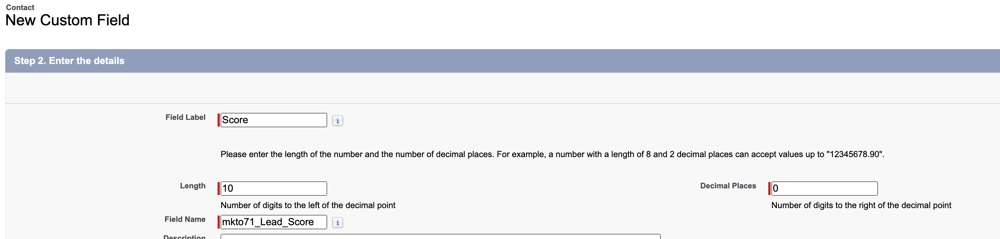

# 第1步（共3步）:將Marketo欄位添加到Veeva CRM {#step-1-of-3-add-marketo-fields-to-veeva-crm}

>[!PREREQUISITES]
>
>您的Veeva CRM實例必須具有訪問Salesforce API的權限，才能在Marketo Engage和Veeva CRM之間同步資料。

Marketo Engage使用一組欄位來捕獲某些類型的市場營銷相關資訊。 如果希望Veeva CRM中提供此資料，請按照以下說明操作。

`1.` 在Veeva CRM中對聯繫人對象建立自定義欄位：得分

`2.` 如果需要，可以建立其他欄位（請參閱下表）。

所有這些自定義欄位都是可選的，不需要同步Marketo Engage和Veeva CRM。

## 將Marketo欄位添加到Veeva CRM {#add-marketo-fields-to-veeva-crm}

在上面列出的Veeva CRM中的潛在客戶和聯繫人對象上添加自定義欄位。 如果要添加更多內容，請參閱本節末尾的可用欄位表。

對「分數」欄位執行以下步驟以添加它。

1. 登錄到Veeva CRM，然後按一下 **設定**。

   

1. 按一下「對象和欄位」，然後選擇「對象管理器」。

   

1. 在搜索欄中，搜索Contact。

   

1. 按一下Contact對象。

1. 選擇欄位和關係。

1. 按一下 **新建**。

   

1. 選擇相應的欄位類型（對於分數 — 數字）。

   

1. 按一下 **下一個**。

   

1. 輸入欄位的欄位標籤、長度和欄位名稱，如下表所示。

<table>
 <tbody>
  <tr>
   <th>欄位標籤
   <th>欄位名稱
   <th>資料類型
   <th>欄位屬性
  </tr>
  <tr>
   <td>得分</td>
   <td>mkto71_Lead_Score</td>
   <td>數字</td>
   <td>長度10 
小數位0</td>
  </tr>
 </tbody>
</table>

>[!NOTE]
>
>當Veeva CRM使用欄位名稱建立API名稱時，它會將__c附加到欄位名稱。

>[!NOTE]
>
>文本和數字欄位需要長度，但日期/時間欄位不需要。說明是可選的。

1. 按一下 **下一個**。

   

1. 指定訪問設定並按一下 **下一個**。

1. 將所有角色設定為「可見」和「只讀」。

1. 清除同步用戶配置檔案的只讀複選框：

* 如果用戶具有系統管理員的配置檔案作為同步用戶，請清除系統管理員配置檔案的只讀複選框（如下所示）。
* 如果為同步用戶建立了自定義配置檔案，請清除該自定義配置檔案的「只讀」複選框。

   

1. 選擇應顯示該欄位的頁面佈局。

1. 按一下 **保存並新建** 以返回並建立其他兩個自定義欄位。

1. 按一下 **保存** 你三件事都完了。

   

>[!NOTE]
>
>通過將欄位添加到Contact對象中，這些欄位也添加到Person Account對象中。

可選：對下表中的任何附加自定義欄位使用上述過程。

<table>
 <tbody>
  <tr>
   <th>欄位標籤
   <th>欄位名稱
   <th>資料類型
   <th>欄位屬性
  </tr>
  <tr>
   <td>推斷城市</td>
   <td>mkto71_Inferred_City</td>
   <td>文本</td>
   <td>長255</td>
  </tr>
  <tr>
   <td>推斷公司</td>
   <td>mkto71_Inferred_Company</td>
   <td>文本</td>
   <td>長255</td>
  </tr>
  <tr>
   <td>推斷國家</td>
   <td>mkto71_推斷的國家/地區</td>
   <td>文本</td>
   <td>長255</td>
  </tr>
  <tr>
   <td>推斷都市區</td>
   <td>mkto71_推斷的_大都會區</td>
   <td>文本</td>
   <td>長255</td>
  </tr>
  <tr>
   <td>推斷出的電話區號</td>
   <td>mkto71_推斷電話區號</td>
   <td>文本</td>
   <td>長255</td>
  </tr>
  <tr>
   <td>推斷的郵遞區號</td>
   <td>mkto71_推斷的_郵遞區號</td>
   <td>文本</td>
   <td>長255</td>
  </tr>
  <tr>
   <td>推斷的州區</td>
   <td>mkto71_推斷狀態區域</td>
   <td>文本</td>
   <td>長255</td>
  </tr>
 </tbody>
</table>

>[!NOTE]
>
>在建立新欄位後，Marketo自動分配的欄位中的值將不會立即在Veeva CRM中可用。 Marketo將在下次更新到任一系統上的記錄時將資料同步到Veeva CRM(即，更新Marketo和Veeva CRM之間同步的任何欄位)。
