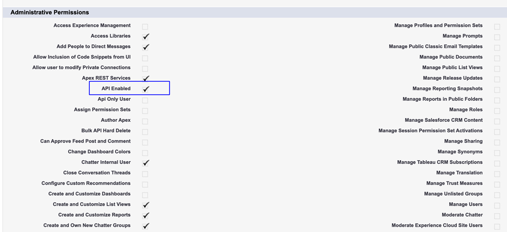

# 第2步（共3步）:建立Veeva CRM用戶以進行Marketo Engage {#step-2-of-3-create-a-veeva-crm-user-for-marketo-engage}

>[!NOTE]
>
>本文中的步驟必須由Veeva CRM管理員完成。

>[!PREREQUISITES]
>
>[第1步（共3步）:將Marketo欄位添加到Salesforce（專業）](/help/marketo/product-docs/crm-sync/veeva-crm-sync/setup/step-1-of-3-add-marketo-fields-to-veeva-crm.md){target=&quot;_blank&quot;

在本文中，您將使用Veeva CRM頁面佈局自定義欄位權限，並建立一個Marketo-Veeva CRM同步用戶。

## 設定頁面佈局 {#set-page-layouts}

按照這些步驟，Marketo同步用戶將可以更新自定義欄位。

1. 按一下Nav搜索欄中的「帳戶（人員帳戶）」頁面佈局，而不按Enter鍵，然後按一下「聯繫人」下的「頁面佈局」。

   

1. 按一下 **頁面佈局**。

   

1. 按一下 **HCP — 專業**。

   

1. 按一下並拖動新 **節** 到頁面佈局。

1. 在節名稱中輸入「Marketo」，然後按一下 **確定**。

   

1. 按一下並將「分數」欄位拖動到「Marketo」部分。

   

1. 對以下欄位重複上述步驟：

   * 推斷城市
   * 推斷公司
   * 推斷國家
   * 推斷都市區
   * 推斷出的電話區號
   * 推斷的郵遞區號
   * 推斷的州區

   >[!NOTE]
   >
   >這些欄位需要位於頁面佈局中，以便Marketo可以讀/寫它們。

   >[!TIP]
   >
   >通過向下拖動到頁面右側，為欄位建立兩列。 可以將欄位從一側移到另一側，以平衡列長度。

1. 完成HCP專業版式後，按一下 **保存**。

   

>[!NOTE]
>
>對其他「帳戶」頁面佈局重複此操作。

## 建立配置檔案 {#create-a-profile}

1. 按一下 **設定**。

   

1. 在導航搜索欄中鍵入「配置式」，然後按一下 **配置檔案** 的子菜單。

   

1. 按一下 **新建**。

   

1. 選擇「標準用戶」，將配置檔案命名為「Marketo-Salesforce同步」，然後按一下 **保存**。

   

## 設定配置檔案權限 {#set-profile-permissions}

1. 按一下 **編輯** 設定安全權限。

   

1. 在「管理權限」部分下，確保選中了「已啟用API」。

   

   >[!TIP]
   >
   >確保選中「Password Never Expires（密碼永不過期）」框。

1. 在「一般用戶權限」部分下，確保選中了「編輯事件」和「編輯任務」。

   

1. 在「標準對象權限」部分下，確保為「帳戶」和「聯繫人」選中「讀取」、「建立」、「編輯」和「刪除」權限。

   

1. 在「自定義對象權限」部分下，確保已為「調用」、「調用密鑰消息」和任何其它所需的自定義對象檢查「讀取」權限。

   

1. 完成後，按一下 **保存** 在頁面底部。

   

## 設定欄位權限 {#set-field-permissions}

1. 與您的營銷人員討論，瞭解同步所需的自定義欄位。

>[!NOTE]
>
>此步驟將防止您不需要的欄位在Marketo出現，這將減少雜亂並加快同步。

1. 在配置檔案詳細資訊頁面中，轉至「欄位級別安全性」部分。 按一下「查看」編輯聯繫人和帳戶對象的輔助功能。

   

>[!TIP]
>
>您可以根據組織的需要配置其他對象。

1. 對於每個對象，按一下 **編輯**。

   

找到不必要的欄位，確保「讀取訪問」和「編輯訪問」是 **聯合國**&#x200B;選中。 按一下 **保存** 完成。

>[!NOTE]
>
>僅編輯自定義欄位的輔助功能。

1. 禁用所有不必要的欄位後，請檢查以下對象欄位的讀取訪問和編輯訪問。 完成後，按一下「保存」。

<table>
 <tbody>
  <tr>
   <th>對象
   <th>欄位
  </tr>
  <tr>
   <td>帳戶</td>
   <td>類型欄位</td>
  </tr>
  <tr>
   <td>事件</td>
   <td>所有欄位</td>
  </tr>
  <tr>
   <td>任務</td>
   <td>所有欄位</td>
  </tr>
 </tbody>
</table>

## 建立同步用戶 {#create-sync-user}

Marketo需要憑據才能訪問Veeva CRM。 最好使用下面的步驟建立的專用用戶完成此操作。

>[!NOTE]
>
>如果您的組織沒有其他Veeva CRM許可證，則可以將現有的市場營銷用戶與系統管理員配置檔案一起使用。

1. 在導航搜索欄中輸入「用戶」，然後按一下 **用戶** 在管理用戶下。

   

1. 按一下 **新用戶**。

   

1. 填寫必填欄位，選擇「用戶許可證：Salesforce，設定配置檔案：Marketo同步用戶，然後按一下 **保存**。

   

>[!TIP]
>
>確保輸入的電子郵件地址有效。 您需要以同步用戶身份登錄才能重置密碼。

太棒了！ 現在，您擁有一個Marketo Engage可以用來連接到Veeva CRM的帳戶。 我們來吧。

>[!MORELIKETHIS]
>
>[第3步（共3步）:連接Marketo和Veeva CRM](/help/marketo/product-docs/crm-sync/veeva-crm-sync/setup/step-3-of-3-connect-marketo-engage-and-veeva-crm.md){target=&quot;_blank&quot;
