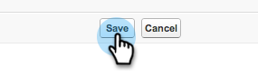

# 步驟2/3：建立Veeva CRM使用者以進行Marketo Engage {#step-2-of-3-create-a-veeva-crm-user-for-marketo-engage}

>[!NOTE]
>
>本文中的步驟必須由Veeva CRM管理員完成。

>[!PREREQUISITES]
>
>[步驟1/3：將Marketo欄位新增至Salesforce (Professional)](/help/marketo/product-docs/crm-sync/veeva-crm-sync/setup/step-1-of-3-add-marketo-fields-to-veeva-crm.md){target="_blank"}

在本文中，您將使用Veeva CRM頁面配置來自訂欄位許可權，並建立Marketo-Veeva CRM同步使用者。

## 設定頁面配置 {#set-page-layouts}

依照這些步驟操作將允許Marketo同步使用者更新自訂欄位。

1. 按一下導覽搜尋列中的「帳戶（個人帳戶）」頁面配置，而不按Enter，然後按一下「連絡人」下的「頁面配置」。

   

1. 按一下 **頁面配置**.

   

1. 按一下 **HCP — 專業**.

   

1. 按一下並拖曳新專案 **章節** 放入頁面版面中。

1. 在區段名稱中輸入「Marketo」並按一下 **確定**.

   

1. 按一下並將分數欄位拖曳至Marketo區段。

   

1. 對下列欄位重複上述步驟：

   * 推斷的城市
   * 推斷公司
   * 推斷國家
   * 推斷的大都會區
   * 推斷的電話區碼
   * 推斷的郵遞區號
   * 推斷的州別區域

   >[!NOTE]
   >
   >這些欄位必須位於頁面版面配置中，Marketo才能加以讀取/寫入。

   >[!TIP]
   >
   >向下拖曳至頁面右側，為欄位建立兩欄。 您可以將欄位從一側移動到另一側，以平衡欄長度。

1. 完成HCP專業版面配置後，按一下 **儲存**.

   

>[!NOTE]
>
>對其他「帳戶」頁面配置重複此步驟。

## 建立設定檔 {#create-a-profile}

1. 按一下 **設定**.

   

1. 在導覽搜尋列中輸入「設定檔」，然後按一下 **設定檔** 連結。

   

1. 按一下 **新增**.

   

1. 選取標準使用者，將設定檔命名為「Marketo-Salesforce Sync」，然後按一下 **儲存**.

   

## 設定設定檔許可權 {#set-profile-permissions}

1. 按一下 **編輯** 以設定安全性許可權。

   

1. 在「管理許可權」區段下，確定已選取「已啟用API」。

   

   >[!TIP]
   >
   >請務必勾選「密碼永不過期」方塊。

1. 在「一般使用者許可權」區段下，確定已選取「編輯事件」和「編輯任務」。

   

1. 在「標準物件許可權」區段下，確定已勾選「帳戶」和「連絡人」的「讀取」、「建立」、「編輯」和「刪除」許可權。

   

1. 在「自訂物件許可權」區段下，確定已針對「呼叫」、「呼叫金鑰訊息」以及其他任何所需的「自訂物件」勾選「讀取」許可權。

   

1. 完成後，按一下 **儲存** 位於頁面底部。

   

## 設定欄位許可權 {#set-field-permissions}

1. 與您的行銷人員討論，找出同步所需的自訂欄位。

>[!NOTE]
>
>此步驟將防止您不需要的欄位顯示在Marketo中，這將降低雜亂程度並加快同步速度。

1. 在設定檔詳細資訊頁面中，前往欄位層級安全性區段。 按一下「檢視」可編輯「連絡人」和「帳戶」物件的協助工具。

   

>[!TIP]
>
>您可以根據組織的需求設定其他物件。

1. 對於每個物件，按一下 **編輯**.

   

找出不必要的欄位，確定讀取存取權和編輯存取權是 **取消**&#x200B;已核取。 按一下 **儲存** 完成時。

>[!NOTE]
>
>僅編輯自訂欄位的協助工具。

1. 停用完所有不必要的欄位後，請核取下列物件欄位的「讀取存取權」和「編輯存取權」。 完成時，按一下「儲存」 。

<table>
 <tbody>
  <tr>
   <th>物件
   <th>欄位
  </tr>
  <tr>
   <td>帳戶</td>
   <td>型別欄位</td>
  </tr>
  <tr>
   <td>Event</td>
   <td>所有欄位</td>
  </tr>
  <tr>
   <td>任務</td>
   <td>所有欄位</td>
  </tr>
 </tbody>
</table>

## 建立同步使用者 {#create-sync-user}

Marketo需要憑證才能存取Veeva CRM。 最好由下列步驟建立的專屬使用者完成此操作。

>[!NOTE]
>
>如果您的組織沒有其他Veeva CRM授權，您可以使用具有系統管理員設定檔的現有行銷使用者。

1. 在導覽搜尋列中輸入「users」，然後按一下 **使用者** 在「管理使用者」底下。

   

1. 按一下 **新使用者**.

   

1. 填寫必填欄位，選取使用者授權：Salesforce，設定設定檔：Marketo同步使用者，然後按一下 **儲存**.

   

>[!TIP]
>
>請確定您輸入的電子郵件地址有效。 您必須以同步使用者身分登入才能重設密碼。

太棒了！ 現在您已擁有Marketo Engage可用來連線Veeva CRM的帳戶。 開始吧。

>[!MORELIKETHIS]
>
>[步驟3之3：連線Marketo和Veeva CRM](/help/marketo/product-docs/crm-sync/veeva-crm-sync/setup/step-3-of-3-connect-marketo-engage-and-veeva-crm.md){target="_blank"}
