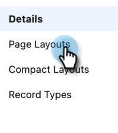

# 步驟3之2：建立Veeva CRM使用者以進行Marketo Engage {#step-2-of-3-create-a-veeva-crm-user-for-marketo-engage}

>[!NOTE]
>
>本文中的步驟必須由Veeva CRM管理員完成。

>[!PREREQUISITES]
>
>[步驟3之1：將Marketo欄位新增至Salesforce (Professional)](/help/marketo/product-docs/crm-sync/veeva-crm-sync/setup/step-1-of-3-add-marketo-fields-to-veeva-crm.md){target="_blank"}

在本文中，您將使用Veeva CRM頁面配置來自訂欄位許可權，並建立Marketo-Veeva CRM同步使用者。

## 設定頁面配置 {#set-page-layouts}

按照以下步驟操作將允許Marketo同步使用者更新自訂欄位。

1. 按一下導覽搜尋列中的[帳戶] （個人帳戶）版面配置，不按Enter，然後按一下[連絡人]底下的[頁面配置] **&#x200B;**。

   

1. 按一下&#x200B;**[!UICONTROL 頁面配置]**。

   

1. 按一下&#x200B;**[!UICONTROL HCP - Professional]**。

   

1. 按一下並將新的&#x200B;**[!UICONTROL 區段]**&#x200B;拖曳到版面配置中。

1. 在區段名稱中輸入「Marketo」，然後按一下&#x200B;**[!UICONTROL 確定]**。

   

1. 按一下並拖曳分數欄位至Marketo區段。

   

1. 對下列欄位重複上述步驟：

   * 推斷的城市
   * 推斷公司
   * 推斷國家
   * 推斷的大都會區
   * 推斷的電話區碼
   * 推斷的郵遞區號
   * 推斷的州別區域

   >[!NOTE]
   >
   >這些欄位必須位於頁面配置中，Marketo才能讀取/寫入這些欄位。

   >[!TIP]
   >
   >向下拖曳至頁面右側，為欄位建立兩欄。 您可以將欄位從一側移動到另一側，以平衡欄長度。

1. 完成HCP-Professional配置後，按一下&#x200B;**[!UICONTROL 儲存]**。

   

   >[!NOTE]
   >
   >對其他「帳戶」頁面配置重複此步驟。

## 建立設定檔 {#create-a-profile}

1. 按一下&#x200B;**[!UICONTROL 設定]**。

   

1. 在導覽搜尋列中輸入「設定檔」，然後按一下&#x200B;**[!UICONTROL 設定檔]**&#x200B;連結。

   

1. 按一下&#x200B;**[!UICONTROL 新增]**。

   

1. 選取「標準使用者」，將設定檔命名為「Marketo-Salesforce Sync」，然後按一下&#x200B;**[!UICONTROL 儲存]**。

   

## 設定設定檔許可權 {#set-profile-permissions}

1. 按一下&#x200B;**[!UICONTROL 編輯]**&#x200B;以設定安全性許可權。

   

1. 在「管理許可權」區段下，確定已選取&#x200B;**[!UICONTROL 已啟用API]**。

   

   >[!TIP]
   >
   >請務必勾選「密碼永不過期」方塊。

1. 在一般使用者許可權區段下，確定已選取&#x200B;**[!UICONTROL 編輯事件]**&#x200B;和&#x200B;**[!UICONTROL 編輯任務]**。

   

1. 在[標準物件許可權]區段下，確定已檢查帳戶和連絡人的&#x200B;**[!UICONTROL 讀取]**、**[!UICONTROL 建立]**、**[!UICONTROL 編輯]**&#x200B;和&#x200B;**[!UICONTROL 刪除]**&#x200B;許可權。

   

1. 在「自訂物件許可權」區段下，確定已針對&#x200B;**[!UICONTROL 呼叫]**、**[!UICONTROL 呼叫金鑰訊息]**&#x200B;以及其他任何需要的自訂物件檢查讀取許可權。

   

1. 完成時，請按一下頁面底部的&#x200B;**[!UICONTROL 儲存]**。

   

## 設定欄位許可權 {#set-field-permissions}

1. 與您的行銷人員討論，找出同步所需的自訂欄位。

   >[!NOTE]
   >
   >此步驟將防止您不需要的欄位顯示在Marketo中，這將減少雜亂並加快同步速度。

1. 在設定檔詳細資訊頁面中，移至[!UICONTROL 欄位層級安全性]區段。 按一下&#x200B;**[!UICONTROL 檢視]**&#x200B;以編輯連絡人和帳戶物件的協助工具。

   

   >[!TIP]
   >
   >您可以根據組織的需求設定其他物件。

1. 按一下每個物件的&#x200B;**[!UICONTROL 編輯]**。

   

1. 找出不必要的欄位，確定讀取存取和編輯存取為&#x200B;_未勾選_。 完成時，按一下&#x200B;**[!UICONTROL 儲存]**。

   

   >[!NOTE]
   >
   >僅編輯自訂欄位的協助工具。

1. 停用完所有不必要的欄位後，請核取下列物件欄位的「讀取存取權」和「編輯存取權」。 完成時，按一下&#x200B;**[!UICONTROL 儲存]**。

<table>
 <tbody>
  <tr>
   <th>物件
   <th>欄位
  </tr>
  <tr>
   <td>帳戶</td>
   <td>型別欄位</td>
  </tr>
  <tr>
   <td>事件</td>
   <td>所有欄位</td>
  </tr>
  <tr>
   <td>任務</td>
   <td>所有欄位</td>
  </tr>
 </tbody>
</table>

## 建立同步使用者 {#create-sync-user}

Marketo需要憑證才能存取Veeva CRM。 建議您先透過下列步驟建立專屬使用者，再完成這項工作。

>[!NOTE]
>
>如果您的組織沒有其他Veeva CRM授權，您可以使用具有系統管理員設定檔的現有行銷使用者。

1. 在導覽搜尋列中輸入「使用者」，然後按一下「管理使用者」下的&#x200B;**[!UICONTROL 使用者]**。

   

1. 按一下&#x200B;**[!UICONTROL 新增使用者]**。

   

1. 填寫必填欄位，選取使用者授權： Salesforce，設定設定檔： Marketo同步使用者，然後按一下&#x200B;**[!UICONTROL 儲存]**。

   

>[!TIP]
>
>請確定您輸入的電子郵件地址有效。 您必須以同步處理使用者身分登入，才能重設密碼。

太好了！ 現在您已擁有Marketo Engage可用來連線Veeva CRM的帳戶。 開始吧。

>[!MORELIKETHIS]
>
>[步驟3之3：連線Marketo和Veeva CRM](/help/marketo/product-docs/crm-sync/veeva-crm-sync/setup/step-3-of-3-connect-marketo-engage-and-veeva-crm.md){target="_blank"}
